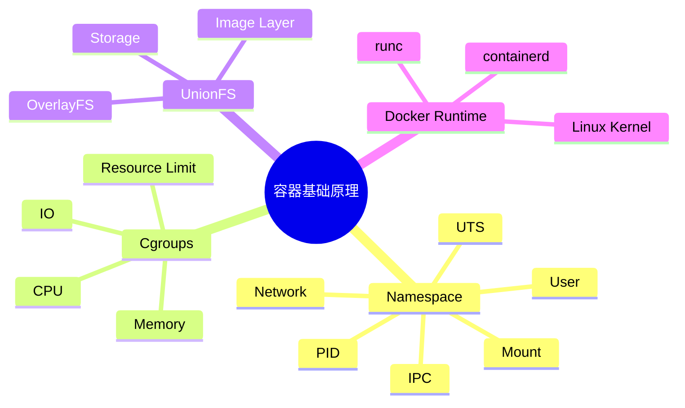

# 02 容器基础原理：Namespace、Cgroups 与 UnionFS

> 本文属于「Docker + Kubernetes 云原生专题」。
>
> 本篇介绍容器技术底层实现原理，重点讲解 Linux Namespace、Cgroups、UnionFS，以及 Docker 容器为什么能够实现轻量化隔离。

---

# 目录

1. 容器技术基础
2. 容器与操作系统虚拟化
3. Namespace隔离机制
4. Cgroups资源限制机制
5. UnionFS联合文件系统
6. 容器运行原理
7. Docker与底层技术关系
8. 系统架构设计师考点
9. Mermaid知识结构图
10. 本节小结

---

# 1. 容器技术基础

容器是一种操作系统级虚拟化技术。

与虚拟机不同，容器不需要模拟完整硬件，而是：

- 共享宿主机Linux Kernel；
- 隔离应用运行环境；
- 限制资源使用。

基本思想：

```text
应用程序

↓

容器环境

↓

Linux Kernel

↓

物理服务器
```

---

# 2. 容器与操作系统虚拟化

传统虚拟机：

```text
应用

↓

Guest OS

↓

Hypervisor

↓

Host OS

↓

硬件
```

容器：

```text
应用

↓

Container

↓

Docker Engine

↓

Linux Kernel

↓

硬件
```

区别：

- 虚拟机虚拟化操作系统；
- 容器虚拟化应用运行环境。

---

# 3. Namespace隔离机制（★★★★★）

Namespace是Linux提供的资源隔离机制。

作用：

> 为进程提供独立的系统视图，使容器感觉自己运行在独立系统中。

Docker利用Namespace实现：

- 进程隔离；
- 网络隔离；
- 文件系统隔离；
- 用户隔离。

---

# 3.1 PID Namespace

作用：

隔离进程编号。

容器内部：

```text
PID 1

↓

应用进程
```

宿主机：

```text
PID 10001

↓

容器进程
```

不同容器之间：

- 看不到彼此进程。

---

# 3.2 Network Namespace

作用：

实现网络隔离。

提供：

- 独立网卡；
- 独立IP；
- 独立路由表。

结构：

```text
Container A

↓

Network Namespace


Container B

↓

Network Namespace
```

---

# 3.3 Mount Namespace

作用：

隔离文件系统视图。

不同容器：

看到不同目录结构。

---

# 3.4 UTS Namespace

作用：

隔离主机名。

例如：

容器内部：

```text
server-a
```

宿主机：

```text
host-machine
```

---

# 3.5 IPC Namespace

作用：

隔离进程间通信资源。

包括：

- 信号量；
- 消息队列；
- 共享内存。

---

# 3.6 User Namespace

作用：

隔离用户权限。

实现：

容器内部root用户：

↓

宿主机普通用户权限。

提高安全性。

---

# 4. Cgroups资源限制机制（★★★★★）

Cgroups（Control Groups）用于：

> 限制、统计和隔离进程使用的系统资源。

主要控制：

- CPU；
- 内存；
- 磁盘IO；
- 网络资源。

---

# 4.1 CPU限制

例如：

限制容器最多使用：

```text
2个CPU核心
```

避免单个应用占满服务器资源。

---

# 4.2 Memory限制

例如：

```text
最大内存 512MB
```

超过限制：

- 触发OOM；
- 系统终止进程。

---

# 4.3 Block IO限制

控制：

- 磁盘读取速度；
- 磁盘写入速度。

---

# 4.4 Cgroups作用

实现：

```text
资源隔离

+

资源限制

+

资源统计
```

---

# 5. UnionFS联合文件系统（★★★★★）

UnionFS是一种分层文件系统。

Docker镜像采用：

> 分层存储机制。

结构：

```text
Container Layer

↓

Writable Layer

↓

Image Layer 3

↓

Image Layer 2

↓

Image Layer 1
```

---

# 5.1 镜像分层优势

优势：

## 节省空间

多个镜像共享相同基础层。

---

## 加快构建

只重新构建变化部分。

---

## 方便版本管理

每层可以独立管理。

---

# 5.2 常见存储驱动

Docker支持：

- Overlay2；
- AUFS；
- Device Mapper。

Linux环境常用：

```text
OverlayFS
```

---

# 6. 容器运行原理（★★★★★）

Docker创建容器流程：

```text
用户执行docker run

↓

Docker Engine

↓

containerd

↓

runc

↓

Linux Kernel

↓

创建Namespace

↓

配置Cgroups

↓

挂载UnionFS

↓

启动应用
```

---

# 7. Docker与底层技术关系

整体关系：

```text
Docker

↓

Container Runtime

↓

Namespace

↓

Cgroups

↓

UnionFS

↓

Linux Kernel
```

对应关系：

|Docker能力|底层技术|
|-|-|
|进程隔离|Namespace|
|资源限制|Cgroups|
|镜像存储|UnionFS|
|容器运行|runc|

---

# 8. 系统架构设计师考点

## 考点1：容器轻量化原因

答案：

> 容器共享宿主机操作系统内核，不需要运行完整Guest OS，因此资源占用更低。

---

## 考点2：Namespace作用

关键词：

- 隔离；
- 独立视图；
- 进程、网络、文件系统隔离。

---

## 考点3：Cgroups作用

关键词：

- 资源限制；
- 资源统计；
- CPU和内存控制。

---

## 考点4：Docker镜像分层

关键词：

- UnionFS；
- Layer；
- 共享基础镜像。

---

# 9. Mermaid知识结构图



---

# 本节小结

容器技术核心依赖三大基础：

## Namespace

负责：

> 隔离环境。

## Cgroups

负责：

> 控制资源。

## UnionFS

负责：

> 镜像分层存储。

Docker通过：

```text
Namespace

+

Cgroups

+

UnionFS
```

实现轻量、高效、可移植的容器运行环境。

下一篇：

📄 `03-docker-architecture.md`

内容：

- Docker整体架构；
- Docker Client；
- Docker Daemon；
- containerd；
- runc；
- Docker运行流程。
