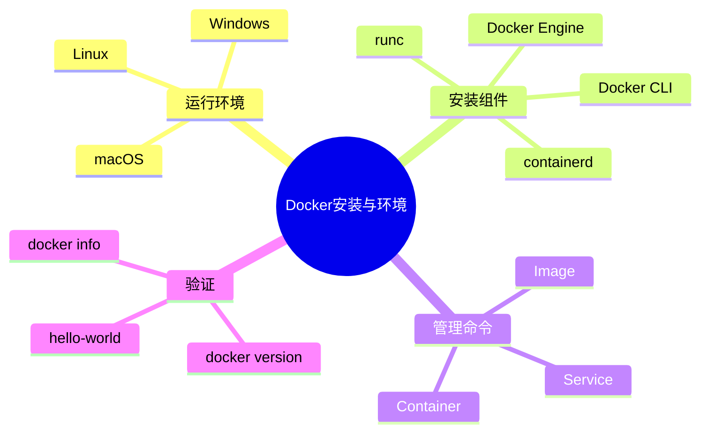

# 04 Docker 安装与环境配置

> 本文属于「Docker + Kubernetes 云原生专题」。
>
> 本篇介绍 Docker 安装方式、运行环境配置、Docker Desktop、Linux环境部署以及基础命令验证。

---

# 目录

1. Docker安装概述
2. Docker运行环境要求
3. Linux安装Docker
4. Docker Desktop安装
5. Docker服务管理
6. Docker基础命令
7. Docker运行验证
8. 常见问题
9. 系统架构设计师考点
10. Mermaid知识结构图
11. 本节小结

---

# 1. Docker安装概述

Docker支持多种运行环境：

- Linux；
- Windows；
- macOS。

企业生产环境通常使用：

```text
Linux

↓

Docker Engine

↓

Container
```

开发环境常使用：

```text
Windows/macOS

↓

Docker Desktop

↓

Linux VM

↓

Docker Engine
```

---

# 2. Docker运行环境要求

## Linux环境

推荐：

- Ubuntu；
- Debian；
- CentOS；
- Rocky Linux。

要求：

- 64位操作系统；
- Linux Kernel支持容器功能；
- 开启必要内核能力。

---

## Windows环境

通常使用：

- Docker Desktop；
- WSL2。

架构：

```text
Windows

↓

WSL2

↓

Linux Kernel

↓

Docker Engine
```

---

## macOS环境

Docker Desktop通过虚拟化运行Linux环境。

结构：

```text
macOS

↓

Docker Desktop

↓

Linux VM

↓

Docker Engine
```

---

# 3. Linux安装Docker

典型流程：

```text
更新系统

↓

安装依赖

↓

添加Docker仓库

↓

安装Docker Engine

↓

启动服务

↓

验证安装
```

---

## 3.1 安装Docker Engine

主要组件：

- docker-ce；
- docker-cli；
- containerd。

---

## 3.2 启动Docker服务

Linux使用systemd管理：

```bash
systemctl start docker

systemctl enable docker
```

作用：

- 启动Docker；
- 设置开机自动启动。

---

# 4. Docker Desktop安装

Docker Desktop适用于：

- Windows开发环境；
- macOS开发环境。

包含：

- Docker Engine；
- Docker CLI；
- Docker Compose；
- Kubernetes支持。

---

# 5. Docker服务管理

常用命令：

## 查看状态

```bash
systemctl status docker
```

---

## 启动

```bash
systemctl start docker
```

---

## 停止

```bash
systemctl stop docker
```

---

## 重启

```bash
systemctl restart docker
```

---

# 6. Docker基础命令

## 查看版本

```bash
docker version
```

---

## 查看信息

```bash
docker info
```

---

## 查看帮助

```bash
docker help
```

---

## 查看镜像

```bash
docker images
```

---

## 查看容器

```bash
docker ps
```

---

# 7. Docker运行验证

测试：

```bash
docker run hello-world
```

执行流程：

```text
docker run

↓

查找hello-world镜像

↓

本地不存在

↓

Docker Hub下载

↓

创建容器

↓

输出测试信息
```

---

# 8. Docker镜像管理基础

## 下载镜像

```bash
docker pull nginx
```

---

## 删除镜像

```bash
docker rmi nginx
```

---

## 查看镜像列表

```bash
docker images
```

---

# 9. Docker容器管理基础

## 创建运行容器

```bash
docker run nginx
```

---

## 后台运行

```bash
docker run -d nginx
```

---

## 查看运行容器

```bash
docker ps
```

---

## 停止容器

```bash
docker stop container_id
```

---

## 删除容器

```bash
docker rm container_id
```

---

# 10. 常见问题

## Docker启动失败

检查：

- Docker服务状态；
- Kernel支持；
- 配置文件。

---

## 权限问题

普通用户执行Docker：

需要加入：

```text
docker group
```

---

## 镜像下载慢

解决：

- 配置镜像加速；
- 使用企业镜像仓库。

---

# 11. 系统架构设计师考点

## Docker运行环境

关键词：

- Linux Kernel；
- Docker Engine；
- Container Runtime。

---

## Docker安装组成

核心组件：

- Docker Engine；
- Docker CLI；
- containerd；
- runc。

---

## Docker运行验证

答：

> 通过docker run命令创建测试容器，验证Docker Engine、镜像管理和容器运行环境是否正常。

---

# 12. Mermaid知识结构图



---

# 本节小结

Docker安装核心：

1. Linux是生产环境主要选择；
2. Docker Desktop适合开发环境；
3. Docker Engine负责容器运行；
4. containerd和runc提供底层运行能力；
5. docker run hello-world可以验证安装是否成功。

下一篇：

📄 `05-image.md`

内容：

- Docker镜像原理；
- 镜像分层；
- Docker Hub；
- 镜像构建与管理。
