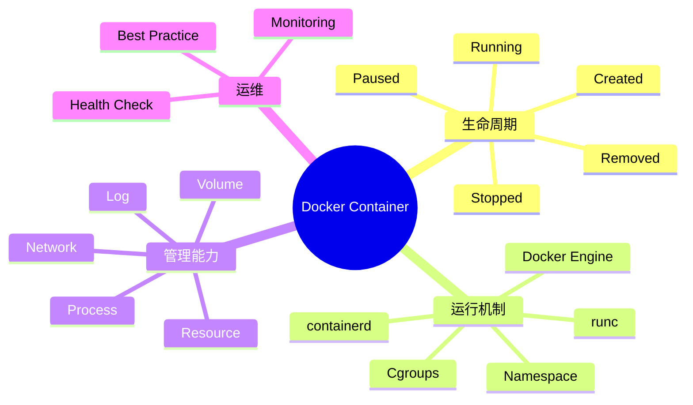

# 06 Docker 容器运行机制与生命周期管理

> 本文属于「Docker + Kubernetes 云原生专题」。
>
> 本篇从系统架构视角介绍 Docker Container（容器）的运行机制、生命周期管理、资源控制、日志管理、数据管理以及容器运维实践。

---

# 目录

1. Docker Container概述
2. Container与Image关系
3. Docker容器运行原理
4. 容器创建流程
5. 容器生命周期
6. 容器状态管理
7. 容器启动与停止机制
8. 容器进程管理
9. 容器资源管理
10. 容器日志管理
11. 容器数据管理
12. 容器网络基础
13. 容器健康检查
14. 容器最佳实践
15. 常用容器管理命令
16. 系统架构设计师考点
17. Mermaid知识结构图
18. 本节小结

---

# 1. Docker Container概述

Docker Container（容器）：

> 是Docker Image运行后的实例，是应用实际运行的基本单位。

镜像负责定义：

- 应用程序；
- 运行环境；
- 依赖组件。

容器负责：

- 启动应用；
- 执行业务逻辑；
- 管理运行状态。

关系：

```text
Docker Image

↓

docker run

↓

Docker Container
```

---

# 2. Container与Image关系

Image：

- 静态；
- 只读；
- 应用模板。

Container：

- 动态；
- 可运行；
- 应用实例。

关系：

```text
多个Container

↓

共享同一个Image
```

例如：

```text
Nginx Image

↓

Container A

Container B

Container C
```

---

# 3. Docker容器运行原理

容器启动依赖：

- Docker Engine；
- containerd；
- runc；
- Linux Kernel。

完整流程：

```text
用户请求

↓

Docker Client

↓

Docker Daemon

↓

containerd

↓

runc

↓

Namespace创建

↓

Cgroups配置

↓

文件系统挂载

↓

启动应用进程
```

---

# 4. 容器创建流程

执行：

```bash
docker run nginx
```

流程：

```text
检查镜像

↓

创建Container

↓

配置网络

↓

挂载存储

↓

创建隔离环境

↓

启动应用
```

---

# 5. 容器生命周期

Docker容器生命周期：

```text
Created

↓

Running

↓

Paused

↓

Stopped

↓

Removed
```

---

## Created

表示：

- 容器已经创建；
- 尚未运行。

---

## Running

表示：

- 容器正在运行；
- 应用进程正常启动。

---

## Paused

表示：

- 暂停容器进程；
- 保留运行状态。

---

## Stopped

表示：

- 容器停止；
- 数据仍可能保留。

---

## Removed

表示：

- 容器实例删除。

---

# 6. 容器状态管理

查看容器：

```bash
docker ps
```

查看所有状态：

```bash
docker ps -a
```

查看详情：

```bash
docker inspect container_id
```

---

# 7. 容器启动与停止机制

启动：

```bash
docker start container_id
```

停止：

```bash
docker stop container_id
```

重启：

```bash
docker restart container_id
```

删除：

```bash
docker rm container_id
```

---

# 8. 容器进程管理

容器本质：

> 是一个被隔离的Linux进程环境。

查看进程：

```bash
docker top container_id
```

进入容器：

```bash
docker exec -it container_id bash
```

---

# 9. 容器资源管理

Docker通过：

- Namespace；
- Cgroups；

实现资源隔离。

控制：

- CPU；
- 内存；
- IO。

示例：

```bash
docker run \
--memory=512m \
--cpus=2 \
nginx
```

---

# 10. 容器日志管理

容器日志流程：

```text
应用输出

↓

Docker Logging Driver

↓

日志系统
```

常见方式：

- json-file；
- journald；
- Fluentd。

查看日志：

```bash
docker logs container_id
```

---

# 11. 容器数据管理

容器默认存储：

- 临时；
- 随容器生命周期变化。

持久化方式：

## Volume

```text
Container

↓

Volume

↓

Host Storage
```

## Bind Mount

直接映射宿主机目录。

---

# 12. 容器网络基础

Docker网络用于：

- 容器通信；
- 服务访问；
- 网络隔离。

常见网络：

- bridge；
- host；
- none；
- overlay。

---

# 13. 容器健康检查

Health Check用于：

检测：

- 应用是否启动；
- 服务是否正常。

流程：

```text
Container

↓

Health Check

↓

状态反馈

↓

运维处理
```

---

# 14. 容器最佳实践

## 一个容器运行一个主要进程

优势：

- 职责清晰；
- 易管理。

---

## 使用轻量镜像

例如：

- Alpine；
- 精简基础镜像。

---

## 不在容器内部保存重要数据

使用：

- Volume；
- 外部存储。

---

## 使用健康检查

提高：

- 服务可靠性；
- 自动化运维能力。

---

# 15. 常用容器管理命令

创建运行：

```bash
docker run nginx
```

查看：

```bash
docker ps
```

停止：

```bash
docker stop id
```

删除：

```bash
docker rm id
```

查看日志：

```bash
docker logs id
```

进入容器：

```bash
docker exec -it id bash
```

---

# 16. 系统架构设计师考点

## 考点1：容器与镜像区别

答案：

> 镜像是静态模板，容器是镜像运行后的动态实例。

---

## 考点2：容器如何实现隔离？

答案：

> Docker通过Namespace实现运行环境隔离，通过Cgroups实现资源限制。

---

## 考点3：容器为什么轻量？

答案：

> 容器共享宿主机操作系统内核，不需要完整Guest OS，因此启动速度快、资源占用低。

---

## 考点4：容器生命周期管理作用

答案：

> 通过生命周期管理实现应用实例创建、运行、停止和删除，使应用运行状态可控。

---

# 17. Mermaid知识结构图



---

# 本节小结

Docker Container是云原生应用运行的基本单位。

核心知识：

1. Container是Image运行后的实例；
2. Docker通过containerd和runc创建容器；
3. Namespace实现隔离；
4. Cgroups实现资源控制；
5. Volume实现数据持久化；
6. Health Check提升应用可靠性。

下一篇：

📄 `07-dockerfile.md`

内容：

- Dockerfile语法；
- 镜像自动构建；
- 多阶段构建；
- 镜像优化实践。
