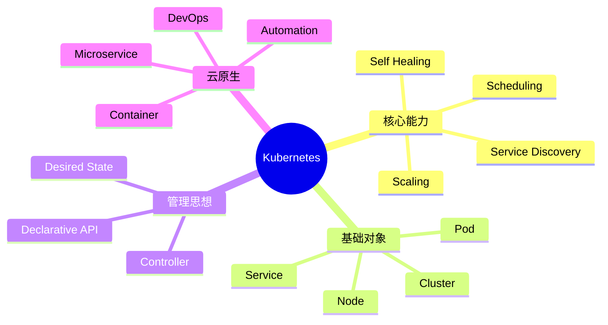

# 16 Kubernetes 概述与云原生基础

> 本文属于「Docker + Kubernetes 云原生专题」。
>
> 本篇作为 Kubernetes 专题开篇，介绍 Kubernetes 的发展背景、核心能力、设计思想，以及 Kubernetes 与 Docker、云原生体系之间的关系。

---

# 目录

1. Kubernetes概述
2. Kubernetes发展背景
3. 为什么需要Kubernetes
4. Kubernetes解决的问题
5. Kubernetes核心能力
6. Kubernetes与Docker关系
7. Kubernetes与云原生
8. Kubernetes核心思想
9. Kubernetes声明式API
10. Kubernetes自动化能力
11. Kubernetes应用场景
12. Kubernetes生态体系
13. Kubernetes基本术语
14. Kubernetes架构演进
15. Kubernetes学习路线
16. 系统架构设计师考点
17. Mermaid知识结构图
18. 本节小结

---

# 1. Kubernetes概述

Kubernetes（简称 K8s）：

> 一个开源的容器编排平台，用于自动化部署、扩展和管理容器化应用。

核心目标：

```text
Application

↓

Container

↓

Cluster Management
```

主要解决：

- 容器调度；
- 服务发现；
- 自动扩缩容；
- 故障恢复；
- 配置管理。

---

# 2. Kubernetes发展背景

技术演进：

```text
传统部署

↓

虚拟机时代

↓

容器时代

↓

云原生时代
```

---

## 传统部署

特点：

- 物理服务器运行应用；
- 资源利用率低；
- 环境差异明显。

---

## 虚拟机时代

通过Hypervisor实现：

- 资源隔离；
- 多应用部署。

不足：

- 虚拟机体积较大；
- 启动速度较慢。

---

## 容器时代

Docker推动应用容器化：

```text
Application

↓

Container

↓

Host OS
```

优势：

- 轻量；
- 启动快；
- 环境一致。

---

# 3. 为什么需要Kubernetes

Docker解决：

> 如何创建和运行一个容器。

企业环境进一步需要：

```text
100+

↓

1000+

↓

10000+

Containers
```

产生问题：

- 容器如何调度？
- 容器异常如何恢复？
- 如何扩容？
- 如何服务发现？
- 如何自动发布？

因此需要：

```text
Container Runtime

↓

Kubernetes

↓

Cloud Native Platform
```

---

# 4. Kubernetes解决的问题

## 自动调度

根据：

- CPU；
- Memory；
- 节点状态；

选择合适节点运行应用。

---

## 自动恢复

例如：

```text
Container Crash

↓

Kubernetes Detect

↓

Restart Container
```

---

## 自动扩缩容

例如：

```text
Replica 3

↓

Replica 10
```

根据业务压力动态调整。

---

## 服务发现

通过：

- Service；
- DNS。

实现服务之间通信。

---

## 滚动更新

支持：

- 无停机升级；
- 灰度发布；
- 快速回滚。

---

# 5. Kubernetes核心能力

六大核心能力：

```text
Kubernetes

├── Scheduling
├── Self Healing
├── Scaling
├── Service Discovery
├── Configuration Management
└── Storage Management
```

---

# 6. Kubernetes与Docker关系

常见误区：

> Kubernetes不是Docker。

关系：

```text
Application

↓

Container Image

↓

Container Runtime

↓

Kubernetes
```

Docker负责：

- 镜像构建；
- 容器运行。

Kubernetes负责：

- 容器编排；
- 生命周期管理；
- 集群调度。

技术演进：

```text
Docker

↓

Docker Compose

↓

Docker Swarm

↓

Kubernetes
```

---

# 7. Kubernetes与云原生

云原生核心理念：

```text
Cloud Native

├── Container
├── Microservice
├── DevOps
└── Automation
```

Kubernetes是云原生平台的重要基础。

---

# 8. Kubernetes核心思想

## 声明式管理（★★★★★）

传统方式：

告诉系统：

> 怎么执行。

例如：

```bash
启动3个容器
```

Kubernetes：

描述目标状态：

```yaml
replicas: 3
```

系统自动达到目标状态。

---

# 9. Kubernetes声明式API

核心思想：

```text
Desired State

↓

Controller

↓

Actual State
```

控制器持续比较：

- 当前状态；
- 目标状态。

自动进行调整。

---

# 10. Kubernetes自动化能力

包括：

- 自动调度；
- 自动恢复；
- 自动扩容；
- 自动发布；
- 自动配置管理。

---

# 11. Kubernetes应用场景

常见：

## 微服务平台

管理：

- API服务；
- 网关；
- 后端服务。

---

## 云平台基础设施

提供：

- 弹性资源；
- 自动部署。

---

## DevOps平台

结合：

- CI/CD；
- 自动发布。

---

# 12. Kubernetes生态体系

核心组件：

|组件|作用|
|-|-|
|Container Runtime|运行容器|
|API Server|统一入口|
|Scheduler|调度|
|Controller Manager|状态控制|
|etcd|数据存储|

生态：

- Helm；
- Prometheus；
- Istio；
- Argo CD。

---

# 13. Kubernetes基本术语

|概念|作用|
|-|-|
|Cluster|Kubernetes集群|
|Node|节点|
|Pod|最小运行单元|
|Deployment|应用管理|
|Service|服务访问|
|Ingress|入口管理|
|ConfigMap|配置管理|
|Secret|敏感数据|
|Volume|存储|
|Namespace|资源隔离|

---

# 14. Kubernetes架构演进

演进路线：

```text
单机Docker

↓

Docker Compose

↓

Docker Swarm

↓

Kubernetes

↓

Cloud Native Platform
```

---

# 15. Kubernetes学习路线

建议：

```text
基础

↓

架构

↓

Pod

↓

Deployment

↓

Service

↓

Storage

↓

Network

↓

Security

↓

Monitoring

↓

Production Practice
```

---

# 16. 系统架构设计师考点

## Kubernetes是什么？

答：

> Kubernetes是一个开源容器编排平台，用于自动化部署、扩展和管理容器化应用。

---

## 为什么需要Kubernetes？

答：

> 当容器规模扩大后，需要统一解决容器调度、服务发现、自动扩缩容、故障恢复和生命周期管理问题。

---

## Kubernetes核心思想？

答：

> Kubernetes采用声明式管理，通过描述目标状态，由控制器持续调整系统状态，使实际状态最终达到期望状态。

---

## Kubernetes与Docker区别？

答：

> Docker负责容器镜像构建和容器运行，Kubernetes负责大规模容器编排和应用生命周期管理。

---

# 17. Mermaid知识结构图



---

# 18. 本节小结

Kubernetes是云原生时代的重要基础平台。

核心知识：

1. Kubernetes负责容器集群编排；
2. Docker负责容器基础能力；
3. Kubernetes通过声明式API管理应用状态；
4. Controller持续保证系统达到目标状态；
5. Kubernetes提供调度、自愈、扩缩容和服务发现能力；
6. Kubernetes是现代云原生平台的重要组成部分。

---

# 一句话冲刺记忆

> Docker解决“运行一个容器”，Kubernetes解决“管理成千上万个容器”，声明式API和控制器机制是Kubernetes的核心思想。
