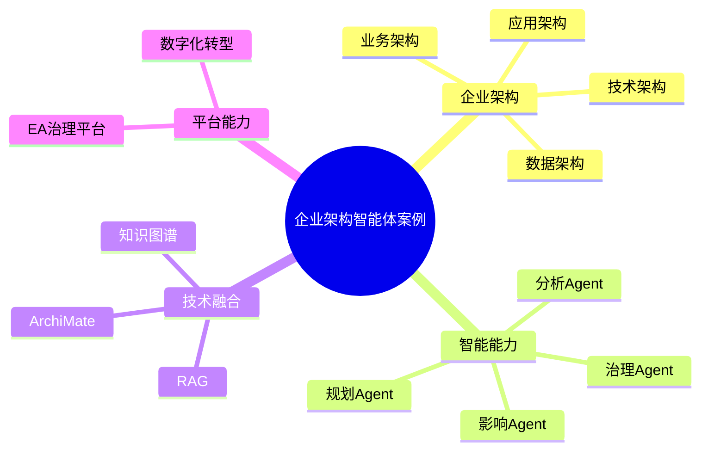

# 126-ai-agent-enterprise-architecture-case.md（企业架构智能体案例）

> 本文用于系统架构设计师考试案例分析专题 V2 复习。

## 1. 企业架构智能体案例概述

企业架构智能体（Enterprise Architecture Agent）面向企业战略、业务、应用、数据和技术架构管理，通过AI结合企业架构知识体系，实现架构分析、规划、治理和优化。

传统企业架构：

```text
企业战略
↓
业务分析
↓
系统规划
↓
技术设计
↓
架构治理
```

智能化企业架构：

```text
企业架构师
↓
Enterprise Architecture Agent
↓
EA知识库
↓
业务模型
↓
应用模型
↓
数据模型
↓
技术模型
↓
AI分析模型
```

---

## 2. Enterprise Architecture Agent基本概念

核心能力：

- 企业架构理解
- 架构模型分析
- 架构规划辅助
- 架构影响分析
- 转型路径推荐

特点：

- 跨业务领域
- 跨技术领域
- 强战略支撑

---

## 3. 企业架构建设挑战

主要问题：

- 业务与IT脱节
- 系统重复建设
- 数据孤岛严重
- 架构规划复杂

---

## 4. 企业架构智能体总体架构

```text
企业架构师

↓

EA Agent应用层

↓

Agent能力服务层

↓

企业架构模型与知识层

↓

AI分析模型层

↓

EA智能治理平台
```

---

## 5. 企业架构知识库建设

知识来源：

- 企业战略
- 业务模型
- 应用清单
- 数据模型
- 技术标准
- 架构文档

技术：

- RAG
- 知识图谱
- ArchiMate模型

---

## 6. 业务架构分析Agent

能力：

- 业务流程分析
- 业务能力识别
- 业务模型建立

流程：

```text
业务需求
↓
业务架构Agent
↓
能力分析
↓
业务模型
```

---

## 7. 应用架构分析Agent

能力：

- 应用系统分析
- 系统关系识别
- 应用合理性评估

分析：

- 生命周期
- 系统依赖
- 重复建设

---

## 8. 数据架构分析Agent

能力：

- 数据模型分析
- 数据流分析
- 数据资产识别

---

## 9. 技术架构分析Agent

能力：

- 技术栈分析
- 平台规划
- 技术路线建议

分析：

- 云平台
- 中间件
- 基础设施

---

## 10. 架构蓝图规划Agent

能力：

- 生成目标架构
- 规划演进路线
- 分析实施阶段

---

## 11. 数字化转型分析Agent

能力：

- 转型方案分析
- 数字能力评估
- 建设路径推荐

---

## 12. 架构影响分析Agent

能力：

- 变更影响分析
- 依赖关系分析
- 风险预测

---

## 13. 企业架构多智能体协同

```text
业务Agent

↓

应用Agent

↓

数据Agent

↓

技术Agent

↓

治理Agent
```

实现企业架构全过程智能化。

---

## 14. EA智能治理平台

```text
战略架构

+

业务架构

+

应用架构

+

数据架构

+

技术架构

+

AI分析
```

---

## 案例分析答题模板

### 业务与IT脱节

建设企业架构智能体，实现业务架构和技术架构统一规划。

### 系统重复建设

引入应用架构分析Agent，实现应用资产分析和优化。

### 数据孤岛严重

建设数据架构分析Agent，实现数据流分析和数据治理。

### 推进企业架构建设

构建EA智能治理平台，实现战略、业务、应用、数据和技术架构智能管理。

---

## 高频考点

1. 企业架构智能体总体架构；
2. EA知识库建设；
3. 业务、应用、数据、技术架构分析；
4. 架构蓝图规划；
5. 数字化转型分析；
6. EA智能治理平台建设。

---

## Mermaid知识结构图



---

## 本节小结

企业架构智能体通过企业架构模型、知识库、AI分析模型和治理流程结合，实现战略、业务、应用、数据和技术架构的智能化规划与持续优化。
