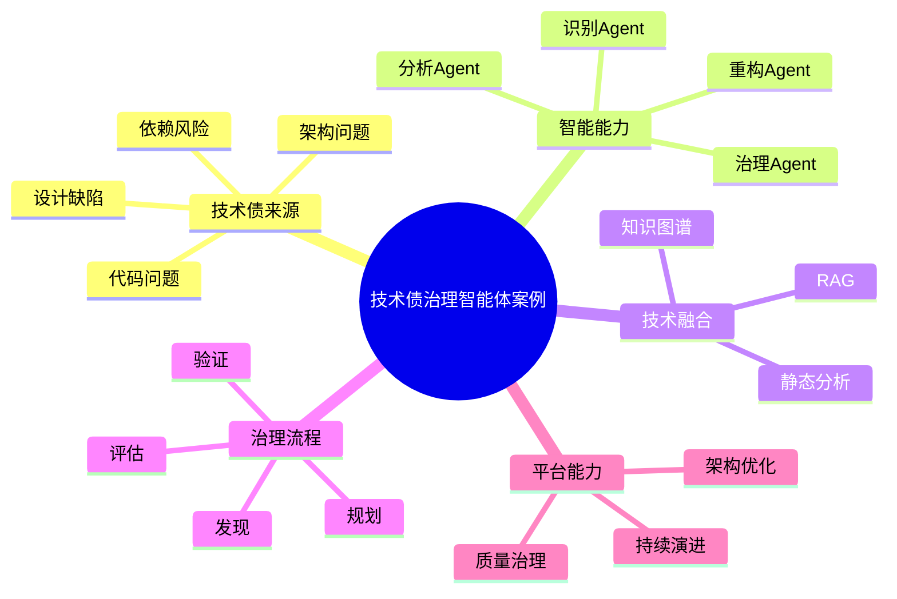

# 127-ai-agent-technical-debt-case.md（技术债治理智能体案例）

> 本文用于系统架构设计师考试案例分析专题 V2 复习。
>
> 本篇重点整理 Technical Debt AI Agent（技术债治理智能体）架构设计案例，包括技术债识别、架构腐化分析、代码质量评估、风险预测、重构方案推荐、老旧系统治理以及AI技术债治理平台建设。

---

# 目录

1. 技术债治理智能体案例概述
2. Technical Debt Agent基本概念
3. 技术债形成原因案例
4. 技术债治理智能体总体架构案例
5. 技术债知识库建设案例
6. 代码技术债识别Agent案例
7. 架构腐化检测Agent案例
8. 依赖风险分析Agent案例
9. 技术债评估Agent案例
10. 技术债优先级排序Agent案例
11. 重构方案推荐Agent案例
12. 老旧系统治理Agent案例
13. 技术资产健康度分析Agent案例
14. 技术债趋势预测Agent案例
15. 技术债闭环管理Agent案例
16. 技术债多智能体协同案例
17. Technical Debt Agent安全治理案例
18. Technical Debt Agent运营管理案例
19. AI技术债治理平台案例
20. 技术债治理智能体演进案例
21. 案例分析答题模板
22. 高频考点
23. 易错点
24. Mermaid知识结构图
25. 本节小结

---

# 1. 技术债治理智能体案例概述

技术债治理智能体：

> 面向软件系统长期演进过程中产生的设计缺陷、代码问题、架构问题和维护成本，通过AI技术结合软件工程数据，实现技术债发现、分析、治理和持续优化的AI Agent系统。

传统技术债治理：

```text
代码问题

↓

人工发现

↓

人工分析

↓

制定重构计划

↓

人工执行
```

技术债智能治理：

```text
开发团队

↓

Technical Debt Agent

↓

代码仓库

↓

架构模型

↓

质量数据

↓

AI分析模型
```

---

# 2. Technical Debt Agent基本概念

核心能力：

- 技术债识别；
- 风险分析；
- 成本评估；
- 优化建议；
- 治理跟踪。

特点：

- 强软件工程知识；
- 强历史数据依赖；
- 强持续治理能力。

---

# 3. 技术债形成原因案例

主要原因：

- 快速交付导致临时方案增加；
- 技术选型不合理；
- 缺少架构治理；
- 缺少质量管理。

---

# 4. 技术债治理智能体总体架构案例

```text
开发人员

↓

Technical Debt Agent应用层

↓

Agent能力服务层

↓

代码与架构数据层

↓

AI分析模型层

↓

技术债治理平台
```

---

# 5. 技术债知识库建设案例

知识来源：

- 编码规范；
- 架构规范；
- 重构案例；
- 缺陷记录；
- 历史项目。

技术：

- RAG；
- 知识图谱；
- 软件工程知识模型。

---

# 6. 代码技术债识别Agent案例

能力：

- 代码扫描；
- 复杂度分析；
- 问题定位。

分析：

- 重复代码；
- 高复杂度代码；
- 坏味道代码。

流程：

```text
代码仓库

↓

识别Agent

↓

技术债发现

↓

问题报告
```

---

# 7. 架构腐化检测Agent案例

能力：

- 架构规则检查；
- 依赖关系分析；
- 架构偏离检测。

发现：

- 分层违规；
- 循环依赖；
- 模块耦合。

---

# 8. 依赖风险分析Agent案例

能力：

- 第三方组件分析；
- 版本风险检测；
- 升级建议。

关注：

- 开源组件；
- 中间件；
- 基础框架。

---

# 9. 技术债评估Agent案例

能力：

- 评估技术债规模；
- 计算影响范围；
- 分析维护成本。

指标：

- 修复成本；
- 风险等级；
- 业务影响。

---

# 10. 技术债优先级排序Agent案例

能力：

- 自动排序治理任务。

依据：

- 风险；
- 成本；
- 业务价值；
- 修复难度。

---

# 11. 重构方案推荐Agent案例

能力：

- 推荐重构方式；
- 生成优化方案；
- 预测收益。

示例：

```text
单体系统

↓

模块化

↓

服务化

↓

云原生架构
```

---

# 12. 老旧系统治理Agent案例

能力：

- 系统健康分析；
- 生命周期评估；
- 迁移建议。

---

# 13. 技术资产健康度分析Agent案例

能力：

- 技术栈分析；
- 系统评分；
- 健康趋势预测。

---

# 14. 技术债趋势预测Agent案例

能力：

- 预测技术债增长；
- 发现风险趋势；
- 提前治理。

---

# 15. 技术债闭环管理Agent案例

流程：

```text
发现

↓

评估

↓

规划

↓

治理

↓

验证

↓

持续监控
```

---

# 16. 技术债多智能体协同案例

架构：

```text
代码Agent

↓

架构Agent

↓

风险Agent

↓

重构Agent

↓

治理Agent
```

实现：

技术债全过程智能管理。

---

# 17. Technical Debt Agent安全治理案例

安全：

- 代码数据保护；
- 权限控制；
- 敏感信息脱敏；
- 操作审计。

---

# 18. Technical Debt Agent运营管理案例

管理：

- 检测准确率；
- 治理完成率；
- 技术债下降趋势；
- 系统健康度。

---

# 19. AI技术债治理平台案例

```text
代码分析

+

架构分析

+

风险评估

+

重构建议

+

治理跟踪
```

---

# 20. 技术债治理智能体演进案例

```text
人工代码检查

↓

静态分析工具

↓

质量管理平台

↓

AI技术债分析

↓

智能软件治理体系
```

---

# 案例分析答题模板

## 技术债不断增加

> 建设技术债治理Agent，实现技术债自动识别和持续治理。

## 老系统维护困难

> 引入老旧系统治理Agent，分析系统健康度并制定演进方案。

## 架构逐渐腐化

> 建设架构腐化检测Agent，实现架构规则检查和风险发现。

## 推进软件质量治理

> 构建AI技术债治理平台，实现发现、评估、治理、验证全过程智能化。

---

# 高频考点

重点掌握：

1. 技术债治理智能体总体架构；
2. 技术债识别方法；
3. 架构腐化检测；
4. 技术债评估与排序；
5. 重构方案规划；
6. 技术债闭环治理。

---

# 易错点

|易错知识|正确理解|
|-|-|
|技术债只是代码问题|技术债还包括架构、设计和技术选型问题|
|发现问题即可完成治理|需要评估、规划、实施和验证闭环|
|AI可以自动重构所有系统|复杂系统仍需要人工决策|
|技术债只关注开发阶段|技术债需要持续治理|

---

# Mermaid知识结构图



---

# 本节小结

技术债治理智能体架构案例核心：

> 通过代码数据、架构模型、质量指标、AI分析模型和治理流程结合，实现技术债发现、评估、治理和持续优化。

案例分析重点：

- 理解 Technical Debt Agent 架构；
- 掌握技术债识别与评估方法；
- 理解架构腐化和重构治理；
- 掌握AI技术债治理平台建设路径。
