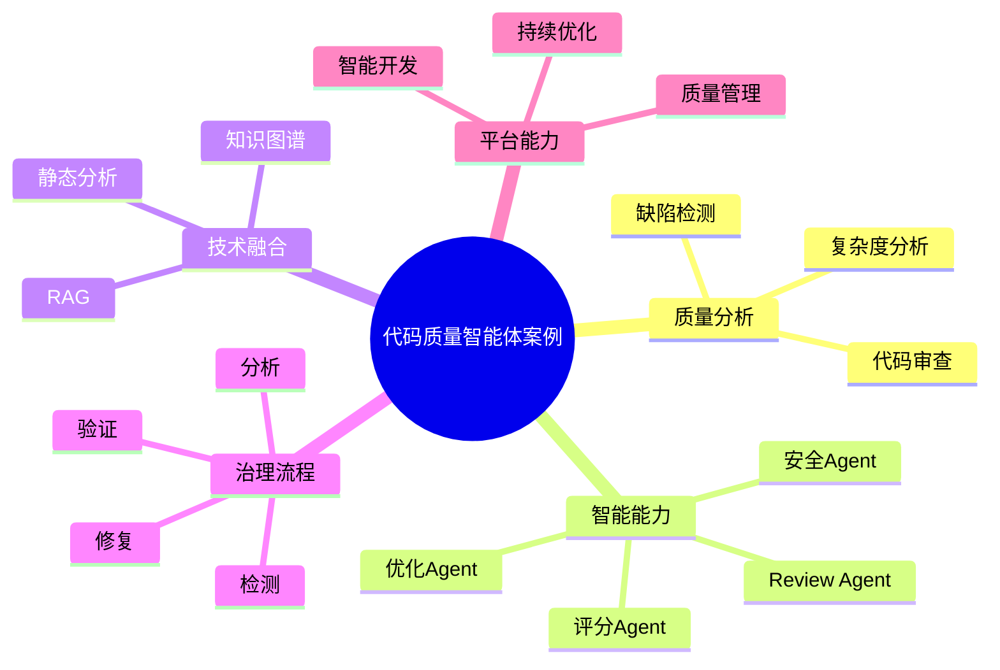

# 128-ai-agent-code-quality-case.md（代码质量智能体案例）

> 本文用于系统架构设计师考试案例分析专题 V2 复习。
>
> 本篇重点整理 Code Quality AI Agent（代码质量智能体）架构设计案例，包括智能代码审查、编码规范检查、缺陷检测、代码复杂度分析、质量评分、自动重构建议、代码安全分析以及AI代码质量治理平台建设。

---

# 目录

1. 代码质量智能体案例概述
2. Code Quality Agent基本概念
3. 代码质量管理挑战案例
4. 代码质量智能体总体架构案例
5. 代码质量知识库建设案例
6. 智能代码审查Agent案例
7. 编码规范检查Agent案例
8. 代码缺陷检测Agent案例
9. 代码复杂度分析Agent案例
10. 代码质量评分Agent案例
11. 自动重构建议Agent案例
12. 代码安全分析Agent案例
13. 测试覆盖分析Agent案例
14. 代码质量趋势预测Agent案例
15. 代码质量闭环治理Agent案例
16. 代码质量多智能体协同案例
17. Code Quality Agent安全治理案例
18. Code Quality Agent运营管理案例
19. AI代码质量治理平台案例
20. 代码质量智能体演进案例
21. 案例分析答题模板
22. 高频考点
23. 易错点
24. Mermaid知识结构图
25. 本节小结

---

# 1. 代码质量智能体案例概述

代码质量智能体：

> 面向软件开发全过程，通过AI技术结合代码分析、质量规则和工程数据，实现代码审查、缺陷发现、质量评估和持续优化的AI Agent系统。

传统代码质量管理：

```text
开发提交代码

↓

人工Code Review

↓

测试发现问题

↓

修改代码

↓

重新提交
```

代码质量智能体：

```text
开发人员

↓

Code Quality Agent

↓

代码仓库

↓

静态分析

↓

质量规则

↓

AI模型
```

---

# 2. Code Quality Agent基本概念

核心能力：

- 代码理解；
- 质量分析；
- 缺陷发现；
- 优化建议；
- 持续监控。

特点：

- 强代码理解能力；
- 强工程规则结合；
- 强开发流程集成。

---

# 3. 代码质量管理挑战案例

主要问题：

- 人工Review效率低；
- 缺陷发现滞后；
- 编码规范难统一；
- 代码复杂度持续增加。

---

# 4. 代码质量智能体总体架构案例

```text
开发人员

↓

Code Quality Agent应用层

↓

Agent能力服务层

↓

代码与质量数据层

↓

AI分析模型层

↓

智能代码质量平台
```

---

# 5. 代码质量知识库建设案例

知识来源：

- 编码规范；
- 代码审查规则；
- 历史缺陷；
- 重构案例；
- 最佳实践。

技术：

- RAG；
- 知识图谱；
- 软件工程知识模型。

---

# 6. 智能代码审查Agent案例

能力：

- 自动理解代码；
- 发现潜在问题；
- 提供修改建议。

流程：

```text
代码提交

↓

Review Agent

↓

代码分析

↓

审查意见
```

---

# 7. 编码规范检查Agent案例

能力：

- 检查代码规范；
- 检测风格问题；
- 提供修复建议。

例如：

- 命名规范；
- 注释规范；
- 编码规则。

---

# 8. 代码缺陷检测Agent案例

能力：

- 发现潜在Bug；
- 分析错误模式；
- 提前预警。

检测：

- 空指针；
- 异常处理缺失；
- 逻辑错误。

---

# 9. 代码复杂度分析Agent案例

能力：

- 分析代码复杂度；
- 发现高风险模块。

指标：

- 圈复杂度；
- 方法长度；
- 模块耦合度。

---

# 10. 代码质量评分Agent案例

能力：

生成：

- 代码质量评分；
- 模块健康度；
- 风险等级。

指标：

- 可维护性；
- 可测试性；
- 可靠性。

---

# 11. 自动重构建议Agent案例

能力：

- 提供重构方案；
- 推荐优化方式；
- 降低维护成本。

示例：

```text
复杂模块

↓

拆分模块

↓

降低耦合

↓

提高可维护性
```

---

# 12. 代码安全分析Agent案例

能力：

- 安全漏洞检测；
- 依赖风险分析；
- 安全编码检查。

结合：

- DevSecOps。

---

# 13. 测试覆盖分析Agent案例

能力：

- 分析测试覆盖率；
- 发现测试不足；
- 推荐测试场景。

---

# 14. 代码质量趋势预测Agent案例

能力：

- 分析质量变化；
- 预测风险趋势；
- 提前治理。

---

# 15. 代码质量闭环治理Agent案例

流程：

```text
检测

↓

分析

↓

修复建议

↓

验证

↓

持续优化
```

---

# 16. 代码质量多智能体协同案例

```text
Review Agent

↓

规范Agent

↓

缺陷Agent

↓

安全Agent

↓

优化Agent
```

实现：

代码质量全过程智能治理。

---

# 17. Code Quality Agent安全治理案例

安全：

- 代码权限控制；
- 源码保护；
- 敏感信息检测；
- 审计记录。

---

# 18. Code Quality Agent运营管理案例

管理：

- 检测准确率；
- 缺陷发现率；
- 修复完成率；
- 质量趋势。

---

# 19. AI代码质量治理平台案例

```text
代码分析

+

规范检查

+

缺陷检测

+

安全扫描

+

优化建议
```

---

# 20. 代码质量智能体演进案例

```text
人工Code Review

↓

静态分析工具

↓

质量管理平台

↓

AI代码质量Agent

↓

智能软件工程体系
```

---

# 案例分析答题模板

## Code Review效率低

> 建设智能代码审查Agent，实现代码自动分析和质量检查。

## 缺陷发现滞后

> 引入代码缺陷检测Agent，实现开发阶段提前发现问题。

## 代码维护困难

> 建设自动重构建议Agent，提高代码可维护性。

## 推进软件质量治理

> 构建AI代码质量治理平台，实现检测、分析、优化、验证全过程智能化。

---

# 高频考点

重点掌握：

1. 代码质量智能体总体架构；
2. 智能代码审查；
3. 缺陷检测；
4. 代码质量评分；
5. 自动重构建议；
6. 软件质量闭环治理。

---

# 易错点

|易错知识|正确理解|
|-|-|
|代码质量只是格式检查|还包括缺陷、复杂度、安全和可维护性|
|AI可以完全替代Review|AI主要辅助开发人员提升效率|
|只分析代码即可|需要结合规范、历史缺陷和工程数据|
|质量治理只在开发阶段|需要持续集成全过程治理|

---

# Mermaid知识结构图



---

# 本节小结

代码质量智能体架构案例核心：

> 通过代码数据、质量规则、工程知识和AI模型结合，实现代码审查、缺陷发现、质量评估和持续优化。

案例分析重点：

- 理解 Code Quality Agent 架构；
- 掌握代码质量治理方法；
- 理解AI辅助代码审查；
- 掌握AI代码质量平台建设路径。
