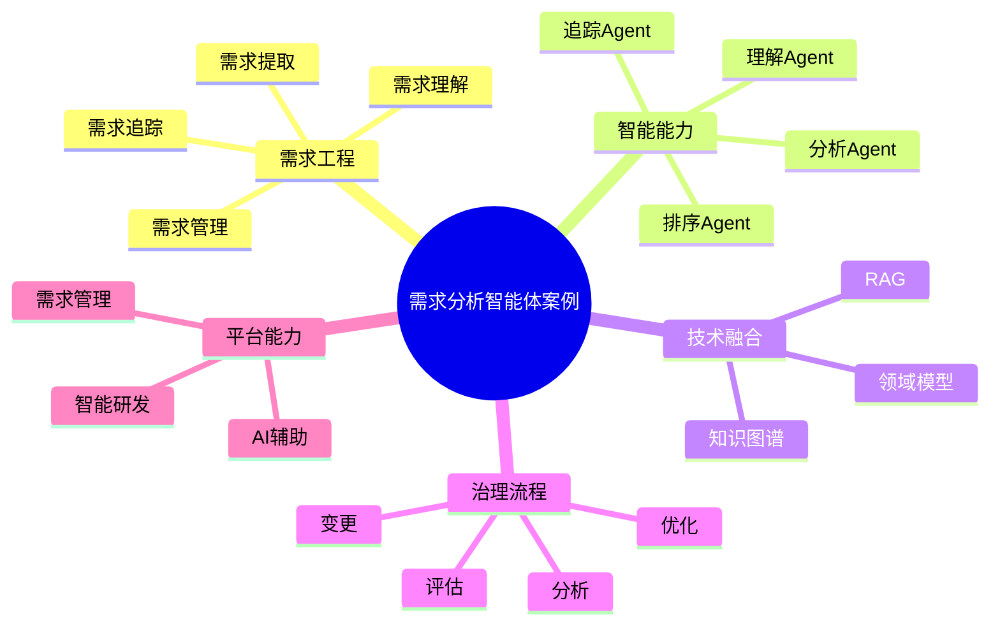

# 129-ai-agent-requirement-analysis-case.md（需求分析智能体案例）

> 本文用于系统架构设计师考试案例分析专题 V2 复习。
>
> 本篇重点整理 Requirement Analysis AI Agent（需求分析智能体）架构设计案例，包括需求理解、需求提取、用户故事生成、需求分类、需求冲突分析、需求优先级排序、需求影响分析、需求追踪以及AI需求工程平台建设。

---

# 目录

1. 需求分析智能体案例概述
2. Requirement Analysis Agent基本概念
3. 需求工程建设挑战案例
4. 需求分析智能体总体架构案例
5. 需求知识库建设案例
6. 需求理解Agent案例
7. 需求提取Agent案例
8. 用户故事生成Agent案例
9. 需求分类Agent案例
10. 需求冲突分析Agent案例
11. 需求优先级排序Agent案例
12. 需求影响分析Agent案例
13. 需求追踪Agent案例
14. 需求变更分析Agent案例
15. 需求质量评估Agent案例
16. 需求分析多智能体协同案例
17. Requirement Analysis Agent安全治理案例
18. Requirement Analysis Agent运营管理案例
19. AI需求工程平台案例
20. 需求分析智能体演进案例
21. 案例分析答题模板
22. 高频考点
23. 易错点
24. Mermaid知识结构图
25. 本节小结

---

# 1. 需求分析智能体案例概述

需求分析智能体：

> 面向软件需求工程全过程，通过AI技术结合业务知识、需求文档和历史经验，实现需求理解、分析、管理和持续优化的AI Agent系统。

传统需求分析：

```text
用户需求

↓

产品经理分析

↓

需求文档

↓

开发理解

↓

实现功能
```

需求分析智能体：

```text
用户

↓

Requirement Analysis Agent

↓

需求知识库

↓

业务模型

↓

用户故事

↓

AI分析模型
```

---

# 2. Requirement Analysis Agent基本概念

核心能力：

- 需求理解；
- 需求提取；
- 需求分析；
- 需求管理；
- 需求追踪。

特点：

- 强业务理解；
- 强领域知识；
- 强上下文分析。

---

# 3. 需求工程建设挑战案例

主要问题：

- 需求描述不清晰；
- 需求变更频繁；
- 优先级难确定；
- 需求追踪困难。

---

# 4. 需求分析智能体总体架构案例

```text
用户

↓

Requirement Agent应用层

↓

Agent能力服务层

↓

需求数据与知识层

↓

AI分析模型层

↓

智能需求工程平台
```

---

# 5. 需求知识库建设案例

知识来源：

- 历史需求；
- 产品文档；
- 用户反馈；
- 业务规则；
- 领域知识。

技术：

- RAG；
- 知识图谱；
- 领域模型。

---

# 6. 需求理解Agent案例

能力：

- 理解自然语言需求；
- 分析业务目标；
- 识别关键内容。

流程：

```text
用户描述

↓

需求理解Agent

↓

需求解析

↓

结构化需求
```

---

# 7. 需求提取Agent案例

能力：

自动提取：

- 功能需求；
- 非功能需求；
- 业务约束。

---

# 8. 用户故事生成Agent案例

能力：

根据需求生成：

- 用户角色；
- 使用场景；
- 验收条件。

示例：

```text
作为用户

我希望完成订单支付

从而快速完成购买
```

---

# 9. 需求分类Agent案例

分类：

- 功能需求；
- 性能需求；
- 安全需求；
- 业务需求。

---

# 10. 需求冲突分析Agent案例

能力：

- 发现需求矛盾；
- 分析影响；
- 提供协调建议。

例如：

- 性能要求与成本冲突；
- 安全要求与体验冲突。

---

# 11. 需求优先级排序Agent案例

依据：

- 业务价值；
- 用户影响；
- 开发成本；
- 风险等级。

方法：

- MoSCoW；
- ROI分析。

---

# 12. 需求影响分析Agent案例

能力：

分析：

- 影响模块；
- 影响人员；
- 测试范围；
- 发布时间。

---

# 13. 需求追踪Agent案例

建立：

```text
需求

↓

设计

↓

代码

↓

测试

↓

发布
```

全过程追踪。

---

# 14. 需求变更分析Agent案例

能力：

- 分析变更影响；
- 评估修改成本；
- 推荐处理方案。

---

# 15. 需求质量评估Agent案例

检查：

- 完整性；
- 一致性；
- 可测试性；
- 可实现性。

---

# 16. 需求分析多智能体协同案例

架构：

```text
理解Agent

↓

提取Agent

↓

分析Agent

↓

排序Agent

↓

追踪Agent
```

实现：

需求全过程智能化。

---

# 17. Requirement Analysis Agent安全治理案例

安全：

- 需求数据保护；
- 用户隐私保护；
- 权限控制；
- 审计管理。

---

# 18. Requirement Analysis Agent运营管理案例

管理：

- 分析准确率；
- 需求质量；
- 用户满意度；
- 知识库更新。

---

# 19. AI需求工程平台案例

平台能力：

```text
需求管理

+

知识库

+

AI分析

+

追踪管理

+

质量评估
```

---

# 20. 需求分析智能体演进案例

```text
人工需求分析

↓

需求管理工具

↓

敏捷需求管理

↓

AI需求分析Agent

↓

智能需求工程体系
```

---

# 案例分析答题模板

## 需求描述不清

> 建设需求理解Agent，实现自然语言需求自动分析和结构化。

## 需求变更影响大

> 引入需求影响分析Agent，实现变更范围自动评估。

## 优先级难确定

> 建设需求优先级排序Agent，根据业务价值和成本进行智能排序。

## 推进AI需求工程

> 构建AI需求工程平台，实现需求分析、管理、追踪全过程智能化。

---

# 高频考点

重点掌握：

1. 需求分析智能体总体架构；
2. 需求知识库建设；
3. 需求理解与提取；
4. 用户故事生成；
5. 需求优先级排序；
6. 需求追踪管理。

---

# 易错点

|易错知识|正确理解|
|-|-|
|需求分析只是写文档|需求工程包含理解、分析、管理和追踪|
|AI可以替代产品经理|AI主要辅助需求分析和决策|
|需求变化不需要分析|变更必须评估影响范围|
|只关注功能需求|还需要考虑性能、安全等非功能需求|

---

# Mermaid知识结构图



---

# 本节小结

需求分析智能体架构案例核心：

> 通过需求数据、业务知识、历史经验和AI模型结合，实现需求理解、分析、管理、追踪全过程智能化。

案例分析重点：

- 理解 Requirement Analysis Agent 架构；
- 掌握需求工程智能化方法；
- 理解需求追踪和影响分析；
- 掌握AI需求工程平台建设路径。
