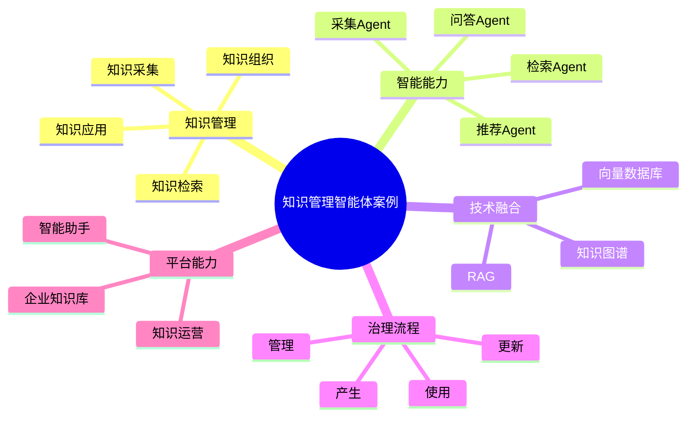

# 137-ai-agent-knowledge-management-case.md（知识管理智能体案例）

> 本文用于系统架构设计师考试案例分析专题 V2 复习。
>
> 本篇重点整理 Knowledge Management AI Agent（知识管理智能体）架构设计案例，包括知识采集、知识清洗、知识分类、知识抽取、知识检索、知识问答、知识推荐、知识更新、专家经验沉淀以及AI企业知识管理平台建设。

---

# 目录

1. 知识管理智能体案例概述
2. Knowledge Management Agent基本概念
3. 企业知识管理建设挑战案例
4. 知识管理智能体总体架构案例
5. 企业知识库建设案例
6. 知识采集Agent案例
7. 知识清洗Agent案例
8. 知识分类Agent案例
9. 知识抽取Agent案例
10. 知识关联Agent案例
11. 知识检索Agent案例
12. 知识问答Agent案例
13. 知识推荐Agent案例
14. 知识更新Agent案例
15. 专家经验沉淀Agent案例
16. 知识运营分析Agent案例
17. 企业知识多智能体协同案例
18. Knowledge Management Agent安全治理案例
19. AI企业知识管理平台案例
20. 知识管理智能体演进案例
21. 案例分析答题模板
22. 高频考点
23. 易错点
24. Mermaid知识结构图
25. 本节小结

---

# 1. 知识管理智能体案例概述

知识管理智能体：

> 面向企业知识全生命周期管理，通过AI技术结合企业文档、业务知识、专家经验和知识模型，实现知识采集、组织、检索、应用和持续优化的AI Agent系统。

传统知识管理：

```text
知识产生

↓

人工整理

↓

文档存储

↓

人工搜索

↓

知识使用
```

知识管理智能体：

```text
员工

↓

Knowledge Management Agent

↓

企业知识库

↓

知识图谱

↓

AI知识模型
```

---

# 2. Knowledge Management Agent基本概念

核心能力：

- 知识采集；
- 知识组织；
- 知识检索；
- 知识问答；
- 知识运营。

特点：

- 强语义理解；
- 强知识关联；
- 强业务适应能力。

---

# 3. 企业知识管理建设挑战案例

主要问题：

- 企业知识分散；
- 文档查找困难；
- 专家经验无法沉淀；
- 知识更新不及时。

---

# 4. 知识管理智能体总体架构案例

```text
企业员工

↓

Knowledge Agent应用层

↓

Agent能力服务层

↓

知识数据与知识层

↓

AI模型层

↓

智能知识管理平台
```

---

# 5. 企业知识库建设案例

知识来源：

- 企业文档；
- 技术资料；
- 产品资料；
- 流程规范；
- 项目经验；
- 专家知识。

技术：

- RAG；
- 向量数据库；
- 知识图谱。

---

# 6. 知识采集Agent案例

能力：

- 自动采集企业知识；
- 获取文档内容；
- 发现知识来源。

流程：

```text
知识源

↓

采集Agent

↓

知识内容
```

---

# 7. 知识清洗Agent案例

能力：

- 去除重复内容；
- 格式标准化；
- 清理无效知识。

---

# 8. 知识分类Agent案例

能力：

自动分类：

- 技术知识；
- 业务知识；
- 管理知识；
- 产品知识。

---

# 9. 知识抽取Agent案例

能力：

从文档中提取：

- 关键概念；
- 实体关系；
- 业务规则。

形成：

知识模型。

---

# 10. 知识关联Agent案例

能力：

建立：

- 知识关系；
- 业务关联；
- 专业领域关系。

技术：

- 知识图谱。

---

# 11. 知识检索Agent案例

能力：

相比传统搜索：

- 理解语义；
- 理解上下文；
- 返回相关知识。

技术：

- 向量检索；
- RAG。

---

# 12. 知识问答Agent案例

流程：

```text
用户问题

↓

问答Agent

↓

知识检索

↓

LLM生成答案
```

应用：

- 企业助手；
- 技术支持；
- 客服支持。

---

# 13. 知识推荐Agent案例

能力：

根据：

- 用户角色；
- 工作内容；
- 历史行为；

推荐：

- 相关知识；
- 学习资料。

---

# 14. 知识更新Agent案例

能力：

- 发现过期知识；
- 提醒更新；
- 保持知识有效性。

---

# 15. 专家经验沉淀Agent案例

能力：

将：

- 专家经验；
- 项目经验；
- 问题解决方案；

转化为：

企业知识资产。

---

# 16. 知识运营分析Agent案例

分析：

- 知识使用率；
- 热门知识；
- 知识缺口。

---

# 17. 企业知识多智能体协同案例

```text
采集Agent

↓

分类Agent

↓

抽取Agent

↓

检索Agent

↓

问答Agent
```

实现：

企业知识全过程智能管理。

---

# 18. Knowledge Management Agent安全治理案例

安全：

- 知识权限控制；
- 敏感信息保护；
- 访问审计；
- 数据隔离。

---

# 19. AI企业知识管理平台案例

```text
知识采集

+

知识管理

+

智能搜索

+

智能问答

+

知识运营
```

---

# 20. 知识管理智能体演进案例

```text
人工文档管理

↓

知识管理系统

↓

企业知识平台

↓

AI知识Agent

↓

智能知识管理体系
```

---

# 案例分析答题模板

## 企业知识分散

> 建设知识采集Agent，实现企业知识统一汇聚。

## 知识查询效率低

> 引入知识检索Agent，结合RAG实现智能搜索。

## 专家经验无法沉淀

> 建设专家经验沉淀Agent，实现隐性知识资产化。

## 推进AI知识管理

> 构建AI企业知识管理平台，实现知识采集、组织、检索、应用全过程智能化。

---

# 高频考点

重点掌握：

1. 知识管理智能体总体架构；
2. 企业知识库建设；
3. RAG知识检索流程；
4. 知识问答Agent设计；
5. 知识运营和持续更新。

---

# 易错点

|易错知识|正确理解|
|-|-|
|知识管理只是文档存储|还包括知识组织、应用和运营|
|搜索系统等于知识智能体|AI智能体具备理解和推理能力|
|知识库建立后无需维护|知识需要持续更新|
|所有知识都可以公开访问|需要权限和安全控制|

---

# Mermaid知识结构图



---

# 本节小结

知识管理智能体架构案例核心：

> 通过企业知识库、知识图谱、RAG和AI模型结合，实现企业知识采集、组织、检索、问答和持续运营全过程智能化。

案例分析重点：

- 理解 Knowledge Management Agent 架构；
- 掌握企业知识库建设方法；
- 理解RAG智能检索流程；
- 掌握AI企业知识管理平台建设路径。
