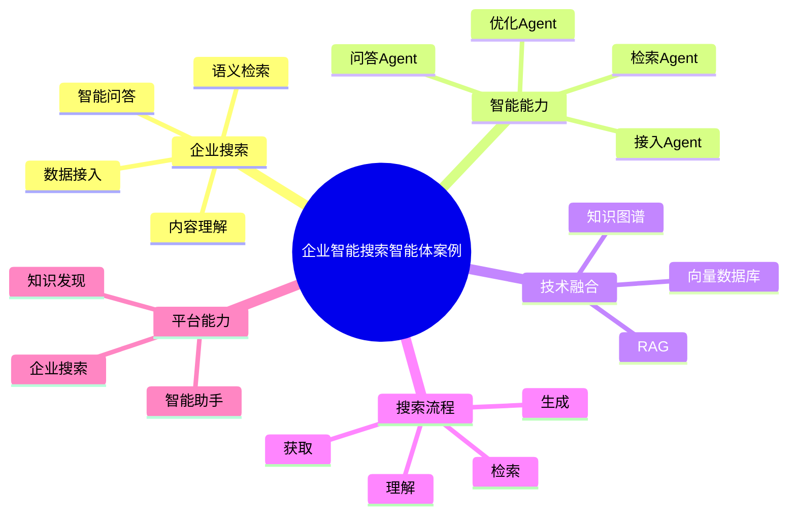

# 138-ai-agent-enterprise-search-case.md（企业智能搜索智能体案例）

> 本文用于系统架构设计师考试案例分析专题 V2 复习。
>
> 本篇重点整理 Enterprise Search AI Agent（企业智能搜索智能体）架构设计案例，包括多源数据接入、文档解析、内容理解、语义检索、向量搜索、知识关联发现、智能问答、搜索排序、搜索推荐以及AI企业智能搜索平台建设。

---

# 目录

1. 企业智能搜索智能体案例概述
2. Enterprise Search Agent基本概念
3. 企业搜索建设挑战案例
4. 企业智能搜索智能体总体架构案例
5. 企业搜索知识库建设案例
6. 多源数据接入Agent案例
7. 文档解析Agent案例
8. 内容理解Agent案例
9. 语义检索Agent案例
10. 向量搜索Agent案例
11. 知识关联发现Agent案例
12. 搜索意图识别Agent案例
13. 智能问答搜索Agent案例
14. 搜索结果排序Agent案例
15. 搜索推荐Agent案例
16. 搜索效果分析Agent案例
17. 企业智能搜索多智能体协同案例
18. Enterprise Search Agent安全治理案例
19. AI企业智能搜索平台案例
20. 企业搜索智能体演进案例
21. 案例分析答题模板
22. 高频考点
23. 易错点
24. Mermaid知识结构图
25. 本节小结

---

# 1. 企业智能搜索智能体案例概述

企业智能搜索智能体：

> 面向企业内部信息检索场景，通过AI技术结合语义理解、知识库和搜索引擎能力，实现企业数据发现、智能检索和知识问答的AI Agent系统。

传统企业搜索：

```text
用户输入关键词

↓

关键词匹配

↓

返回文档列表

↓

人工查看
```

企业智能搜索：

```text
用户问题

↓

Enterprise Search Agent

↓

语义理解

↓

知识检索

↓

AI生成答案
```

---

# 2. Enterprise Search Agent基本概念

核心能力：

- 数据接入；
- 内容理解；
- 语义检索；
- 智能问答；
- 搜索优化。

特点：

- 强语义理解；
- 强知识关联；
- 强上下文分析。

---

# 3. 企业搜索建设挑战案例

主要问题：

- 企业信息分散；
- 关键词搜索效果差；
- 搜索结果过多；
- 知识利用率低。

---

# 4. 企业智能搜索总体架构案例

```text
企业用户

↓

Enterprise Search Agent应用层

↓

Agent能力服务层

↓

搜索知识与数据层

↓

AI模型层

↓

智能搜索平台
```

---

# 5. 企业搜索知识库建设案例

数据来源：

- 企业文档；
- 数据库；
- Wiki；
- 项目资料；
- 产品资料；
- 企业业务系统。

技术：

- RAG；
- 向量数据库；
- 知识图谱。

---

# 6. 多源数据接入Agent案例

能力：

- 接入不同数据源；
- 统一数据格式；
- 建立搜索索引。

数据源：

- 文件系统；
- 数据库；
- 企业应用。

---

# 7. 文档解析Agent案例

能力：

- 文档内容提取；
- 表格解析；
- 图片文字识别。

支持：

- PDF；
- Word；
- PPT；
- 图片。

---

# 8. 内容理解Agent案例

能力：

分析：

- 文档主题；
- 关键实体；
- 业务含义。

形成：

知识结构。

---

# 9. 语义检索Agent案例

传统搜索：

```text
关键词匹配
```

智能搜索：

```text
理解用户意图

↓

寻找相关知识
```

---

# 10. 向量搜索Agent案例

技术：

- Embedding；
- 向量数据库；
- 相似度计算。

流程：

```text
用户问题

↓

向量转换

↓

相似搜索

↓

返回结果
```

---

# 11. 知识关联发现Agent案例

能力：

发现：

- 文档关系；
- 人员关系；
- 业务关系。

技术：

- 知识图谱。

---

# 12. 搜索意图识别Agent案例

能力：

理解：

- 用户目的；
- 查询场景；
- 业务需求。

---

# 13. 智能问答搜索Agent案例

流程：

```text
用户问题

↓

检索相关知识

↓

LLM理解生成

↓

返回答案
```

技术：

- RAG；
- LLM。

---

# 14. 搜索结果排序Agent案例

能力：

根据：

- 相关度；
- 权威性；
- 时间；
- 用户角色；

优化搜索排序。

---

# 15. 搜索推荐Agent案例

能力：

根据：

- 用户历史行为；
- 工作内容；
- 用户角色；

推荐相关知识。

---

# 16. 搜索效果分析Agent案例

分析：

- 搜索成功率；
- 用户满意度；
- 热门查询；
- 搜索缺口。

---

# 17. 企业智能搜索多智能体协同案例

```text
接入Agent

↓

解析Agent

↓

检索Agent

↓

问答Agent

↓

优化Agent
```

实现：

企业搜索全过程智能化。

---

# 18. Enterprise Search Agent安全治理案例

安全：

- 搜索权限控制；
- 数据访问隔离；
- 敏感信息过滤；
- 搜索日志审计。

---

# 19. AI企业智能搜索平台案例

```text
数据接入

+

内容理解

+

智能检索

+

知识问答

+

效果优化
```

---

# 20. 企业搜索智能体演进案例

```text
关键词搜索

↓

企业搜索引擎

↓

语义搜索

↓

AI搜索Agent

↓

智能知识搜索体系
```

---

# 案例分析答题模板

## 企业信息分散

> 建设多源数据接入Agent，实现企业数据统一搜索。

## 搜索准确率低

> 引入语义检索Agent，利用向量搜索提升搜索准确性。

## 用户无法快速获取答案

> 建设智能问答搜索Agent，结合RAG实现知识问答。

## 推进AI企业搜索

> 构建AI企业智能搜索平台，实现数据接入、检索、问答全过程智能化。

---

# 高频考点

重点掌握：

1. 企业智能搜索总体架构；
2. 多源数据接入；
3. RAG检索流程；
4. 向量数据库应用；
5. 智能问答搜索；
6. 搜索安全治理。

---

# 易错点

|易错知识|正确理解|
|-|-|
|企业搜索只是关键词匹配|AI搜索需要语义理解和上下文分析|
|搜索结果越多越好|需要智能排序和精准推荐|
|RAG只负责生成答案|RAG包含知识检索和增强生成过程|
|搜索系统无需权限控制|企业搜索必须考虑数据安全|

---

# Mermaid知识结构图



---

# 本节小结

企业智能搜索智能体架构案例核心：

> 通过企业数据、多源检索、向量搜索、知识图谱和大语言模型结合，实现企业信息发现、智能检索和知识问答全过程智能化。

案例分析重点：

- 理解 Enterprise Search Agent 架构；
- 掌握RAG智能搜索流程；
- 理解向量检索和知识关联；
- 掌握AI企业搜索平台建设路径。
