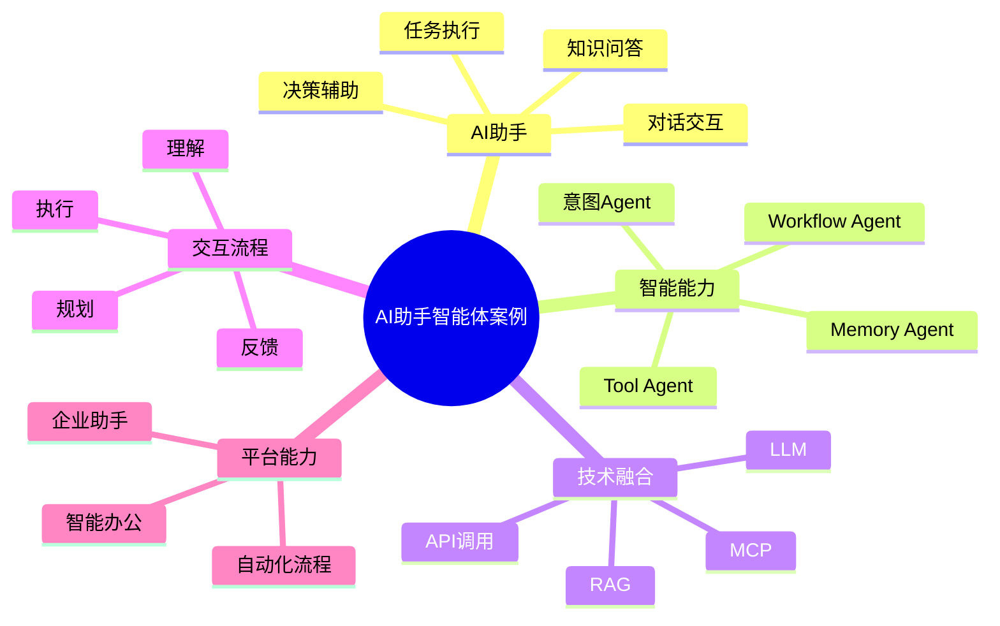

# 139-ai-agent-ai-assistant-case.md（AI助手智能体案例）

> 本文用于系统架构设计师考试案例分析专题 V2 复习。
>
> 本篇重点整理 AI Assistant Agent（AI助手智能体）架构设计案例，包括智能对话、多轮交互、上下文管理、Memory记忆机制、Tool Calling工具调用、Workflow流程编排、任务执行以及企业AI助手平台建设。

---

# 目录

1. AI助手智能体案例概述
2. AI Assistant Agent基本概念
3. 智能助手建设挑战案例
4. AI助手智能体总体架构案例
5. AI助手知识库建设案例
6. 用户意图识别Agent案例
7. 多轮对话Agent案例
8. Context上下文管理Agent案例
9. Memory记忆管理Agent案例
10. Tool Calling工具调用Agent案例
11. Workflow流程编排Agent案例
12. 任务执行Agent案例
13. 个人办公助手案例
14. 企业业务助手案例
15. 决策辅助Agent案例
16. 多智能体协同案例
17. AI Assistant Agent安全治理案例
18. AI助手运营管理案例
19. 企业AI助手平台案例
20. AI助手智能体演进案例
21. 案例分析答题模板
22. 高频考点
23. 易错点
24. Mermaid知识结构图
25. 本节小结

---

# 1. AI助手智能体案例概述

AI助手智能体：

> 基于大语言模型和智能体技术，通过理解用户需求、调用企业知识和外部工具，实现任务辅助、信息查询和业务流程自动化的AI Agent系统。

传统助手：

```text
用户输入

↓

规则匹配

↓

返回固定答案
```

AI助手：

```text
用户请求

↓

AI Assistant Agent

↓

意图理解

↓

知识检索

↓

工具调用

↓

任务执行
```

---

# 2. AI Assistant Agent基本概念

核心能力：

- 自然语言理解；
- 多轮对话；
- 知识查询；
- 工具调用；
- 任务执行；
- 记忆管理。

特点：

- 主动性；
- 自适应；
- 可扩展；
- 可协作。

---

# 3. 智能助手建设挑战案例

主要问题：

- 用户需求理解困难；
- 信息获取效率低；
- 操作流程复杂；
- 用户体验不足。

---

# 4. AI助手智能体总体架构案例

```text
用户

↓

AI Assistant应用层

↓

Agent能力服务层

↓

知识与数据层

↓

工具调用层

↓

AI模型层
```

---

# 5. AI助手知识库建设案例

知识来源：

- 企业文档；
- 产品资料；
- 业务流程；
- FAQ；
- 制度规范。

技术：

- RAG；
- 向量数据库；
- 知识图谱。

---

# 6. 用户意图识别Agent案例

能力：

分析：

- 用户目标；
- 请求类型；
- 业务场景。

流程：

```text
用户输入

↓

意图识别Agent

↓

任务分类
```

---

# 7. 多轮对话Agent案例

能力：

- 理解上下文；
- 保持对话连续；
- 补充缺失信息。

---

# 8. Context上下文管理Agent案例

管理：

- 当前会话；
- 用户信息；
- 业务状态。

作用：

提升回答准确性。

---

# 9. Memory记忆管理Agent案例

能力：

保存：

- 用户偏好；
- 历史任务；
- 常用操作。

类型：

- 短期记忆；
- 长期记忆。

---

# 10. Tool Calling工具调用Agent案例

能力：

调用：

- API；
- 数据库；
- 企业系统；
- 第三方服务。

流程：

```text
用户请求

↓

Agent判断

↓

调用工具

↓

返回结果
```

---

# 11. Workflow流程编排Agent案例

能力：

将复杂任务拆解：

```text
任务目标

↓

步骤规划

↓

执行流程

↓

结果汇总
```

---

# 12. 任务执行Agent案例

能力：

执行：

- 创建任务；
- 查询数据；
- 发送通知；
- 自动处理流程。

---

# 13. 个人办公助手案例

能力：

- 日程管理；
- 邮件处理；
- 文档总结；
- 信息提醒。

---

# 14. 企业业务助手案例

应用：

- 客服助手；
- 销售助手；
- HR助手；
- 运维助手。

---

# 15. 决策辅助Agent案例

能力：

分析：

- 业务数据；
- 历史信息；
- 当前状态。

输出：

决策建议。

---

# 16. 多智能体协同案例

架构：

```text
对话Agent

↓

知识Agent

↓

工具Agent

↓

任务Agent

↓

反馈Agent
```

实现：

复杂业务自动化。

---

# 17. AI Assistant Agent安全治理案例

安全：

- 用户身份认证；
- 权限控制；
- 数据隔离；
- 操作审计。

---

# 18. AI助手运营管理案例

指标：

- 用户满意度；
- 任务成功率；
- 响应速度；
- 使用频率。

---

# 19. 企业AI助手平台案例

```text
智能对话

+

知识问答

+

工具调用

+

流程自动化

+

智能决策
```

---

# 20. AI助手智能体演进案例

```text
传统聊天机器人

↓

智能客服

↓

AI助手

↓

Agent智能体

↓

企业智能工作伙伴
```

---

# 案例分析答题模板

## 用户查询效率低

> 建设AI助手智能体，结合企业知识库实现智能问答。

## 工作流程复杂

> 引入工具调用Agent，实现跨系统自动执行。

## 用户体验不足

> 建设Memory记忆管理Agent，实现个性化交互。

## 推进企业AI助手

> 构建企业AI助手平台，实现知识查询、任务执行和业务流程自动化。

---

# 高频考点

重点掌握：

1. AI助手智能体总体架构；
2. Agent与大语言模型结合方式；
3. RAG知识增强流程；
4. Memory记忆机制；
5. Tool Calling工具调用；
6. Workflow任务编排。

---

# 易错点

|易错知识|正确理解|
|-|-|
|AI助手只是聊天机器人|AI助手具备理解、规划和执行能力|
|大模型可以直接完成所有任务|复杂任务需要工具和流程编排|
|记忆机制只保存聊天记录|Memory需要管理用户和业务上下文|
|工具调用无需权限控制|企业应用必须进行安全治理|

---

# Mermaid知识结构图



---

# 本节小结

AI助手智能体架构案例核心：

> 通过大语言模型、企业知识库、工具调用和工作流编排结合，实现用户理解、知识查询、任务执行和业务自动化全过程智能化。

案例分析重点：

- 理解 AI Assistant Agent 架构；
- 掌握RAG知识增强方法；
- 理解Memory和Tool Calling机制；
- 掌握企业AI助手平台建设路径。
