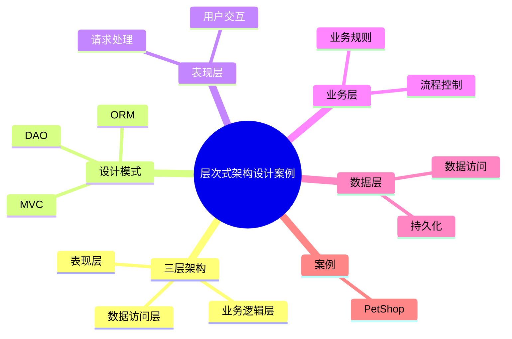

# 14 Layered Architecture Case（层次式架构设计案例）

> 本文用于系统架构设计师考试案例分析专题 V2 复习。
>
> 本篇结合《架构案例专题2》中层次式架构设计方向进行整理，重点覆盖表现层、中间层、数据访问层、三层架构、MVC模式、DAO、ORM以及层次式架构案例分析方法。

---

# 目录

1. 层次式架构案例概述
2. 层次式架构基本概念
3. 三层架构案例
4. 表现层设计案例
5. 业务逻辑层设计案例
6. 数据访问层设计案例
7. DAO设计模式案例
8. ORM对象关系映射案例
9. MVC与层次式架构结合案例
10. PetShop架构案例分析
11. 层次式架构优缺点
12. 案例分析答题模板
13. 高频考点
14. 易错点
15. Mermaid知识结构图
16. 本节小结

---

# 1. 层次式架构案例概述

层次式架构是软件系统中常见的架构风格。

主要目标：

- 降低系统耦合；
- 提高可维护性；
- 支持系统扩展。

典型案例：

- 企业信息系统；
- Web应用系统；
- 管理系统。

分析流程：

```text
用户请求

↓

表现层

↓

业务逻辑层

↓

数据访问层

↓

数据库
```

---

# 2. 层次式架构基本概念（★★★★★）

层次式架构：

> 将系统按照职责划分为多个层次，每一层负责特定功能。

核心思想：

- 高层调用低层；
- 层之间接口通信；
- 隐藏内部实现。

优势：

- 职责清晰；
- 易维护；
- 易测试。

---

# 3. 三层架构案例（★★★★★）

经典三层架构：

```text
表示层 Presentation

↓

业务逻辑层 Business Logic

↓

数据访问层 Data Access

↓

数据库
```

---

## 表示层

负责：

- 用户交互；
- 页面展示；
- 接收请求。

---

## 业务逻辑层

负责：

- 业务规则；
- 流程控制；
- 数据处理。

---

## 数据访问层

负责：

- 数据库访问；
- 数据持久化。

---

# 4. 表现层设计案例

表现层主要关注：

- 用户界面；
- 请求处理；
- 数据展示。

常见技术：

- Web页面；
- 前端框架；
- Controller控制器。

设计目标：

- 用户体验；
- 页面与业务逻辑分离。

---

# 5. 业务逻辑层设计案例（★★★★★）

业务逻辑层是系统核心。

主要职责：

- 封装业务规则；
- 处理业务流程；
- 协调多个数据操作。

优势：

避免：

- 表示层包含业务逻辑；
- 数据访问层承担业务处理。

---

# 6. 数据访问层设计案例（★★★★★）

数据访问层：

负责屏蔽数据库差异。

主要功能：

- 查询数据；
- 保存数据；
- 更新数据。

优势：

- 隔离数据库变化；
- 提高可维护性。

---

# 7. DAO设计模式案例（★★★★★）

DAO：

Data Access Object。

作用：

> 将数据访问逻辑封装起来，为业务层提供统一接口。

结构：

```text
业务层

↓

DAO接口

↓

DAO实现

↓

数据库
```

优势：

- 降低业务层与数据库耦合；
- 方便数据库替换；
- 易于测试。

---

# 8. ORM对象关系映射案例（★★★★★）

ORM：

Object Relational Mapping。

作用：

将：

- 对象模型；

映射到：

- 关系数据库表。

优势：

- 减少数据库操作代码；
- 提高开发效率。

---

对象：

```text
User对象

↓

User表
```

---

# 9. MVC与层次式架构结合案例

MVC：

```text
Model

View

Controller
```

与三层架构结合：

```text
View

↓

Controller

↓

Business Layer

↓

DAO

↓

Database
```

优势：

- 表现和业务分离；
- 提高系统可维护性。

---

# 10. PetShop架构案例分析（★★★★★）

PetShop是经典分层架构案例。

主要思想：

通过分层设计实现：

- 表示层分离；
- 业务逻辑封装；
- 数据访问抽象。

架构：

```text
Web层

↓

业务层

↓

数据访问层

↓

数据库
```

案例关注：

- 分层职责；
- 模块解耦；
- 数据访问封装。

---

# 11. 层次式架构优缺点

## 优点

### 易维护

修改某一层不会影响全部系统。

---

### 易扩展

可以替换某一层实现。

---

### 易测试

每层可以独立测试。

---

## 缺点

### 性能损耗

层间调用增加。

---

### 结构复杂

层次过多导致设计复杂。

---

# 12. 案例分析答题模板

## 场景：系统维护困难

答案：

> 采用分层架构，将系统划分为表现层、业务逻辑层和数据访问层，降低模块耦合，提高系统可维护性。

---

## 场景：数据库变化频繁

答案：

> 采用DAO模式封装数据访问逻辑，使业务层与数据库实现隔离，提高系统扩展能力。

---

## 场景：提高开发效率

答案：

> 采用ORM技术，将对象模型映射到关系数据库，减少底层数据库操作代码，提高开发效率。

---

# 13. 高频考点（★★★★★）

重点掌握：

1. 三层架构结构；
2. 表现层职责；
3. 业务逻辑层职责；
4. 数据访问层职责；
5. DAO设计模式；
6. ORM思想；
7. MVC与分层结合。

---

# 14. 易错点

| 易错知识 | 正确理解 |
|---|---|
| 三层架构等于MVC | 两者属于不同层面的划分 |
| DAO负责业务处理 | DAO只负责数据访问 |
| 数据访问层包含页面逻辑 | 数据访问层只处理数据 |
| 分层越多越好 | 需要根据系统复杂度设计 |

---

# 15. Mermaid知识结构图



---

# 16. 本节小结

层次式架构案例核心：

> 通过合理划分系统层次，将表示、业务和数据访问职责分离，提高系统可维护性、扩展性和可靠性。

案例分析重点：

- 判断系统是否需要分层；
- 明确各层职责；
- 使用DAO、ORM等技术降低耦合；
- 结合MVC理解表现层设计。
