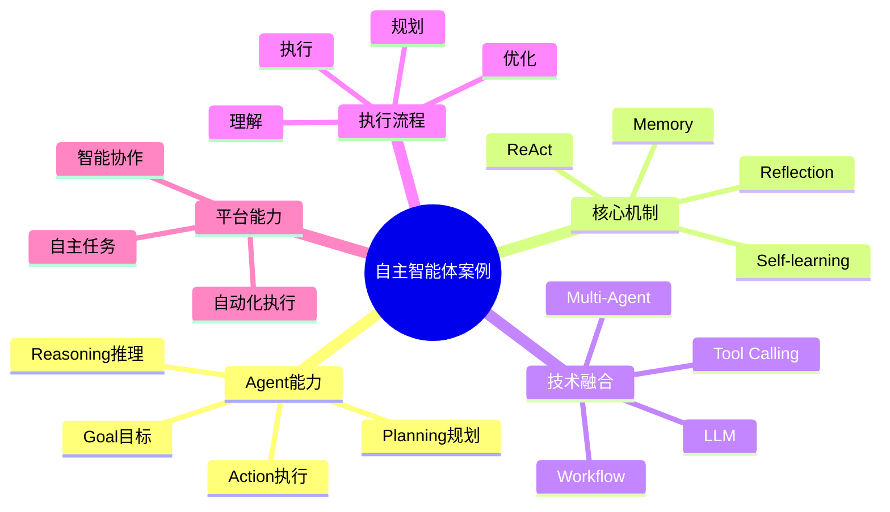

# 140-ai-agent-autonomous-agent-case.md（自主智能体架构案例）

> 本文用于系统架构设计师考试案例分析专题 V2 复习。
>
> 本篇重点整理 Autonomous Agent（自主智能体）架构设计案例，包括目标驱动、任务规划、推理决策、ReAct模式、工具调用、Memory记忆、环境感知、自我反思、多智能体协作以及企业自主智能体平台建设。

---

# 目录

1. 自主智能体案例概述
2. Autonomous Agent基本概念
3. 自主智能体建设挑战案例
4. 自主智能体总体架构案例
5. Goal目标驱动Agent案例
6. Task任务规划Agent案例
7. Reasoning推理Agent案例
8. Planning计划生成Agent案例
9. ReAct智能体模式案例
10. Tool Calling执行Agent案例
11. Memory记忆管理Agent案例
12. Environment环境感知Agent案例
13. Reflection自我反思Agent案例
14. Self-learning自学习Agent案例
15. 自主任务执行案例
16. 多智能体协作案例
17. Autonomous Agent安全治理案例
18. 自主智能体运营管理案例
19. 企业自主智能体平台案例
20. 自主智能体演进案例
21. 案例分析答题模板
22. 高频考点
23. 易错点
24. Mermaid知识结构图
25. 本节小结

---

# 1. 自主智能体案例概述

自主智能体：

> 能够根据目标自主理解任务、制定计划、调用工具、执行行动并根据反馈持续优化的AI Agent系统。

传统AI：

```text
用户问题

↓

AI回答

↓

任务结束
```

自主智能体：

```text
目标输入

↓

理解目标

↓

任务规划

↓

执行任务

↓

结果评估

↓

持续优化
```

---

# 2. Autonomous Agent基本概念

核心能力：

- 目标理解；
- 任务规划；
- 推理决策；
- 工具执行；
- 状态记忆；
- 自我优化。

特点：

- 自主性；
- 适应性；
- 连续性；
- 可扩展性。

---

# 3. 自主智能体建设挑战案例

主要问题：

- 复杂任务难以自动完成；
- 执行依赖人工；
- 缺少反馈机制；
- 长流程稳定性不足。

---

# 4. 自主智能体总体架构案例

```text
用户目标

↓

Goal理解层

↓

Planning规划层

↓

Reasoning推理层

↓

Action执行层

↓

Memory记忆层

↓

Environment环境层
```

---

# 5. Goal目标驱动Agent案例

能力：

理解：

- 用户目标；
- 业务目标；
- 系统目标。

例如：

目标：

> 自动完成季度销售分析报告。

拆解：

- 获取数据；
- 分析趋势；
- 生成报告。

---

# 6. Task任务规划Agent案例

能力：

将复杂目标拆解：

```text
目标

↓

任务分解

↓

执行步骤

↓

任务完成
```

---

# 7. Reasoning推理Agent案例

能力：

进行：

- 逻辑分析；
- 问题判断；
- 决策推理。

---

# 8. Planning计划生成Agent案例

能力：

生成：

- 执行计划；
- 操作顺序；
- 资源安排。

---

# 9. ReAct智能体模式案例

ReAct：

> Reasoning + Acting

流程：

```text
思考

↓

行动

↓

观察结果

↓

再次思考
```

优势：

- 动态调整；
- 支持工具调用。

---

# 10. Tool Calling执行Agent案例

能力：

调用：

- API；
- 数据库；
- 软件系统；
- 外部服务。

流程：

```text
计划

↓

调用工具

↓

获取结果

↓

继续执行
```

---

# 11. Memory记忆管理Agent案例

保存：

- 历史任务；
- 用户偏好；
- 执行经验。

类型：

- 短期记忆；
- 长期记忆。

---

# 12. Environment环境感知Agent案例

能力：

感知：

- 系统状态；
- 外部环境；
- 执行结果。

---

# 13. Reflection自我反思Agent案例

能力：

分析：

- 执行是否成功；
- 存在哪些问题；
- 如何优化。

流程：

```text
执行

↓

评价

↓

改进

↓

重新执行
```

---

# 14. Self-learning自学习Agent案例

能力：

根据：

- 历史经验；
- 用户反馈；
- 执行结果；

优化行为。

---

# 15. 自主任务执行案例

例如：

自动生成项目报告：

```text
获取项目数据

↓

分析数据

↓

生成报告

↓

发送通知
```

---

# 16. 多智能体协作案例

架构：

```text
规划Agent

↓

执行Agent

↓

分析Agent

↓

反馈Agent
```

实现：

复杂任务协同完成。

---

# 17. Autonomous Agent安全治理案例

安全：

- 权限控制；
- 工具调用限制；
- 数据保护；
- 行为审计。

---

# 18. 自主智能体运营管理案例

指标：

- 任务完成率；
- 执行准确率；
- 自动化程度；
- 用户满意度。

---

# 19. 企业自主智能体平台案例

平台能力：

```text
目标管理

+

任务规划

+

工具调用

+

执行监控

+

反馈优化
```

---

# 20. 自主智能体演进案例

```text
规则系统

↓

聊天机器人

↓

AI助手

↓

Agent智能体

↓

自主智能系统
```

---

# 案例分析答题模板

## AI只能回答不能执行

> 引入自主智能体，通过规划和工具调用实现任务自动执行。

## 复杂任务步骤多

> 建设任务规划Agent，实现目标拆解和流程编排。

## 执行结果无法优化

> 引入Reflection反馈机制，实现自主评估和持续优化。

## 构建企业自主智能体

> 建设Autonomous Agent平台，实现目标驱动、任务规划、执行反馈全过程智能化。

---

# 高频考点

重点掌握：

1. 自主智能体总体架构；
2. Goal目标驱动机制；
3. Planning任务规划；
4. ReAct执行模式；
5. Tool Calling工具调用；
6. Reflection反馈优化。

---

# 易错点

|易错知识|正确理解|
|-|-|
|自主智能体只是聊天机器人|自主智能体具备规划和执行能力|
|大模型可以直接完成所有任务|复杂任务需要Agent机制辅助|
|执行一次即可结束|需要反馈和持续优化|
|Agent可以无限调用工具|企业环境必须进行权限控制|

---

# Mermaid知识结构图



---

# 本节小结

自主智能体架构案例核心：

> 通过大语言模型、目标驱动机制、任务规划、工具调用、记忆和反馈优化结合，实现复杂任务自主执行和持续优化。

案例分析重点：

- 理解 Autonomous Agent 架构；
- 掌握Goal、Planning、Action执行模式；
- 理解ReAct和Reflection机制；
- 掌握企业自主智能体平台建设路径。
