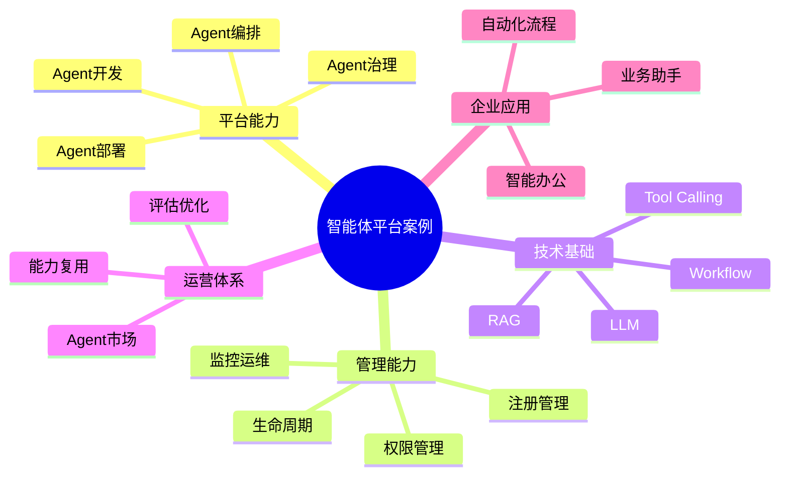

# 142-ai-agent-agent-platform-case.md（智能体平台架构案例）

> 本文用于系统架构设计师考试案例分析专题 V2 复习。
>
> 本篇重点整理 Agent Platform（智能体平台）架构设计案例，包括Agent开发框架、Agent运行环境、生命周期管理、编排引擎、工具管理、知识管理、模型管理、权限治理、监控运维以及企业级智能体平台建设。

---

# 目录

1. 智能体平台案例概述
2. Agent Platform基本概念
3. 企业智能体平台建设挑战案例
4. 智能体平台总体架构案例
5. Agent开发框架案例
6. Agent运行环境案例
7. Agent生命周期管理案例
8. Agent注册管理案例
9. Agent编排引擎案例
10. Agent工具管理平台案例
11. Agent知识管理平台案例
12. Agent模型管理案例
13. Agent权限管理案例
14. Agent监控运维案例
15. Agent评估优化案例
16. Agent市场案例
17. 企业级Agent平台案例
18. Agent Platform安全治理案例
19. 智能体平台运营管理案例
20. 智能体平台演进案例
21. 案例分析答题模板
22. 高频考点
23. 易错点
24. Mermaid知识结构图
25. 本节小结

---

# 1. 智能体平台案例概述

智能体平台：

> 面向企业AI Agent应用建设，通过统一的平台能力支持Agent开发、部署、运行、管理和治理，实现智能体规模化应用的平台体系。

传统AI应用：

```text
业务系统

↓

单独开发AI能力

↓

独立部署
```

智能体平台：

```text
业务需求

↓

Agent平台

↓

Agent开发

↓

Agent部署

↓

Agent运行治理
```

---

# 2. Agent Platform基本概念

核心能力：

- Agent创建；
- Agent运行；
- Agent编排；
- Agent治理；
- Agent复用。

特点：

- 平台化；
- 服务化；
- 可扩展；
- 可治理。

---

# 3. 企业智能体平台建设挑战案例

主要问题：

- Agent数量快速增长；
- Agent开发重复；
- Agent安全风险增加；
- Agent质量难保证。

---

# 4. 智能体平台总体架构案例

```text
企业用户

↓

Agent应用层

↓

Agent平台服务层

↓

Agent运行管理层

↓

模型与知识层

↓

基础设施层
```

---

# 5. Agent开发框架案例

能力：

提供：

- Agent模板；
- Prompt管理；
- 工作流设计；
- 工具接入。

目标：

降低Agent开发成本。

---

# 6. Agent运行环境案例

负责：

- Agent执行；
- 状态管理；
- 任务调度。

包括：

- Runtime；
- 容器环境；
- 执行引擎。

---

# 7. Agent生命周期管理案例

生命周期：

```text
创建

↓

测试

↓

发布

↓

运行

↓

升级

↓

下线
```

---

# 8. Agent注册管理案例

能力：

管理：

- Agent名称；
- Agent版本；
- Agent能力描述；
- Agent运行状态。

---

# 9. Agent编排引擎案例

能力：

实现：

- 多Agent组合；
- 工作流编排；
- 任务调度。

流程：

```text
任务

↓

编排引擎

↓

多个Agent协同

↓

完成目标
```

---

# 10. Agent工具管理平台案例

管理：

- API工具；
- 数据工具；
- 企业系统接口。

作用：

扩展Agent执行能力。

---

# 11. Agent知识管理平台案例

提供：

- 企业知识库；
- RAG检索；
- 知识更新。

支持Agent获取业务知识。

---

# 12. Agent模型管理案例

管理：

- 大语言模型；
- 嵌入模型；
- 推理服务。

支持：

- 模型切换；
- 模型优化；
- 服务治理。

---

# 13. Agent权限管理案例

控制：

- 用户权限；
- Agent权限；
- 工具权限；
- 数据权限。

---

# 14. Agent监控运维案例

监控：

- 调用次数；
- 响应时间；
- 错误率；
- 资源使用情况。

---

# 15. Agent评估优化案例

指标：

- 任务成功率；
- 回答准确率；
- 用户满意度；
- 成本效率。

---

# 16. Agent市场案例

能力：

提供：

- Agent共享；
- Agent复用；
- Agent发布。

类似：

企业内部Agent应用商店。

---

# 17. 企业级Agent平台案例

平台能力：

```text
Agent开发

+

Agent部署

+

Agent编排

+

Agent治理

+

Agent运营
```

---

# 18. Agent Platform安全治理案例

安全：

- 身份认证；
- 权限控制；
- 数据保护；
- 操作审计。

---

# 19. 智能体平台运营管理案例

指标：

- Agent数量；
- 调用量；
- 成功率；
- 用户反馈。

---

# 20. 智能体平台演进案例

```text
单AI应用

↓

AI服务平台

↓

Agent平台

↓

企业智能体生态
```

---

# 案例分析答题模板

## Agent开发成本高

> 建设Agent开发平台，提供模板、工具和统一开发环境。

## 多Agent管理困难

> 建立Agent生命周期管理体系，实现统一管理。

## Agent无法协同

> 引入Agent编排引擎，实现多Agent任务协作。

## 企业规模化应用AI

> 构建企业级Agent平台，实现开发、部署、运行和治理一体化。

---

# 高频考点

重点掌握：

1. 智能体平台总体架构；
2. Agent生命周期管理；
3. Agent编排引擎；
4. 工具和知识管理；
5. Agent监控治理；
6. 企业级Agent平台建设。

---

# 易错点

|易错知识|正确理解|
|-|-|
|Agent平台只是运行环境|还包括开发、治理和运营能力|
|Agent数量越多越好|需要统一管理和复用|
|Agent无需生命周期管理|企业环境必须管理创建、发布、升级和下线|
|平台只关注模型|还需要工具、知识、权限和监控|

---

# Mermaid知识结构图



---

# 本节小结

智能体平台架构案例核心：

> 通过统一Agent开发、运行、编排、治理和运营平台，实现企业智能体规模化建设和持续管理。

案例分析重点：

- 理解 Agent Platform 架构；
- 掌握Agent生命周期管理；
- 理解Agent编排和治理机制；
- 掌握企业级智能体平台建设路径。
