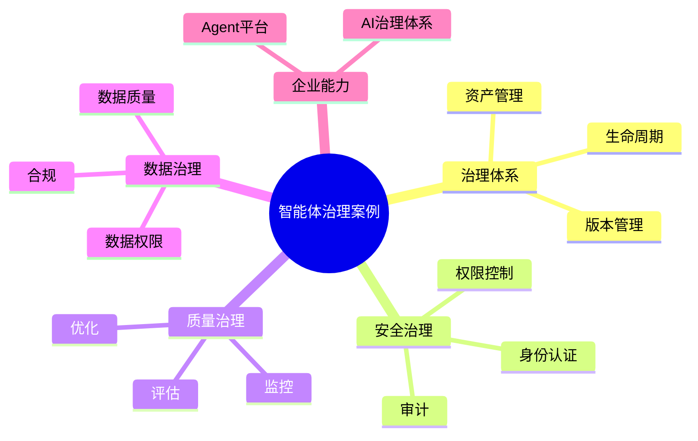

# 143-ai-agent-agent-governance-case.md（智能体治理架构案例）

> 本文用于系统架构设计师考试案例分析专题 V2 复习。
>
> 本篇重点整理 Agent Governance（智能体治理）架构设计案例，包括Agent生命周期治理、权限管理、安全控制、行为审计、质量评估、风险管理、合规治理以及企业AI治理体系建设。

---

# 目录

1. 智能体治理案例概述
2. Agent Governance基本概念
3. 企业智能体治理建设挑战案例
4. 智能体治理总体架构案例
5. Agent生命周期治理案例
6. Agent注册与资产管理案例
7. Agent权限治理案例
8. Agent身份认证案例
9. Agent行为审计案例
10. Agent安全防护案例
11. Agent风险评估案例
12. Agent质量评估案例
13. Agent性能监控案例
14. Agent版本管理案例
15. Agent合规治理案例
16. Agent数据治理案例
17. 多智能体治理案例
18. 企业AI治理平台案例
19. Agent Governance安全体系案例
20. 智能体治理演进案例
21. 案例分析答题模板
22. 高频考点
23. 易错点
24. Mermaid知识结构图
25. 本节小结

---

# 1. 智能体治理案例概述

智能体治理：

> 面向企业AI Agent应用，通过制度、流程、技术平台和安全机制，实现智能体全生命周期可管理、可控制、可审计的治理体系。

传统AI治理：

```text
模型管理

↓

应用部署

↓

运行监控
```

智能体治理：

```text
Agent创建

↓

Agent发布

↓

Agent运行

↓

Agent评估

↓

Agent优化

↓

Agent退出
```

---

# 2. Agent Governance基本概念

核心能力：

- 生命周期管理；
- 权限控制；
- 风险管理；
- 安全审计；
- 质量评估。

特点：

- 可控；
- 可解释；
- 可追踪；
- 可治理。

---

# 3. 企业智能体治理建设挑战案例

主要问题：

- Agent数量快速增长；
- Agent权限复杂；
- 输出质量不稳定；
- 缺少监管体系。

---

# 4. 智能体治理总体架构案例

```text
企业治理体系

↓

Agent治理平台

↓

生命周期管理

↓

安全治理

↓

质量评估

↓

运行监控

↓

Agent应用
```

---

# 5. Agent生命周期治理案例

生命周期：

```text
设计

↓

开发

↓

测试

↓

发布

↓

运行

↓

升级

↓

下线
```

治理内容：

- 审批；
- 版本；
- 责任人；
- 使用范围。

---

# 6. Agent注册与资产管理案例

管理：

- Agent名称；
- Agent版本；
- 功能描述；
- 使用范围；
- 所属部门。

目标：

建立Agent资产目录。

---

# 7. Agent权限治理案例

控制：

- 用户权限；
- Agent权限；
- 工具权限；
- 数据权限。

原则：

最小权限原则。

---

# 8. Agent身份认证案例

确认：

- 用户身份；
- Agent身份；
- 服务身份。

方式：

- Token；
- API Key；
- 企业身份认证。

---

# 9. Agent行为审计案例

记录：

- 调用记录；
- 工具使用；
- 数据访问；
- 输出结果。

作用：

实现行为追踪。

---

# 10. Agent安全防护案例

安全措施：

- 输入过滤；
- 输出检测；
- 敏感信息保护；
- Prompt攻击防护。

---

# 11. Agent风险评估案例

评估：

- 数据风险；
- 模型风险；
- 业务风险；
- 安全风险。

---

# 12. Agent质量评估案例

指标：

- 准确率；
- 成功率；
- 稳定性；
- 用户满意度。

---

# 13. Agent性能监控案例

监控：

- 响应时间；
- 调用次数；
- 资源消耗；
- 错误率。

---

# 14. Agent版本管理案例

管理：

- Prompt版本；
- 模型版本；
- 工具版本；
- Agent配置。

---

# 15. Agent合规治理案例

包括：

- 数据合规；
- 隐私保护；
- 行业规范；
- 审计要求。

---

# 16. Agent数据治理案例

管理：

- 数据来源；
- 数据权限；
- 数据质量；
- 数据生命周期。

---

# 17. 多智能体治理案例

统一治理：

```text
协调Agent

↓

专业Agent

↓

工具Agent

↓

数据Agent
```

管理：

- 权限；
- 通信；
- 审计。

---

# 18. 企业AI治理平台案例

平台能力：

```text
Agent资产管理

+

权限治理

+

安全监控

+

质量评估

+

运行审计
```

---

# 19. Agent Governance安全体系案例

体系：

```text
身份安全

↓

权限安全

↓

数据安全

↓

运行安全

↓

审计安全
```

---

# 20. 智能体治理演进案例

```text
无治理AI应用

↓

AI管理平台

↓

Agent治理平台

↓

企业AI治理体系
```

---

# 案例分析答题模板

## Agent数量快速增长

> 建设Agent资产管理体系，实现智能体统一登记和生命周期管理。

## Agent存在安全风险

> 建立权限控制和行为审计机制，保障智能体安全运行。

## 输出质量无法保证

> 建立Agent质量评估体系，实现智能体效果持续优化。

## 企业规模化应用AI

> 构建Agent Governance平台，实现智能体开发、运行、安全和治理一体化。

---

# 高频考点

重点掌握：

1. 智能体治理总体架构；
2. Agent生命周期管理；
3. 权限和身份治理；
4. 安全审计机制；
5. Agent质量评估；
6. 企业AI治理平台。

---

# 易错点

|易错知识|正确理解|
|-|-|
|Agent治理只是安全管理|还包括生命周期、质量和运营管理|
|Agent上线后无需管理|企业环境需要持续治理|
|只控制用户权限即可|Agent自身权限和工具权限同样重要|
|输出质量无法评价|需要建立评估指标体系|

---

# Mermaid知识结构图



---

# 本节小结

智能体治理架构案例核心：

> 通过生命周期管理、安全控制、权限治理、质量评估和运行监控，实现企业智能体安全、可靠、可持续运行。

案例分析重点：

- 理解 Agent Governance 架构；
- 掌握智能体生命周期治理；
- 理解安全和权限控制机制；
- 掌握企业AI治理体系建设路径。
