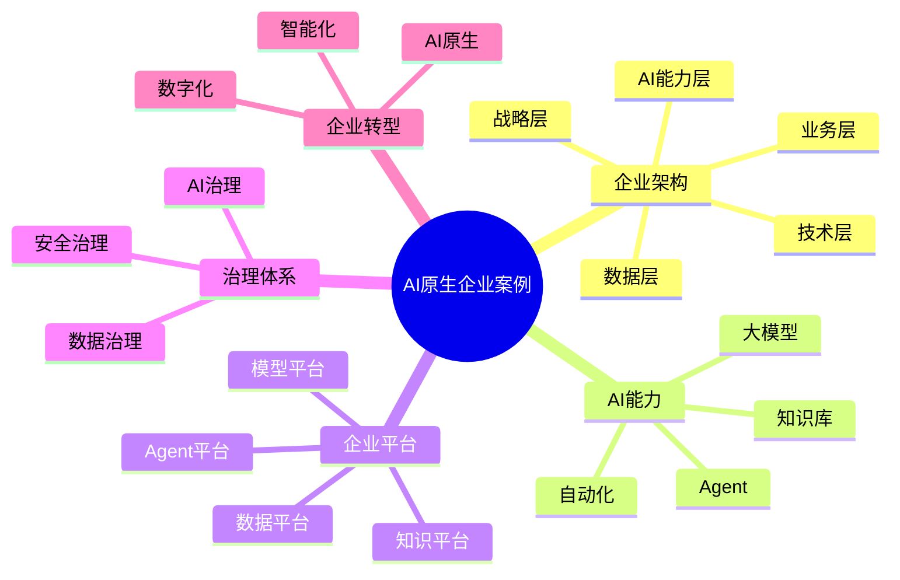

# 149-ai-agent-ai-native-enterprise-case.md（AI原生企业架构案例）

> 本文用于系统架构设计师考试案例分析专题 V2 复习。
>
> 本篇重点整理 AI Native Enterprise（AI原生企业）架构设计案例，包括AI驱动业务架构、企业Agent体系、AI能力中台、企业知识智能体系、数据智能体系、AI治理体系以及企业AI原生转型建设。

---

# 目录

1. AI原生企业案例概述
2. AI Native Enterprise基本概念
3. 企业AI原生转型挑战案例
4. AI原生企业总体架构案例
5. AI驱动业务架构案例
6. AI企业能力架构案例
7. 企业Agent体系架构案例
8. AI能力中台案例
9. 企业知识智能体系案例
10. 企业数据智能体系案例
11. AI业务流程自动化案例
12. AI智能决策案例
13. AI组织协同案例
14. AI原生应用生态案例
15. AI原生技术架构案例
16. AI原生企业平台案例
17. AI治理体系案例
18. AI安全体系案例
19. AI原生企业演进案例
20. 案例分析答题模板
21. 高频考点
22. 易错点
23. Mermaid知识结构图
24. 本节小结

---

# 1. AI原生企业案例概述

AI原生企业：

> 以人工智能作为企业核心生产力，通过AI重新设计业务、组织、流程和技术体系，实现企业智能化运营的新型企业形态。

传统企业：

```text
业务系统

↓

人工操作

↓

数据分析

↓

业务决策
```

AI原生企业：

```text
业务需求

↓

AI理解

↓

Agent执行

↓

智能决策

↓

持续优化
```

---

# 2. AI Native Enterprise基本概念

核心特点：

- AI成为企业基础能力；
- Agent参与业务运行；
- 数据驱动决策；
- 知识持续沉淀；
- 流程自动优化。

---

# 3. 企业AI原生转型挑战案例

主要问题：

- 数据孤岛；
- 业务流程复杂；
- AI应用碎片化；
- 企业治理不足。

---

# 4. AI原生企业总体架构案例

```text
企业战略层

↓

业务架构层

↓

AI能力层

↓

数据知识层

↓

技术基础设施层

↓

治理体系
```

---

# 5. AI驱动业务架构案例

传统：

```text
业务流程

↓

人工执行
```

AI原生：

```text
业务流程

↓

AI Agent

↓

自动执行

↓

结果反馈
```

---

# 6. AI企业能力架构案例

企业能力：

- AI服务能力；
- 数据能力；
- 知识能力；
- Agent能力；
- 自动化能力。

---

# 7. 企业Agent体系架构案例

体系：

```text
企业级Agent平台

↓

业务Agent

↓

专业Agent

↓

工具Agent

↓

数据Agent
```

---

# 8. AI能力中台案例

能力：

提供：

- 模型服务；
- Agent服务；
- 知识服务；
- 数据服务。

作用：

支撑企业AI应用快速建设。

---

# 9. 企业知识智能体系案例

包括：

- 企业知识库；
- RAG系统；
- 知识图谱；
- 智能搜索。

目标：

实现知识资产化。

---

# 10. 企业数据智能体系案例

建设：

- 数据治理；
- 数据分析；
- 数据智能。

支撑：

AI决策。

---

# 11. AI业务流程自动化案例

传统：

```text
人工申请

↓

人工审批

↓

人工处理
```

AI：

```text
用户需求

↓

Agent分析

↓

自动执行

↓

结果反馈
```

---

# 12. AI智能决策案例

能力：

分析：

- 企业数据；
- 市场信息；
- 历史经验。

输出：

智能建议。

---

# 13. AI组织协同案例

应用：

- AI助手；
- 企业知识助手；
- 智能办公。

提升：

组织效率。

---

# 14. AI原生应用生态案例

生态：

```text
员工

↓

AI助手

↓

业务Agent

↓

企业平台
```

---

# 15. AI原生技术架构案例

包括：

- 云原生；
- 大模型；
- Agent平台；
- 数据平台；
- 安全体系。

---

# 16. AI原生企业平台案例

平台能力：

```text
模型管理

+

Agent管理

+

知识管理

+

数据管理

+

应用管理
```

---

# 17. AI治理体系案例

治理：

- AI生命周期；
- 模型治理；
- 数据治理；
- Agent治理。

---

# 18. AI安全体系案例

安全：

- 数据安全；
- 模型安全；
- Agent安全；
- 访问控制。

---

# 19. AI原生企业演进案例

```text
传统企业

↓

数字化企业

↓

智能化企业

↓

AI原生企业
```

---

# 案例分析答题模板

## 企业AI应用分散

> 建设企业级AI能力平台，实现模型、Agent、知识和数据能力统一管理。

## 企业业务效率不足

> 引入AI Agent，实现业务流程自动化和智能决策。

## 企业知识无法复用

> 建设企业知识智能体系，通过RAG实现知识共享和智能检索。

## 企业智能化转型

> 构建AI原生企业架构，实现业务、数据、技术和治理体系融合。

---

# 高频考点

重点掌握：

1. AI原生企业总体架构；
2. 企业Agent体系；
3. AI能力中台；
4. 企业知识和数据智能体系；
5. AI治理与安全体系；
6. 企业AI转型路径。

---

# 易错点

|易错知识|正确理解|
|-|-|
|AI原生企业只是增加AI应用|需要重新设计业务、组织和技术体系|
|只建设模型平台即可|还需要Agent、知识、数据和治理体系|
|AI转型只关注技术|需要结合业务架构和组织流程|
|AI应用无需治理|企业级应用必须具备治理和安全能力|

---

# Mermaid知识结构图



---

# 本节小结

AI原生企业架构案例核心：

> 通过AI能力、Agent体系、数据知识体系和治理体系融合，推动企业从数字化向智能化和AI原生方向演进。

案例分析重点：

- 理解 AI Native Enterprise 架构；
- 掌握企业Agent体系设计；
- 理解AI能力中台建设；
- 掌握企业AI智能化转型路径。
