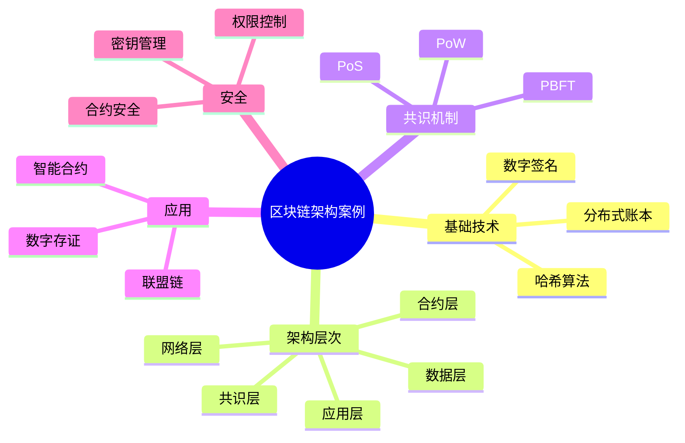

# 29-blockchain-case.md（区块链架构案例）

> 本文用于系统架构设计师考试案例分析专题 V2 复习。

# 目录

1. 区块链案例概述
2. 区块链基本概念
3. 区块链技术特点案例
4. 区块链整体架构案例
5. 区块链数据结构案例
6. 区块链密码技术案例
7. 共识机制案例
8. PoW工作量证明案例
9. PoS权益证明案例
10. PBFT拜占庭容错案例
11. 联盟链架构案例
12. 智能合约案例
13. 区块链节点架构案例
14. 区块链与分布式系统结合案例
15. 区块链安全案例
16. 区块链应用案例
17. 区块链与云计算结合案例
18. 企业区块链平台案例
19. 案例分析答题模板
20. 高频考点
21. 易错点
22. Mermaid知识结构图
23. 本节小结

---

# 1. 区块链案例概述

区块链主要解决：

- 多方协作中的信任问题；
- 数据不可篡改；
- 信息透明共享；
- 去中心化管理。

核心思想：

> 通过分布式账本、密码技术和共识机制，在多个参与方之间建立可信的数据共享体系。

典型架构：

```text
业务应用

↓

智能合约

↓

区块链网络

↓

共识机制

↓

分布式账本
```

---

# 2. 区块链基本概念

区块链是一种由多个节点共同维护的分布式数据库技术。

核心组成：

- 区块；
- 链式结构；
- 节点；
- 共识机制；
- 智能合约。

---

# 3. 区块链技术特点

## 去中心化

多个节点共同维护数据。

## 不可篡改

利用哈希算法和链式结构保证数据完整性。

## 可追溯

交易记录可查询。

## 透明可信

参与节点共享账本。

---

# 4. 区块链整体架构

典型分层：

```text
应用层

↓

合约层

↓

共识层

↓

网络层

↓

数据层
```

---

# 5. 区块链数据结构

区块结构：

```text
Block

├── Block Header
│   ├── Previous Hash
│   ├── Timestamp
│   └── Nonce
│
└── Transactions
```

---

# 6. 区块链密码技术

主要包括：

- 哈希算法；
- 非对称加密；
- 数字签名。

作用：

- 身份认证；
- 数据完整性验证；
- 防止篡改。

---

# 7. 共识机制案例

共识机制用于：

- 保证节点一致性；
- 防止恶意节点；
- 维护账本可靠。

常见机制：

- PoW；
- PoS；
- PBFT。

---

# 8. PoW工作量证明

特点：

- 计算竞争记账权；
- 安全性较高。

缺点：

- 能耗较高；
- 性能有限。

---

# 9. PoS权益证明

特点：

- 根据权益选择节点；
- 能耗较低；
- 效率更高。

---

# 10. PBFT拜占庭容错

适用于：

- 联盟链；
- 企业场景。

特点：

- 高性能；
- 低延迟。

---

# 11. 联盟链架构案例

联盟链：

> 多个组织共同维护的区块链。

特点：

- 权限可控；
- 性能较高；
- 适合企业应用。

---

# 12. 智能合约案例

智能合约：

> 自动执行的程序化合同。

流程：

```text
交易请求

↓

智能合约执行

↓

状态更新

↓

写入区块链
```

---

# 13. 区块链节点架构

节点类型：

- 全节点；
- 轻节点；
- 共识节点。

---

# 14. 区块链与分布式系统结合

结合：

- 分布式存储；
- 分布式计算；
- 共识算法。

优势：

- 提升可信度；
- 支撑多方协作。

---

# 15. 区块链安全案例

安全措施：

- 数字证书；
- 密钥管理；
- 数据加密；
- 权限控制；
- 智能合约审计。

---

# 16. 区块链应用案例

典型应用：

- 供应链金融；
- 数字存证；
- 跨组织协作。

---

# 17. 区块链与云计算结合

架构：

```text
业务系统

↓

区块链服务平台

↓

云计算资源

↓

存储与网络
```

优势：

- 快速部署；
- 弹性扩展。

---

# 18. 企业区块链平台案例

```text
业务应用

↓

智能合约平台

↓

联盟链网络

↓

分布式账本

↓

云基础设施
```

---

# 19. 案例分析答题模板

## 多方缺乏信任

采用区块链技术，通过分布式账本和共识机制建立可信协作环境。

## 数据需要防篡改

利用哈希算法、链式结构和数字签名保证数据完整性。

## 多组织共享数据

采用联盟链架构，通过权限控制和共识机制实现可信数据共享。

## 自动执行业务规则

采用智能合约技术，实现业务规则自动执行。

---

# 20. 高频考点

重点：

1. 区块链架构；
2. 密码技术；
3. 共识机制；
4. 联盟链；
5. 智能合约；
6. 区块链安全。

---

# 21. 易错点

| 易错知识 | 正确理解 |
|---|---|
| 区块链一定完全去中心化 | 联盟链通常是部分去中心化 |
| 数据绝对不可修改 | 实际是修改成本极高 |
| 共识只有PoW | 不同场景选择不同机制 |
| 智能合约等于合同 | 智能合约是可执行程序 |

---

# 22. Mermaid知识结构图



---

# 23. 本节小结

区块链案例核心：

> 通过分布式账本、密码技术和共识机制，在多方参与环境中建立可信、安全的数据共享体系。

案例分析重点：

- 根据业务场景选择区块链架构；
- 根据参与主体选择公链或联盟链；
- 利用密码技术保证数据安全；
- 利用智能合约实现业务自动化；
- 结合云计算和分布式系统构建企业级区块链平台。
