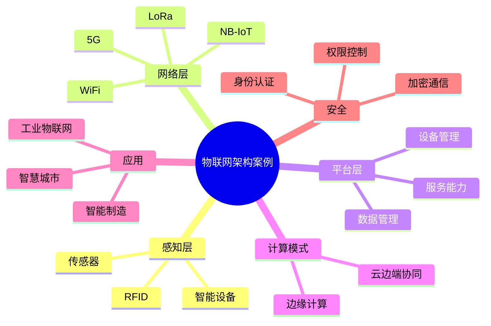

# 30-iot-architecture-case.md（物联网架构案例）

> 本文用于系统架构设计师考试案例分析专题 V2 复习。
>
> 本篇重点整理物联网系统架构设计相关案例，包括物联网体系架构、感知层、网络层、平台层、应用层、MQTT、边缘计算、云边端协同、物联网安全、工业物联网、智慧城市、AI与IoT结合以及企业物联网平台案例。

---

# 目录

1. 物联网案例概述
2. 物联网基本概念
3. 物联网体系架构案例
4. 感知层架构案例
5. 网络传输层案例
6. 平台服务层案例
7. MQTT消息通信案例
8. 边缘计算架构案例
9. 云边端协同架构案例
10. 物联网数据处理案例
11. 物联网安全架构案例
12. 工业物联网案例
13. 智慧城市案例
14. 物联网与AI结合案例
15. 物联网与区块链结合案例
16. 企业物联网平台案例
17. 案例分析答题模板
18. 高频考点
19. 易错点
20. Mermaid知识结构图
21. 本节小结

---

# 1. 物联网案例概述

物联网主要解决：

- 设备互联；
- 数据采集；
- 智能控制；
- 自动化管理。

核心思想：

> 通过传感器、通信网络和数据处理平台，实现物理世界与数字世界的连接。

典型架构：

```text
物理设备

↓

感知层

↓

网络层

↓

平台层

↓

应用层
```

---

# 2. 物联网基本概念

物联网：

> 利用各种信息传感设备，通过网络连接，实现物与物、人与物之间的信息交互。

主要组成：

- 感知设备；
- 通信网络；
- 数据平台；
- 应用系统。

---

# 3. 物联网体系架构案例（★★★★★）

经典四层架构：

```text
应用层

↓

平台服务层

↓

网络传输层

↓

感知层
```

## 感知层

负责：

- 数据采集；
- 环境感知；
- 设备控制。

设备：

- 传感器；
- RFID；
- 摄像头；
- 智能终端。

## 网络层

负责：

- 数据传输；
- 设备通信。

技术：

- 5G；
- WiFi；
- NB-IoT；
- LoRa。

## 平台层

负责：

- 数据管理；
- 设备管理；
- 服务能力提供。

## 应用层

提供：

- 智慧城市；
- 智能制造；
- 智慧医疗。

---

# 4. 感知层架构案例

感知层：

```text
传感器

↓

采集模块

↓

控制设备
```

作用：

- 获取环境信息；
- 转换物理信号。

---

# 5. 网络传输层案例

网络层解决：

- 数据可靠传输；
- 设备连接。

通信方式：

## 有线通信

包括：

- 以太网；
- 光纤。

## 无线通信

包括：

- WiFi；
- 蓝牙；
- 5G；
- NB-IoT；
- LoRa。

---

# 6. 平台服务层案例

物联网平台负责：

- 设备接入；
- 数据管理；
- 规则处理；
- 服务开放。

架构：

```text
设备

↓

IoT平台

↓

业务系统
```

---

# 7. MQTT消息通信案例（★★★★★）

MQTT：

一种轻量级消息协议。

特点：

- 开销小；
- 支持低带宽网络；
- 适合设备通信。

模型：

```text
发布者

↓

Broker

↓

订阅者
```

---

# 8. 边缘计算架构案例（★★★★★）

边缘计算：

> 将计算能力部署到靠近数据源的位置。

解决：

- 延迟高；
- 网络压力大；
- 实时性不足。

架构：

```text
设备

↓

边缘节点

↓

云平台

↓

业务应用
```

---

# 9. 云边端协同架构案例（★★★★★）

典型架构：

```text
端

↓

边

↓

云
```

职责：

## 端

负责：

- 数据采集；
- 简单控制。

## 边

负责：

- 实时计算；
- 数据过滤。

## 云

负责：

- 大数据分析；
- 模型训练；
- 全局管理。

---

# 10. 物联网数据处理案例

流程：

```text
设备数据

↓

数据采集

↓

数据存储

↓

数据分析

↓

智能决策
```

结合：

- 大数据；
- AI分析。

---

# 11. 物联网安全架构案例（★★★★★）

安全问题：

- 设备数量巨大；
- 通信环境复杂；
- 数据敏感。

措施：

## 设备安全

- 身份认证；
- 安全启动。

## 通信安全

- 数据加密；
- 安全协议。

## 平台安全

- 权限控制；
- 日志审计。

---

# 12. 工业物联网案例（★★★★★）

应用：

- 智能制造；
- 设备监控；
- 自动生产。

架构：

```text
工业设备

↓

边缘网关

↓

工业互联网平台

↓

生产管理系统
```

---

# 13. 智慧城市案例

应用：

- 智能交通；
- 环境监测；
- 智慧能源。

架构：

```text
城市设备

↓

IoT平台

↓

城市管理系统
```

---

# 14. 物联网与AI结合案例（★★★★★）

架构：

```text
传感器

↓

IoT平台

↓

AI模型

↓

智能决策
```

应用：

- 预测维护；
- 智能识别；
- 自动控制。

---

# 15. 物联网与区块链结合案例

作用：

- 数据可信；
- 设备身份认证；
- 多方协作。

应用：

- 供应链；
- 智能制造。

---

# 16. 企业物联网平台案例

平台结构：

```text
设备层

↓

连接管理

↓

数据平台

↓

AI分析

↓

业务应用
```

能力：

- 设备管理；
- 数据管理；
- 应用开发。

---

# 17. 案例分析答题模板

## 大量设备接入

> 采用物联网平台和设备管理机制，实现海量设备统一接入和管理。

## 实时控制要求

> 采用边缘计算架构，将计算能力下沉到设备附近，降低响应延迟。

## 数据规模快速增长

> 结合云计算和大数据技术，实现物联网数据存储、分析和价值挖掘。

## 设备安全要求

> 采用身份认证、通信加密和访问控制机制，提高物联网系统安全性。

---

# 18. 高频考点

重点掌握：

1. 物联网四层架构；
2. 感知层；
3. 网络通信技术；
4. MQTT；
5. 边缘计算；
6. 云边端协同；
7. 物联网安全；
8. 工业物联网。

---

# 19. 易错点

| 易错知识 | 正确理解 |
|---|---|
| 物联网只有设备连接 | 还包括数据处理和业务应用 |
| 边缘计算替代云计算 | 边缘和云计算通常协同工作 |
| 设备接入后无需安全管理 | IoT设备同样需要认证和保护 |
| MQTT是一种数据库 | MQTT是消息通信协议 |

---

# 20. Mermaid知识结构图



---

# 21. 本节小结

物联网案例核心：

> 通过感知设备、通信网络、计算平台和业务应用，实现物理世界数据采集、传输、分析和智能控制。

案例分析重点：

- 根据设备规模选择接入方案；
- 根据实时性要求设计边缘计算架构；
- 结合云计算、大数据和AI实现数据价值挖掘；
- 通过安全机制保障设备和数据可靠运行。
