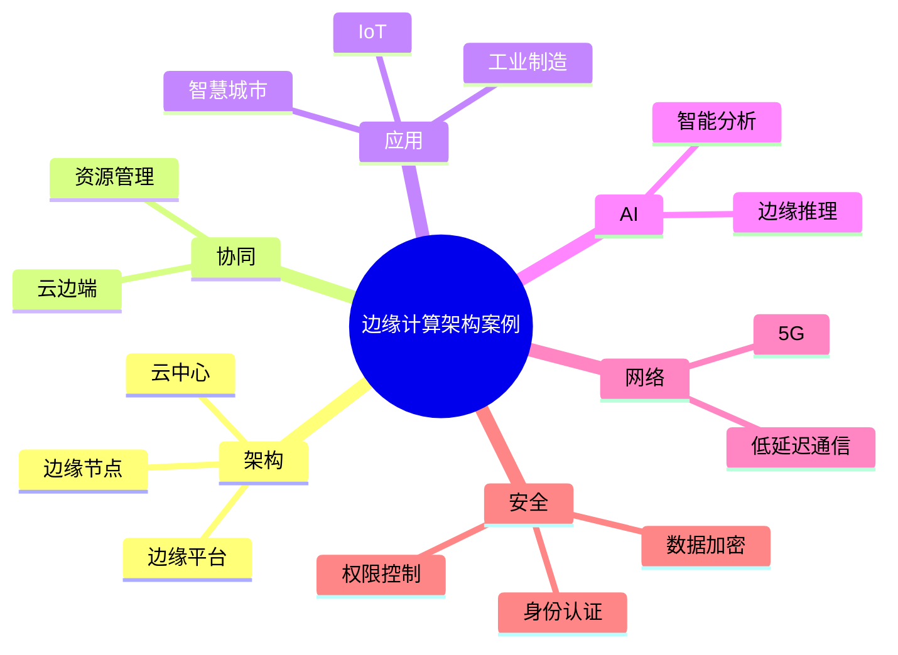

# 31-edge-computing-case.md（边缘计算架构案例）

> 本文用于系统架构设计师考试案例分析专题 V2 复习。
>
> 本篇重点整理边缘计算系统架构设计相关案例，包括边缘计算基本概念、云边协同、边缘节点架构、边缘AI、物联网结合、5G结合、安全设计以及企业边缘计算平台案例。

---

# 目录

1. 边缘计算案例概述
2. 边缘计算基本概念
3. 云计算与边缘计算对比案例
4. 边缘计算整体架构案例
5. 边缘节点架构案例
6. 边缘计算部署模式案例
7. 云边端协同架构案例
8. 边缘数据处理案例
9. 边缘AI架构案例
10. 边缘计算与物联网结合案例
11. 边缘计算与5G结合案例
12. 边缘计算资源管理案例
13. 边缘计算安全案例
14. 工业边缘计算案例
15. 智慧城市边缘计算案例
16. 边缘云架构案例
17. 企业边缘计算平台案例
18. 案例分析答题模板
19. 高频考点
20. 易错点
21. Mermaid知识结构图
22. 本节小结

---

# 1. 边缘计算案例概述

边缘计算主要解决：

- 云端距离设备较远；
- 网络延迟较高；
- 数据传输压力大；
- 实时业务响应不足。

核心思想：

> 将计算、存储和智能服务部署到靠近数据产生源的位置，提高业务实时性和系统效率。

典型架构：

```text
设备终端

↓

边缘节点

↓

边缘平台

↓

云中心

↓

业务应用
```

---

# 2. 边缘计算基本概念

边缘计算：

> 在网络边缘侧提供计算、存储和分析能力的一种分布式计算模式。

主要特点：

- 低延迟；
- 高实时性；
- 降低网络压力；
- 提高数据处理效率。

---

# 3. 云计算与边缘计算对比案例

## 云计算

特点：

- 集中式计算；
- 强大计算能力；
- 适合大规模分析。

---

## 边缘计算

特点：

- 分布式计算；
- 靠近数据源；
- 快速响应。

---

# 4. 边缘计算整体架构案例

典型三层架构：

```text
应用层

↓

边缘平台层

↓

边缘资源层
```

边缘资源层：

- 边缘服务器；
- 网关设备；
- 智能终端。

边缘平台层：

- 设备管理；
- 应用部署；
- 数据处理。

---

# 5. 边缘节点架构案例

边缘节点：

```text
边缘节点

├── 计算资源

├── 存储资源

├── 网络资源

└── AI推理能力
```

作用：

- 数据过滤；
- 实时计算；
- 本地决策。

---

# 6. 边缘计算部署模式案例

## 设备边缘

特点：

- 延迟最低；
- 资源有限。

## 网络边缘

部署于：

- 基站；
- 边缘机房。

特点：

- 支持大量设备连接。

## 云边缘

特点：

- 计算能力较强；
- 接近云服务。

---

# 7. 云边端协同架构案例

架构：

```text
端

↓

边

↓

云
```

职责：

## 端

- 数据采集；
- 简单控制。

## 边

- 实时处理；
- 数据过滤；
- AI推理。

## 云

- 大数据分析；
- 模型训练；
- 全局管理。

---

# 8. 边缘数据处理案例

传统模式：

```text
设备

↓

云端处理
```

问题：

- 延迟高；
- 带宽压力大。

边缘模式：

```text
设备

↓

边缘处理

↓

结果上传云端
```

优势：

- 降低传输量；
- 提高响应速度。

---

# 9. 边缘AI架构案例

边缘AI：

> 将人工智能模型部署到边缘设备，实现本地智能分析。

架构：

```text
数据采集

↓

边缘AI模型

↓

智能判断

↓

控制执行
```

应用：

- 智能摄像头；
- 自动驾驶；
- 工业检测。

---

# 10. 边缘计算与物联网结合案例

架构：

```text
传感器

↓

边缘网关

↓

边缘计算节点

↓

云平台

↓

应用系统
```

优势：

- 降低延迟；
- 减少数据上传；
- 支持实时控制。

---

# 11. 边缘计算与5G结合案例

5G特点：

- 高带宽；
- 低延迟；
- 大连接。

架构：

```text
5G终端

↓

5G网络

↓

边缘计算节点

↓

云平台
```

应用：

- 智能制造；
- 自动驾驶；
- AR/VR。

---

# 12. 边缘计算资源管理案例

包括：

- 计算资源调度；
- 容器管理；
- 应用部署；
- 负载均衡。

常采用：

- Docker；
- Kubernetes边缘方案。

---

# 13. 边缘计算安全案例

安全措施：

## 身份认证

保证设备可信。

## 数据加密

保护传输数据。

## 访问控制

限制资源访问。

## 安全更新

修复漏洞。

---

# 14. 工业边缘计算案例

架构：

```text
工业设备

↓

边缘控制器

↓

工业边缘平台

↓

云平台

↓

生产管理系统
```

应用：

- 设备预测维护；
- 自动化生产；
- 实时质量检测。

---

# 15. 智慧城市边缘计算案例

应用：

- 智能交通；
- 视频分析；
- 环境监测。

架构：

```text
城市设备

↓

边缘节点

↓

城市云平台

↓

管理系统
```

---

# 16. 边缘云架构案例

边缘云：

> 将云计算能力扩展到网络边缘。

特点：

- 云边资源统一管理；
- 弹性扩展；
- 快速部署。

---

# 17. 企业边缘计算平台案例

平台结构：

```text
设备接入

↓

边缘管理平台

↓

数据处理平台

↓

AI分析平台

↓

业务应用
```

能力：

- 设备管理；
- 应用管理；
- 数据分析；
- 模型部署。

---

# 18. 案例分析答题模板

## 实时性要求高

> 采用边缘计算架构，将计算能力部署到靠近数据源的位置，降低网络延迟，提高响应速度。

## 数据量巨大

> 通过边缘节点进行数据过滤和预处理，减少数据传输压力，提高系统效率。

## 大量设备管理

> 建立云边端协同架构，实现设备统一接入、边缘计算和云端管理。

## AI实时分析

> 将AI模型部署到边缘节点，实现本地推理，提高智能应用实时性。

---

# 19. 高频考点

重点掌握：

1. 边缘计算特点；
2. 云边端协同；
3. 边缘节点架构；
4. 边缘AI；
5. 物联网结合；
6. 5G结合；
7. 边缘安全。

---

# 20. 易错点

| 易错知识 | 正确理解 |
|---|---|
| 边缘计算替代云计算 | 两者通常协同工作 |
| 所有数据都上传云端 | 边缘节点可进行预处理 |
| 边缘节点不需要安全保护 | 边缘环境同样需要安全机制 |
| 边缘计算只是硬件设备 | 还包括平台和软件能力 |

---

# 21. Mermaid知识结构图



---

# 22. 本节小结

边缘计算案例核心：

> 通过将计算能力下沉到网络边缘，实现数据快速处理、实时响应和云边协同。

案例分析重点：

- 根据业务实时性选择边缘计算方案；
- 利用边缘节点降低网络压力；
- 结合云计算实现统一管理；
- 结合AI、IoT和5G构建智能应用。
