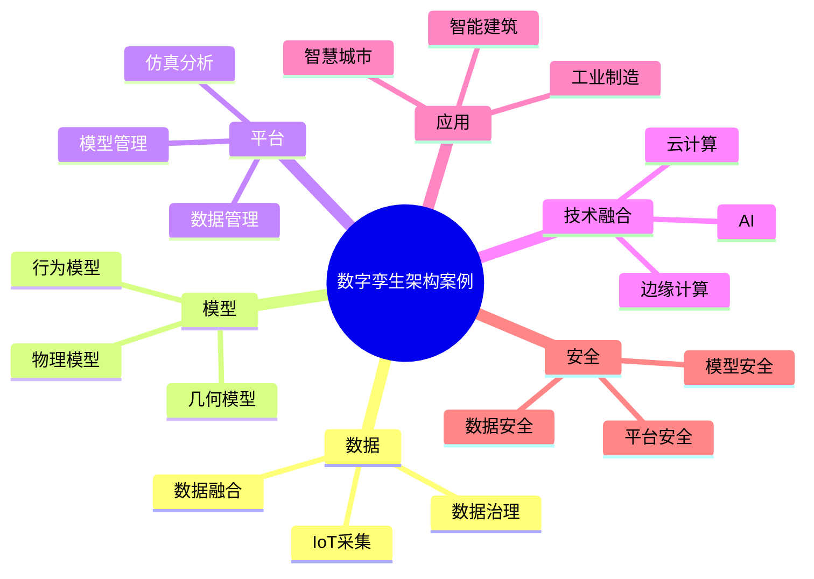

# 32-digital-twin-case.md（数字孪生架构案例）

> 本文用于系统架构设计师考试案例分析专题 V2 复习。
>
> 本篇重点整理数字孪生系统架构设计相关案例，包括数字孪生基本概念、体系架构、物理实体建模、数据采集、实时映射、数字孪生平台、工业数字孪生、智慧城市、IoT结合、AI结合、边缘计算结合以及安全设计案例。

---

# 目录

1. 数字孪生案例概述
2. 数字孪生基本概念
3. 数字孪生体系架构案例
4. 物理实体层案例
5. 数据采集层案例
6. 数字模型构建案例
7. 实时映射案例
8. 数据同步机制案例
9. 数字孪生平台架构案例
10. 工业数字孪生案例
11. 智慧城市数字孪生案例
12. 建筑数字孪生案例
13. 设备预测维护案例
14. 数字孪生与IoT结合案例
15. 数字孪生与AI结合案例
16. 数字孪生与边缘计算结合案例
17. 数字孪生安全案例
18. 企业数字孪生平台案例
19. 案例分析答题模板
20. 高频考点
21. 易错点
22. Mermaid知识结构图
23. 本节小结

---

# 1. 数字孪生案例概述

数字孪生主要解决：

- 物理世界与数字世界映射；
- 实时状态监控；
- 智能分析预测；
- 模拟优化决策。

核心思想：

> 利用传感器、数据模型和智能分析技术，在数字空间构建与物理实体对应的虚拟模型，实现实时感知、分析和控制。

典型架构：

```text
物理实体

↓

数据采集

↓

数字模型

↓

数据分析

↓

智能决策

↓

反馈控制
```

---

# 2. 数字孪生基本概念（★★★★★）

数字孪生：

> 在数字空间中创建物理对象的动态虚拟映射，并通过数据持续更新，实现对物理对象的监控、分析和优化。

核心组成：

- 物理实体；
- 数据连接；
- 数字模型；
- 分析计算；
- 应用服务。

---

# 3. 数字孪生体系架构案例（★★★★★）

典型五层架构：

```text
应用服务层

↓

分析决策层

↓

模型服务层

↓

数据管理层

↓

物理感知层
```

## 物理感知层

负责：

- 设备运行状态采集；
- 环境数据采集；
- 实体状态感知。

设备：

- 传感器；
- 摄像头；
- PLC设备。

---

## 数据管理层

负责：

- 数据存储；
- 数据治理；
- 数据融合。

---

## 模型服务层

负责：

- 三维模型；
- 业务模型；
- 仿真模型。

---

## 分析决策层

负责：

- AI分析；
- 状态预测；
- 优化决策。

---

## 应用服务层

提供：

- 可视化；
- 监控；
- 控制。

---

# 4. 物理实体层案例

物理实体包括：

- 工厂设备；
- 建筑物；
- 城市设施；
- 交通系统。

作用：

提供真实世界数据来源。

---

# 5. 数据采集层案例（★★★★★）

数据来源：

- IoT传感器；
- 视频设备；
- 工业控制系统；
- 业务数据库。

流程：

```text
设备

↓

传感器

↓

数据采集

↓

数字孪生平台
```

---

# 6. 数字模型构建案例（★★★★★）

数字模型包括：

## 几何模型

描述：

- 外观；
- 空间结构。

---

## 物理模型

描述：

- 运行规律；
- 状态变化。

---

## 行为模型

描述：

- 操作流程；
- 业务逻辑。

---

# 7. 实时映射案例（★★★★★）

数字孪生核心能力：

> 保持物理对象和数字模型之间的数据同步。

流程：

```text
物理设备状态变化

↓

数据采集

↓

更新数字模型

↓

分析预测

↓

反馈控制
```

---

# 8. 数据同步机制案例

同步方式：

## 实时同步

适用于：

- 自动驾驶；
- 工业控制。

---

## 周期同步

适用于：

- 设备监测；
- 运行统计。

---

## 事件驱动同步

适用于：

- 状态变化；
- 异常告警。

---

# 9. 数字孪生平台架构案例（★★★★★）

平台结构：

```text
数据接入层

↓

数据处理层

↓

模型管理层

↓

仿真分析层

↓

应用展示层
```

能力：

- 数据接入；
- 模型管理；
- 状态监控；
- 模拟预测。

---

# 10. 工业数字孪生案例（★★★★★）

应用：

- 智能制造；
- 设备预测维护；
- 生产优化。

架构：

```text
生产设备

↓

工业传感器

↓

边缘计算

↓

数字孪生平台

↓

生产管理系统
```

---

# 11. 智慧城市数字孪生案例（★★★★★）

应用：

- 城市交通；
- 能源管理；
- 城市规划。

架构：

```text
城市设施

↓

IoT感知网络

↓

城市数字孪生平台

↓

城市管理系统
```

---

# 12. 建筑数字孪生案例

应用：

- 智能楼宇；
- 能耗管理；
- 运维管理。

结合：

- BIM；
- IoT；
- AI分析。

---

# 13. 设备预测维护案例（★★★★★）

传统方式：

定期维护。

问题：

- 成本高；
- 故障发现晚。

数字孪生方式：

```text
设备数据

↓

状态分析

↓

故障预测

↓

提前维护
```

---

# 14. 数字孪生与IoT结合案例

架构：

```text
传感器

↓

IoT平台

↓

数字孪生模型

↓

分析决策

↓

设备控制
```

作用：

- 实时感知；
- 状态同步；
- 智能控制。

---

# 15. 数字孪生与AI结合案例（★★★★★）

AI能力：

- 异常检测；
- 趋势预测；
- 智能优化。

架构：

```text
数据

↓

数字孪生模型

↓

AI分析

↓

优化决策
```

---

# 16. 数字孪生与边缘计算结合案例

架构：

```text
设备

↓

边缘节点

↓

数字孪生平台

↓

云中心
```

优势：

- 降低延迟；
- 提高实时性；
- 减少数据传输。

---

# 17. 数字孪生安全案例（★★★★★）

安全措施：

## 数据安全

- 加密传输；
- 数据权限控制。

---

## 模型安全

- 模型访问控制；
- 模型版本管理。

---

## 平台安全

- 身份认证；
- 操作审计。

---

# 18. 企业数字孪生平台案例

整体架构：

```text
物理设备

↓

IoT接入

↓

数据平台

↓

数字孪生平台

↓

AI分析

↓

业务应用
```

---

# 19. 案例分析答题模板（★★★★★）

## 需要实时监控设备

> 建立数字孪生模型，通过物联网采集设备状态数据，实现物理对象与数字模型实时同步。

---

## 需要预测设备故障

> 利用数字孪生结合AI分析技术，对设备运行状态进行预测，提高维护效率。

---

## 城市复杂系统管理

> 建设城市数字孪生平台，实现城市设施统一建模、实时感知和智能分析。

---

## 数据来源复杂

> 通过IoT数据采集和数据融合技术，实现多源异构数据统一管理。

---

# 20. 高频考点

重点掌握：

1. 数字孪生基本概念；
2. 五层体系架构；
3. 实时映射机制；
4. 数据同步；
5. 工业数字孪生；
6. IoT结合；
7. AI结合；
8. 边缘计算结合。

---

# 21. 易错点

| 易错知识 | 正确理解 |
|---|---|
| 数字孪生只是三维模型 | 数字孪生还包含数据、模型和分析能力 |
| 建模后无需更新 | 数字孪生需要持续数据同步 |
| 只适用于工业 | 可用于城市、建筑、交通等领域 |
| 只关注可视化 | 核心是预测和优化 |

---

# 22. Mermaid知识结构图



---

# 23. 本节小结

数字孪生案例核心：

> 通过物联网感知、数据建模、实时同步和智能分析，在数字空间构建物理实体的动态映射，实现监控、预测和优化。

案例分析重点：

- 建立物理实体与数字模型对应关系；
- 通过IoT实现数据采集；
- 通过AI实现预测分析；
- 通过边缘计算提升实时性；
- 通过平台化架构支撑企业级应用。
