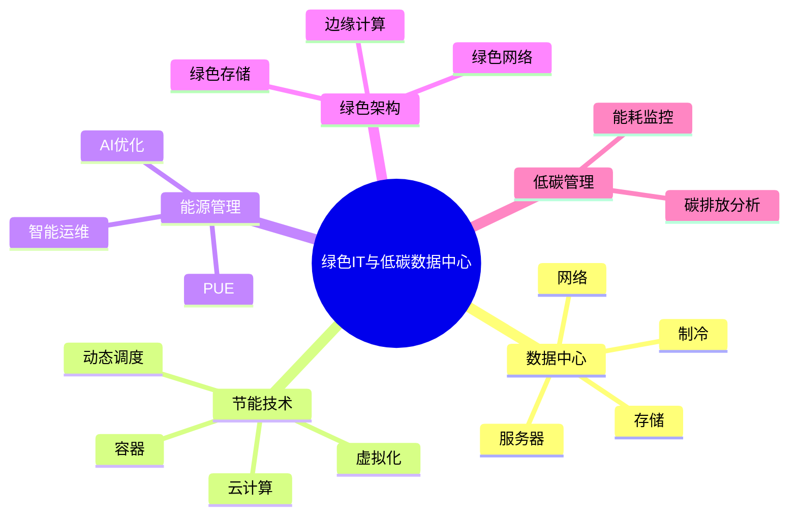

# 33-green-it-case.md（绿色IT与低碳数据中心架构案例）

> 本文用于系统架构设计师考试案例分析专题 V2 复习。
>
> 本篇重点整理绿色IT与低碳数据中心架构设计相关案例，包括绿色IT基本概念、数据中心能耗分析、PUE指标、虚拟化、云计算优化、容器化、智能运维、AI节能、绿色存储以及企业低碳IT平台案例。

---

# 目录

1. 绿色IT案例概述
2. 绿色IT基本概念
3. 数据中心能耗组成案例
4. PUE能源效率指标案例
5. 低碳数据中心架构案例
6. 服务器虚拟化节能案例
7. 云计算资源优化案例
8. 容器化绿色计算案例
9. 数据中心制冷优化案例
10. 新能源数据中心案例
11. 智能运维节能案例
12. AI能源优化案例
13. 边缘计算绿色架构案例
14. 绿色存储架构案例
15. 数据生命周期管理案例
16. 绿色网络架构案例
17. 企业低碳IT平台案例
18. 案例分析答题模板
19. 高频考点
20. 易错点
21. Mermaid知识结构图
22. 本节小结

---

# 1. 绿色IT案例概述

绿色IT主要解决：

- 数据中心能耗过高；
- IT资源利用率低；
- 碳排放压力增加；
- 运维成本提高。

核心思想：

> 通过优化IT基础设施、提高资源利用率、降低能源消耗，实现高效、低碳、可持续的信息系统建设。

典型架构：

```text
业务系统

↓

计算资源优化

↓

能源管理平台

↓

智能运维

↓

低碳数据中心
```

---

# 2. 绿色IT基本概念

绿色IT：

> 在信息系统规划、建设、运行和维护过程中，通过技术和管理手段降低能源消耗和环境影响。

主要目标：

- 节能；
- 降耗；
- 降碳；
- 提高资源利用率。

---

# 3. 数据中心能耗组成案例

数据中心能源：

```text
数据中心能源

├── IT设备
│   ├── 服务器
│   ├── 存储
│   └── 网络设备
│
├── 制冷系统
│
├── 供电系统
│
└── 运维设施
```

主要优化方向：

- 降低服务器能耗；
- 优化制冷效率；
- 提高资源利用率。

---

# 4. PUE能源效率指标案例（★★★★★）

PUE：

Power Usage Effectiveness。

计算：

```text
PUE =
数据中心总能耗
----------------
IT设备能耗
```

含义：

- PUE越接近1，能源效率越高。

优化方式：

- 降低制冷能耗；
- 提升服务器利用率；
- 使用高效电源设备。

---

# 5. 低碳数据中心架构案例

典型架构：

```text
业务应用

↓

云资源池

↓

虚拟化平台

↓

服务器集群

↓

能源管理系统
```

优化：

- 资源池化；
- 动态调度；
- 自动节能。

---

# 6. 服务器虚拟化节能案例（★★★★★）

传统模式：

```text
一台服务器

↓

一个应用
```

问题：

- 利用率低；
- 能耗高。

虚拟化：

```text
物理服务器

↓

虚拟化平台

↓

多个虚拟机
```

优势：

- 提高CPU利用率；
- 减少服务器数量；
- 降低能源消耗。

---

# 7. 云计算资源优化案例

云计算绿色优势：

- 资源共享；
- 弹性扩展；
- 按需分配。

架构：

```text
用户需求

↓

云资源调度

↓

计算资源池

↓

动态调整
```

---

# 8. 容器化绿色计算案例

容器特点：

- 轻量级；
- 启动快速；
- 资源占用低。

架构：

```text
应用

↓

容器平台

↓

计算资源池
```

优势：

- 提升资源密度；
- 降低运行成本。

---

# 9. 数据中心制冷优化案例

优化技术：

- 精确制冷；
- 自然冷却；
- 液冷技术。

管理措施：

- 温度监控；
- 热通道管理；
- 动态调节。

---

# 10. 新能源数据中心案例

新能源包括：

- 太阳能；
- 风能；
- 水电。

目标：

降低：

- 化石能源使用；
- 碳排放。

---

# 11. 智能运维节能案例

流程：

```text
运行数据

↓

智能分析

↓

能源优化

↓

自动调整
```

利用：

- 监控系统；
- 自动化平台；
- AI分析。

---

# 12. AI能源优化案例（★★★★★）

AI能力：

- 预测负载；
- 优化资源分配；
- 调节能源使用。

架构：

```text
监控数据

↓

AI模型

↓

节能策略

↓

自动执行
```

---

# 13. 边缘计算绿色架构案例

优势：

- 减少数据传输；
- 降低网络能耗；
- 提高实时处理能力。

架构：

```text
终端

↓

边缘节点

↓

云中心
```

---

# 14. 绿色存储架构案例

优化：

- 数据分层存储；
- 冷热数据分离；
- 删除无效数据。

策略：

```text
热数据

↓

高速存储

↓

冷数据

↓

低成本存储
```

---

# 15. 数据生命周期管理案例

生命周期：

```text
产生

↓

使用

↓

归档

↓

删除
```

目标：

- 减少无效存储；
- 降低能源消耗。

---

# 16. 绿色网络架构案例

优化：

- 网络设备节能；
- 智能流量调度；
- 降低空闲设备能耗。

---

# 17. 企业低碳IT平台案例

整体架构：

```text
业务系统

↓

云平台

↓

资源调度平台

↓

能源管理平台

↓

碳管理系统
```

能力：

- 能耗监控；
- 碳排放分析；
- 节能优化。

---

# 18. 案例分析答题模板

## 数据中心能耗过高

> 通过虚拟化、资源池化和动态调度技术，提高IT资源利用率，降低能源消耗。

## PUE指标较高

> 优化制冷系统、供电系统和服务器利用率，降低数据中心整体能耗。

## IT资源利用率低

> 采用云计算和虚拟化技术，实现计算资源统一管理和弹性分配。

## 需要低碳运营

> 建设绿色数据中心，引入能源管理平台和智能运维系统，实现节能降碳。

---

# 19. 高频考点

重点掌握：

1. 绿色IT概念；
2. PUE指标；
3. 数据中心节能技术；
4. 虚拟化；
5. 云资源优化；
6. 智能运维；
7. 绿色存储。

---

# 20. 易错点

| 易错知识 | 正确理解 |
|---|---|
| 绿色IT只是节约电能 | 还包括资源利用率和碳管理 |
| 增加服务器一定提升性能 | 需要合理资源调度 |
| 云计算一定绿色 | 需要合理规划资源 |
| 删除数据就是全部优化 | 需要数据生命周期管理 |

---

# 21. Mermaid知识结构图



---

# 22. 本节小结

绿色IT案例核心：

> 通过虚拟化、云计算、智能运维和能源管理技术，提高IT资源利用效率，降低数据中心能源消耗，实现绿色低碳的信息系统建设。

案例分析重点：

- 使用PUE衡量数据中心能源效率；
- 通过虚拟化提高资源利用率；
- 通过云计算实现弹性资源管理；
- 通过AI和智能运维优化能源消耗；
- 建设低碳、可靠、可持续的数据中心。
