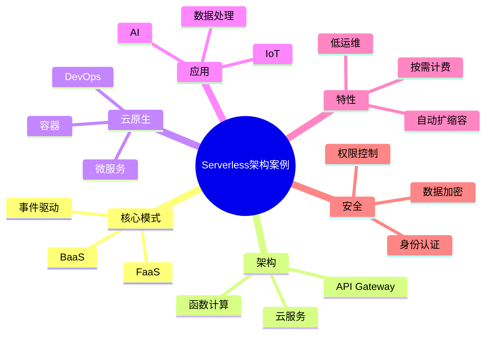

# 34-serverless-case.md（Serverless无服务器架构案例）

> 本文用于系统架构设计师考试案例分析专题 V2 复习。
>
> 本篇重点整理 Serverless 无服务器架构设计相关案例，包括 Serverless 基本概念、FaaS函数计算、BaaS后端服务、事件驱动架构、自动扩缩容、微服务结合、容器结合、AI应用、IoT应用、安全设计以及企业Serverless平台案例。

---

# 目录

1. Serverless案例概述
2. Serverless基本概念
3. Serverless核心特点案例
4. Serverless整体架构案例
5. FaaS函数计算案例
6. BaaS后端服务案例
7. 事件驱动架构案例
8. Serverless与微服务结合案例
9. Serverless与容器结合案例
10. Serverless自动扩缩容案例
11. Serverless应用部署案例
12. Serverless数据处理案例
13. Serverless人工智能案例
14. Serverless物联网案例
15. Serverless安全案例
16. Serverless成本优化案例
17. 企业Serverless平台案例
18. Serverless与DevOps结合案例
19. 案例分析答题模板
20. 高频考点
21. 易错点
22. Mermaid知识结构图
23. 本节小结

---

# 1. Serverless案例概述

Serverless主要解决：

- 服务器资源管理复杂；
- 应用部署效率低；
- 资源利用率不足；
- 弹性伸缩困难。

核心思想：

> 开发人员只关注业务代码，由云平台负责服务器管理、资源调度、自动扩缩容和运行环境维护。

典型架构：

```text
用户请求

↓

API Gateway

↓

函数计算平台

↓

业务函数

↓

云服务资源
```

---

# 2. Serverless基本概念（★★★★★）

Serverless：

> 一种无需用户管理服务器基础设施，通过云平台自动提供计算资源的应用架构模式。

注意：

Serverless并不是没有服务器，而是：

- 用户不直接管理服务器；
- 云平台负责基础设施。

---

# 3. Serverless核心特点案例（★★★★★）

## 无服务器管理

开发人员无需：

- 创建服务器；
- 配置操作系统；
- 管理运行环境。

---

## 自动扩缩容

根据请求量：

- 自动增加实例；
- 自动减少实例。

---

## 按使用付费

资源按照：

- 调用次数；
- 执行时间；

进行计费。

---

## 事件驱动

通过：

- HTTP请求；
- 消息队列；
- 文件上传；
- 定时任务；

触发执行。

---

# 4. Serverless整体架构案例（★★★★★）

典型架构：

```text
用户

↓

API Gateway

↓

FaaS函数计算

↓

BaaS服务

↓

数据库/存储/消息服务
```

组成：

- 接入层；
- 函数计算层；
- 后端服务层；
- 数据存储层。

---

# 5. FaaS函数计算案例（★★★★★）

FaaS：

Function as a Service。

特点：

- 函数级部署；
- 自动运行；
- 自动扩容。

流程：

```text
事件触发

↓

函数启动

↓

执行代码

↓

返回结果
```

适合：

- API接口；
- 数据处理；
- 自动任务。

---

# 6. BaaS后端服务案例

BaaS：

Backend as a Service。

提供：

- 数据库；
- 用户认证；
- 文件存储；
- 消息服务。

优势：

减少：

- 后端开发工作量；
- 基础设施维护。

---

# 7. 事件驱动架构案例（★★★★★）

Serverless常采用事件驱动架构。

架构：

```text
事件源

↓

消息服务

↓

函数计算

↓

业务处理

↓

结果存储
```

事件来源：

- 用户请求；
- 文件上传；
- 消息队列；
- 数据变化。

---

# 8. Serverless与微服务结合案例（★★★★★）

传统微服务：

```text
服务

↓

容器

↓

服务器
```

Serverless微服务：

```text
服务接口

↓

函数

↓

云平台
```

优势：

- 更细粒度；
- 弹性更强；
- 运维成本降低。

---

# 9. Serverless与容器结合案例

架构：

```text
应用代码

↓

Serverless容器平台

↓

容器运行环境

↓

云基础设施
```

优势：

- 保留容器灵活性；
- 减少运维管理。

---

# 10. Serverless自动扩缩容案例（★★★★★）

传统方式：

人工配置：

- CPU；
- 内存；
- 实例数量。

Serverless：

```text
请求增加

↓

自动创建实例

↓

处理请求

↓

请求减少

↓

自动释放资源
```

---

# 11. Serverless应用部署案例

部署流程：

```text
代码提交

↓

自动构建

↓

自动部署

↓

函数运行

↓

监控反馈
```

结合：

- CI/CD；
- DevOps。

---

# 12. Serverless数据处理案例

适用于：

- 数据清洗；
- 日志处理；
- 图片处理。

流程：

```text
数据产生

↓

事件触发

↓

函数处理

↓

数据存储
```

---

# 13. Serverless人工智能案例（★★★★★）

应用：

- AI推理；
- 图片识别；
- 文本分析。

架构：

```text
用户请求

↓

Serverless函数

↓

AI模型服务

↓

返回结果
```

优势：

- 按需调用；
- 降低AI部署成本。

---

# 14. Serverless物联网案例

架构：

```text
IoT设备

↓

消息平台

↓

Serverless函数

↓

数据处理

↓

业务应用
```

应用：

- 设备数据处理；
- 状态告警；
- 自动控制。

---

# 15. Serverless安全案例（★★★★★）

安全措施：

## 身份认证

保证：

- 用户可信；
- 服务可信。

---

## 权限控制

限制：

- 函数访问资源。

---

## 数据安全

采用：

- 加密传输；
- 加密存储。

---

## 运行安全

包括：

- 代码审计；
- 漏洞检测。

---

# 16. Serverless成本优化案例

优势：

- 空闲时不占资源；
- 按实际使用计费。

优化：

- 减少无效调用；
- 优化函数执行时间；
- 合理设计架构。

---

# 17. 企业Serverless平台案例

整体架构：

```text
业务应用

↓

API管理平台

↓

Serverless计算平台

↓

云基础设施

↓

数据库/存储/消息服务
```

能力：

- 函数管理；
- 服务治理；
- 自动扩展；
- 监控分析。

---

# 18. Serverless与DevOps结合案例（★★★★★）

结合：

- 自动构建；
- 自动测试；
- 自动发布；
- 自动监控。

流程：

```text
代码提交

↓

CI/CD流水线

↓

Serverless部署

↓

运行监控
```

---

# 19. 案例分析答题模板（★★★★★）

## 无法预测访问量

> 采用Serverless架构，通过自动扩缩容机制，根据业务请求动态调整计算资源。

---

## 降低运维成本

> 使用Serverless平台，由云平台负责基础设施管理，使开发人员专注业务逻辑。

---

## 突发流量访问

> 采用事件驱动和自动弹性伸缩机制，提高系统处理能力和可靠性。

---

## 快速开发业务接口

> 采用FaaS函数计算结合BaaS服务，提高应用开发效率。

---

# 20. 高频考点

重点掌握：

1. Serverless基本思想；
2. FaaS函数计算；
3. BaaS后端服务；
4. 事件驱动架构；
5. 自动扩缩容；
6. Serverless安全；
7. 与DevOps结合。

---

# 21. 易错点

| 易错知识 | 正确理解 |
|---|---|
| Serverless没有服务器 | 实际由云平台管理服务器 |
| Serverless只能开发简单应用 | 可用于复杂业务场景 |
| Serverless不需要安全设计 | 仍需要身份、权限和数据安全 |
| Serverless等于容器 | 两者是不同架构模式 |

---

# 22. Mermaid知识结构图



---

# 23. 本节小结

Serverless案例核心：

> 通过云平台自动管理基础设施，使开发人员专注业务逻辑，实现弹性计算、快速部署和按需使用。

案例分析重点：

- 根据业务特点选择Serverless架构；
- 利用FaaS实现函数级计算；
- 利用BaaS减少后台开发工作；
- 通过事件驱动实现业务自动处理；
- 结合DevOps实现持续交付。
