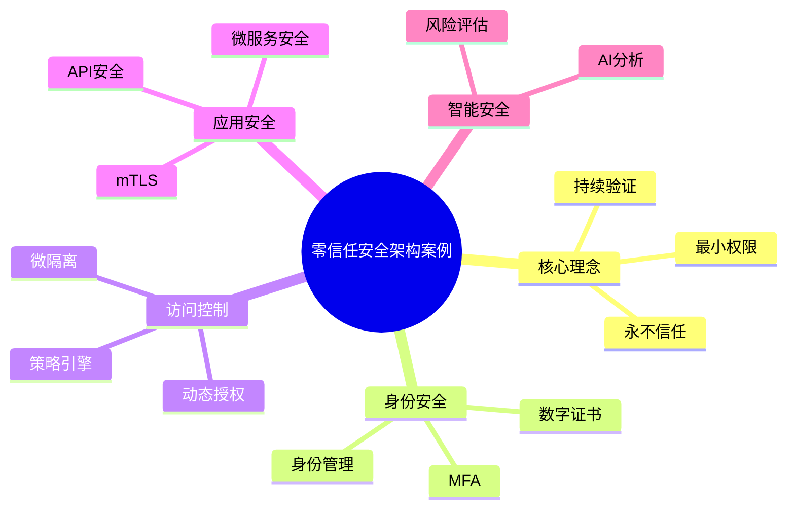

# 35-zero-trust-security-case.md（零信任安全架构案例）

> 本文用于系统架构设计师考试案例分析专题 V2 复习。

# 目录

1. 零信任安全案例概述
2. 零信任基本概念
3. 传统安全模型与零信任对比
4. 零信任核心原则
5. 零信任整体架构
6. 身份认证架构
7. 持续验证
8. 最小权限访问
9. 动态访问控制
10. 微服务零信任
11. API安全
12. 云环境零信任
13. 终端安全
14. 数据安全
15. 网络微隔离
16. SDP软件定义边界
17. 零信任与AI结合
18. 企业零信任平台
19. 案例分析答题模板
20. 高频考点
21. 易错点
22. Mermaid知识结构图
23. 本节小结

---

# 1. 零信任安全案例概述

零信任主要解决：

- 内网不再绝对可信；
- 云环境边界模糊；
- 移动办公安全风险；
- 微服务访问复杂。

核心思想：

> 不默认信任任何用户、设备和网络，在访问过程中持续验证身份、权限和安全状态。

典型架构：

```text
用户/设备

↓

身份认证

↓

策略控制

↓

访问代理

↓

业务资源
```

---

# 2. 零信任基本概念

Zero Trust：

> 基于“永不信任，持续验证”理念构建的安全架构模型。

传统模式：

```text
外网不可信

内网可信
```

零信任：

```text
任何访问都需要验证
```

---

# 3. 零信任核心原则

## 永不信任

任何访问请求都需要验证。

## 持续验证

持续检查：

- 用户身份；
- 设备状态；
- 行为风险。

## 最小权限

只授予完成任务所需的权限。

## 动态策略

根据环境变化调整访问权限。

---

# 4. 零信任整体架构

```text
访问主体

↓

身份认证系统

↓

策略决策中心

↓

策略执行点

↓

业务资源
```

核心组件：

- 身份管理；
- 策略引擎；
- 访问代理；
- 安全分析平台。

---

# 5. 身份认证架构

认证方式：

- 用户账号；
- 多因素认证；
- 数字证书；
- 生物识别。

流程：

```text
用户登录

↓

身份认证

↓

风险评估

↓

授权访问
```

---

# 6. 微服务零信任案例

微服务特点：

- 服务数量多；
- 服务调用复杂。

架构：

```text
服务A

↓

身份认证

↓

服务网格

↓

服务B
```

技术：

- Service Mesh；
- mTLS；
- 服务身份认证。

---

# 7. API安全案例

API风险：

- 非法调用；
- 权限绕过；
- 数据泄露。

措施：

- API认证；
- Token管理；
- 限流；
- 访问审计。

---

# 8. 云环境零信任案例

云环境：

- 资源动态变化；
- 网络边界模糊。

架构：

```text
用户

↓

零信任平台

↓

云资源

↓

业务应用
```

---

# 9. 网络微隔离案例

目标：

- 限制攻击范围；
- 防止横向移动。

架构：

```text
用户

↓

授权区域

↓

指定资源
```

---

# 10. SDP软件定义边界案例

SDP：

Software Defined Perimeter。

作用：

- 隐藏业务资源；
- 动态建立安全访问通道。

流程：

```text
用户请求

↓

身份验证

↓

创建安全连接

↓

访问资源
```

---

# 11. 零信任与AI结合案例

AI能力：

- 风险识别；
- 异常检测；
- 行为分析。

架构：

```text
访问行为

↓

AI分析

↓

风险评分

↓

动态授权
```

---

# 12. 企业零信任平台案例

```text
用户设备

↓

身份中心

↓

零信任访问平台

↓

安全策略中心

↓

业务系统
```

能力：

- 统一身份管理；
- 动态权限控制；
- 安全审计。

---

# 13. 案例分析答题模板

## 企业内部不再可信

> 采用零信任安全架构，不基于网络位置进行信任判断，对所有访问请求进行身份验证。

## 远程办公安全

> 建立统一身份认证和动态访问控制机制，实现用户、设备和资源之间的安全访问。

## 微服务访问复杂

> 引入服务网格和双向认证机制，实现服务间身份验证和安全通信。

## 防止权限滥用

> 采用最小权限原则，根据用户身份、设备状态和风险等级动态授权。

---

# 14. 高频考点

重点掌握：

1. 零信任基本思想；
2. 持续验证；
3. 最小权限；
4. 身份认证；
5. 动态访问控制；
6. 微服务安全；
7. API安全；
8. SDP。

---

# 15. 易错点

| 易错知识 | 正确理解 |
|---|---|
| 内网天然可信 | 零信任认为任何访问都需要验证 |
| 只加强防火墙即可 | 零信任关注身份和访问控制 |
| 一次认证永久有效 | 需要持续验证 |
| 零信任不需要网络安全 | 仍需要网络、数据和终端安全 |

---

# 16. Mermaid知识结构图



---

# 17. 本节小结

零信任案例核心：

> 通过身份认证、持续验证、最小权限和动态访问控制，构建不依赖网络边界的现代安全架构。

案例分析重点：

- 从网络边界安全转向身份安全；
- 对所有访问请求进行验证；
- 根据风险动态调整权限；
- 结合云、微服务和API构建安全体系。
