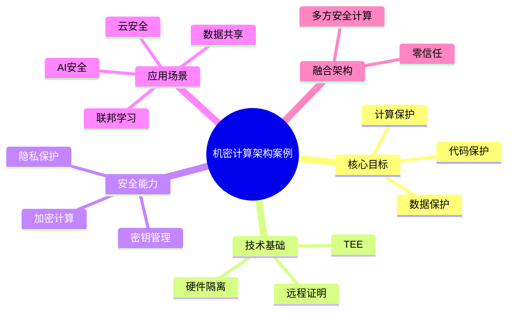

# 36-confidential-computing-case.md（机密计算架构案例）

> 本文用于系统架构设计师考试案例分析专题 V2 复习。
>
> 本篇重点整理机密计算（Confidential Computing）架构设计相关案例，包括可信执行环境TEE、数据使用过程保护、远程证明、密钥管理、云安全、AI模型保护、隐私计算以及零信任结合案例。

---

# 目录

1. 机密计算案例概述
2. 机密计算基本概念
3. 数据安全三阶段案例
4. 传统数据保护与机密计算对比
5. 机密计算整体架构案例
6. 可信执行环境TEE案例
7. 硬件安全隔离案例
8. 远程证明机制案例
9. 密钥管理架构案例
10. 云环境机密计算案例
11. AI模型保护案例
12. 数据隐私计算案例
13. 联邦学习结合案例
14. 多方安全计算结合案例
15. 数据库机密计算案例
16. 零信任与机密计算结合案例
17. 企业机密计算平台案例
18. 机密计算安全案例
19. 案例分析答题模板
20. 高频考点
21. 易错点
22. Mermaid知识结构图
23. 本节小结

---

# 1. 机密计算案例概述

机密计算主要解决：

- 数据使用过程中的泄露风险；
- 云环境中的数据安全问题；
- 第三方计算环境不可信问题；
- AI模型和敏感数据保护问题。

核心思想：

> 通过可信执行环境和硬件隔离技术，在数据处理过程中保护数据机密性。

典型架构：

```text
应用系统

↓

机密计算平台

↓

可信执行环境TEE

↓

硬件安全层

↓

基础设施
```

---

# 2. 机密计算基本概念

Confidential Computing：

> 通过可信执行环境（TEE）等技术，在数据使用过程中保护数据、代码和计算过程安全。

核心保护对象：

- 数据；
- 程序代码；
- 计算过程。

---

# 3. 数据安全三阶段案例

数据生命周期：

```text
数据状态

├── 静态数据
│   数据存储保护
│
├── 传输数据
│   网络加密保护
│
└── 使用数据
    计算过程保护
```

传统安全主要保护：

- 存储阶段；
- 传输阶段。

机密计算重点保护：

> 数据使用阶段。

---

# 4. 传统数据保护与机密计算对比

传统模式：

```text
用户

↓

服务器

↓

明文计算

↓

结果
```

风险：

- 计算环境可能不可信；
- 管理人员可能接触敏感数据。

---

机密计算模式：

```text
用户

↓

可信执行环境

↓

加密数据计算

↓

结果输出
```

优势：

- 降低数据泄露风险；
- 提升云环境可信程度。

---

# 5. 机密计算整体架构案例

典型架构：

```text
应用层

↓

机密计算服务层

↓

TEE可信执行环境

↓

硬件安全层

↓

云基础设施
```

组成：

- 应用服务；
- 安全计算环境；
- 硬件隔离能力；
- 密钥管理系统。

---

# 6. 可信执行环境TEE案例

TEE：

Trusted Execution Environment。

特点：

- 独立隔离区域；
- 防止外部访问；
- 保护代码和数据。

流程：

```text
应用程序

↓

进入TEE环境

↓

加载可信代码

↓

安全执行
```

---

# 7. 硬件安全隔离案例

硬件能力：

- 内存隔离；
- CPU隔离；
- 加密保护。

作用：

防止：

- 非授权访问；
- 数据窃取；
- 运行环境攻击。

---

# 8. 远程证明机制案例

远程证明：

> 验证计算环境是否处于可信状态。

流程：

```text
计算节点

↓

生成证明信息

↓

验证平台

↓

确认可信

↓

允许数据访问
```

应用：

- 云计算；
- AI服务；
- 多方数据协作。

---

# 9. 密钥管理架构案例

保护：

- 加密密钥；
- 身份凭证。

架构：

```text
密钥管理系统

↓

安全密钥存储

↓

TEE环境

↓

数据计算
```

技术：

- KMS；
- HSM。

---

# 10. 云环境机密计算案例

解决：

- 云管理员权限风险；
- 敏感数据上云问题。

架构：

```text
用户数据

↓

云机密计算实例

↓

TEE计算

↓

业务结果
```

---

# 11. AI模型保护案例

AI安全问题：

- 模型参数泄露；
- 训练数据泄露；
- 推理过程暴露。

架构：

```text
用户数据

↓

机密计算环境

↓

AI模型推理

↓

返回结果
```

保护：

- 模型；
- 数据；
- 推理过程。

---

# 12. 数据隐私计算案例

目标：

> 数据可用不可见。

应用：

- 医疗数据分析；
- 金融联合计算；
- 政务数据共享。

技术：

- 机密计算；
- 联邦学习；
- 多方安全计算。

---

# 13. 联邦学习结合案例

传统模式：

数据集中训练。

问题：

- 数据隐私风险。

联邦学习：

```text
数据A

↓

本地训练

↓

模型参数

↓

模型融合
```

结合机密计算：

保护：

- 参数；
- 模型；
- 训练过程。

---

# 14. 多方安全计算结合案例

目标：

多个组织：

- 共同计算；
- 不共享原始数据。

应用：

- 金融分析；
- 医疗研究；
- 企业联合建模。

---

# 15. 数据库机密计算案例

保护：

- 敏感字段；
- 查询过程；
- 分析过程。

架构：

```text
应用

↓

安全数据库

↓

TEE计算

↓

查询结果
```

---

# 16. 零信任与机密计算结合案例

零信任解决：

> 谁可以访问。

机密计算解决：

> 数据如何安全使用。

结合：

```text
身份验证

↓

权限判断

↓

机密计算环境

↓

安全处理数据
```

---

# 17. 企业机密计算平台案例

整体架构：

```text
业务应用

↓

安全访问平台

↓

机密计算服务

↓

TEE资源池

↓

云基础设施
```

能力：

- 数据保护；
- 安全计算；
- 隐私分析。

---

# 18. 机密计算安全案例

安全措施：

## 环境安全

- TEE隔离；
- 远程证明。

## 密钥安全

- 密钥管理；
- 硬件保护。

## 数据安全

- 加密存储；
- 加密传输。

---

# 19. 案例分析答题模板

## 数据不能直接暴露

> 采用机密计算技术，通过可信执行环境保护数据使用过程，实现数据可用不可见。

## 云环境不完全可信

> 使用TEE可信执行环境和远程证明机制，提高云计算环境可信程度。

## 多机构数据共享

> 结合联邦学习、多方安全计算和机密计算，实现数据不出域情况下的数据协同分析。

## AI模型保护

> 将AI模型部署在机密计算环境中，保护模型参数和推理过程安全。

---

# 20. 高频考点

重点掌握：

1. 机密计算基本概念；
2. 数据安全三阶段；
3. TEE可信执行环境；
4. 远程证明；
5. 密钥管理；
6. AI模型保护；
7. 隐私计算结合。

---

# 21. 易错点

| 易错知识 | 正确理解 |
|---|---|
| 加密存储即可保护数据 | 使用过程仍可能暴露 |
| 机密计算等于普通加密 | 重点保护计算过程 |
| TEE只保护硬件 | 同时保护代码和数据 |
| 数据共享必须复制数据 | 可通过隐私计算实现数据可用不可见 |

---

# 22. Mermaid知识结构图



---

# 23. 本节小结

机密计算案例核心：

> 通过可信执行环境、硬件隔离和安全证明机制，在数据使用过程中保护数据和计算过程安全。

案例分析重点：

- 区分数据存储安全、传输安全和使用安全；
- 掌握TEE和远程证明机制；
- 结合云计算、AI和隐私计算设计安全架构；
- 实现数据可用不可见。
