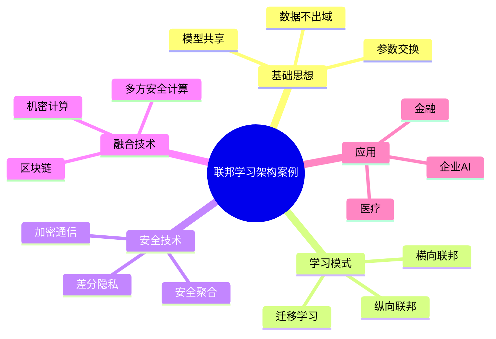

# 37-federated-learning-case.md（联邦学习架构案例）

> 本文用于系统架构设计师考试案例分析专题 V2 复习。
>
> 本篇重点整理联邦学习（Federated Learning）架构设计相关案例，包括联邦学习基本概念、训练模式、整体架构、安全机制、隐私计算结合、医疗金融应用以及企业联邦学习平台案例。

---

# 目录

1. 联邦学习案例概述
2. 联邦学习基本概念
3. 联邦学习核心特点案例
4. 集中式AI训练与联邦学习对比
5. 联邦学习整体架构案例
6. 横向联邦学习案例
7. 纵向联邦学习案例
8. 联邦迁移学习案例
9. 联邦学习训练流程案例
10. 联邦学习数据安全案例
11. 联邦学习与机密计算结合案例
12. 联邦学习与多方安全计算结合案例
13. 联邦学习与区块链结合案例
14. 联邦学习AI模型保护案例
15. 医疗行业联邦学习案例
16. 金融行业联邦学习案例
17. 企业联邦学习平台案例
18. 联邦学习安全挑战案例
19. 案例分析答题模板
20. 高频考点
21. 易错点
22. Mermaid知识结构图
23. 本节小结

---

# 1. 联邦学习案例概述

联邦学习主要解决：

- 数据无法集中存储；
- 数据隐私保护要求高；
- 多机构无法共享原始数据；
- AI模型训练数据不足。

核心思想：

> 在数据不离开本地的情况下，通过交换模型参数实现多方协同训练。

典型架构：

```text
参与方A

数据A

↓

本地训练

↓

模型参数

        ↘

          联邦服务器

        ↗

参与方B

数据B

↓

本地训练
```

---

# 2. 联邦学习基本概念

Federated Learning：

> 一种分布式机器学习方法，使多个参与方在不共享原始数据的情况下共同训练模型。

核心原则：

- 数据不出域；
- 模型可共享；
- 参数可交换。

---

# 3. 联邦学习核心特点

## 数据本地化

原始数据：

- 不上传；
- 保留在本地。

交换：

- 模型参数；
- 梯度信息。

---

## 隐私保护

降低：

- 数据泄露风险；
- 合规风险。

---

## 多方协作

支持：

- 企业联合训练；
- 跨机构AI应用。

---

## 分布式训练

计算任务：

- 分散到多个节点完成。

---

# 4. 集中式AI训练与联邦学习对比

## 集中式训练

```text
数据

↓

数据中心

↓

AI模型训练

↓

模型
```

问题：

- 数据集中风险高；
- 数据合规困难。

---

## 联邦学习

```text
本地数据

↓

本地训练

↓

模型参数

↓

联邦服务器

↓

模型聚合
```

优势：

- 数据不集中；
- 提升隐私保护能力。

---

# 5. 联邦学习整体架构案例

典型架构：

```text
参与方节点

↓

本地训练平台

↓

参数加密传输

↓

联邦协调服务器

↓

模型聚合

↓

更新模型
```

主要组件：

- 数据节点；
- 联邦客户端；
- 联邦服务器；
- 模型管理平台。

---

# 6. 横向联邦学习案例

适用：

- 数据特征相似；
- 用户不同。

例如：

多个银行拥有相同类型客户数据。

特点：

- 样本空间不同；
- 特征空间相同。

---

# 7. 纵向联邦学习案例

适用：

- 用户相同；
- 特征不同。

例如：

银行和电商联合建模。

特点：

- 不共享原始数据；
- 共享模型计算结果。

---

# 8. 联邦迁移学习案例

适用于：

- 用户不同；
- 特征不同；
- 数据量不足。

通过迁移学习：

实现知识共享。

---

# 9. 联邦学习训练流程案例

流程：

```text
初始化模型

↓

模型下发

↓

本地训练

↓

上传参数

↓

模型聚合

↓

更新模型

↓

重复训练
```

---

# 10. 联邦学习数据安全案例

安全措施：

## 参数保护

防止：

- 模型参数泄露。

## 加密通信

保护：

- 参数传输。

## 差分隐私

降低：

- 单个样本影响。

## 安全聚合

保证：

- 聚合过程安全。

---

# 11. 联邦学习与机密计算结合案例

机密计算保护：

- 参数计算过程。

架构：

```text
本地模型

↓

加密参数

↓

TEE环境

↓

安全聚合

↓

最终模型
```

优势：

- 防止参数泄露；
- 提升计算可信度。

---

# 12. 联邦学习与多方安全计算结合案例

MPC：

Multi-Party Computation。

目标：

多个参与方：

- 联合计算；
- 不暴露原始数据。

应用：

- 金融联合分析；
- 医疗研究。

---

# 13. 联邦学习与区块链结合案例

区块链作用：

- 记录训练过程；
- 保证模型可信；
- 防止恶意节点。

架构：

```text
训练节点

↓

联邦学习

↓

区块链记录

↓

模型可信验证
```

---

# 14. 联邦学习AI模型保护案例

保护：

- 模型参数；
- 训练过程；
- 推理结果。

措施：

- 加密算法；
- 权限控制；
- 模型审计。

---

# 15. 医疗行业联邦学习案例

场景：

医院之间共享AI能力。

问题：

- 医疗数据敏感；
- 不允许直接共享。

方案：

```text
医院A

↓

本地训练


医院B

↓

本地训练


↓

联合模型
```

应用：

- 医学影像分析；
- 疾病预测。

---

# 16. 金融行业联邦学习案例

应用：

- 风险预测；
- 信贷分析；
- 反欺诈。

优势：

- 数据不交换；
- 模型可共享。

---

# 17. 企业联邦学习平台案例

架构：

```text
数据源

↓

联邦客户端

↓

联邦管理平台

↓

安全计算平台

↓

AI应用
```

能力：

- 模型管理；
- 任务调度；
- 安全控制。

---

# 18. 联邦学习安全挑战案例

主要问题：

## 参数泄露

攻击：

- 模型反推。

## 恶意节点

攻击：

- 上传异常模型。

## 数据质量差异

问题：

- 数据分布不同。

解决：

- 安全聚合；
- 异常检测；
- 模型验证。

---

# 19. 案例分析答题模板

## 数据不能集中

> 采用联邦学习架构，使数据保留在本地，通过模型参数交换实现多方协同训练。

## 多机构联合建模

> 通过联邦学习结合安全聚合技术，实现数据不共享情况下的模型训练。

## 医疗金融数据敏感

> 采用联邦学习、机密计算和隐私保护技术，实现数据可用不可见。

## 防止模型攻击

> 采用安全聚合、差分隐私和模型验证机制，提高联邦学习安全性。

---

# 20. 高频考点

重点掌握：

1. 联邦学习基本思想；
2. 数据不出域；
3. 横向联邦学习；
4. 纵向联邦学习；
5. 安全聚合；
6. 隐私保护；
7. 与机密计算结合。

---

# 21. 易错点

| 易错知识 | 正确理解 |
|---|---|
| 联邦学习就是共享数据 | 联邦学习共享的是模型参数 |
| 数据必须上传中心服务器 | 原始数据保留在本地 |
| 联邦学习天然安全 | 仍需要加密和安全机制 |
| 只适用于单一行业 | 可用于医疗、金融、企业协作 |

---

# 22. Mermaid知识结构图



---

# 23. 本节小结

联邦学习案例核心：

> 在保护数据隐私的前提下，通过模型参数交换实现多方协同训练，是AI时代数据安全共享的重要架构模式。

案例分析重点：

- 理解数据不出域思想；
- 掌握横向、纵向和迁移联邦学习；
- 结合机密计算和隐私计算提升安全性；
- 应用于医疗、金融等敏感数据场景。
