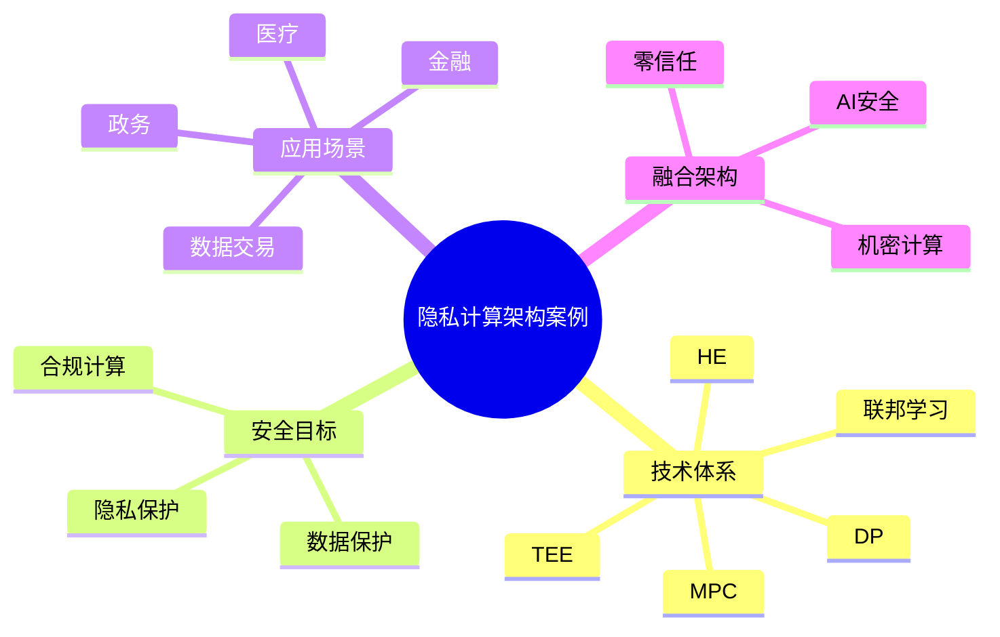

# 38-privacy-computing-case.md（隐私计算架构案例）

> 本文用于系统架构设计师考试案例分析专题 V2 复习。
>
> 本篇重点整理隐私计算（Privacy Computing）架构设计相关案例，包括隐私计算基本概念、技术体系、多方安全计算、同态加密、可信执行环境、联邦学习结合、数据安全共享以及行业应用案例。

---

# 目录

1. 隐私计算案例概述
2. 隐私计算基本概念
3. 数据安全与隐私保护挑战案例
4. 隐私计算技术体系案例
5. 隐私计算整体架构案例
6. 多方安全计算MPC案例
7. 同态加密HE案例
8. 可信执行环境TEE案例
9. 差分隐私DP案例
10. 联邦学习与隐私计算结合案例
11. 隐私计算数据共享案例
12. 金融行业隐私计算案例
13. 医疗行业隐私计算案例
14. 政务数据共享案例
15. 数据要素流通案例
16. 隐私计算安全案例
17. 隐私计算平台架构案例
18. 企业隐私计算解决方案案例
19. 案例分析答题模板
20. 高频考点
21. 易错点
22. Mermaid知识结构图
23. 本节小结

---

# 1. 隐私计算案例概述

隐私计算主要解决：

- 数据无法直接共享；
- 数据价值无法释放；
- 数据合规要求提高；
- 多机构联合分析困难。

核心思想：

> 在保护数据隐私和安全的前提下，实现数据可计算、可分析、可协作。

典型理念：

```text
数据不可见

↓

数据可使用

↓

价值可释放
```

---

# 2. 隐私计算基本概念

Privacy Computing：

> 一系列保护数据隐私的计算技术，使数据在不暴露原始内容的情况下完成计算和分析。

目标：

保护：

- 数据内容；
- 数据关系；
- 计算过程。

---

# 3. 数据安全与隐私保护挑战案例

传统数据共享：

```text
机构A数据

↓

集中平台

↓

机构B使用
```

问题：

- 数据泄露风险；
- 合规风险；
- 数据滥用。

隐私计算：

```text
机构A数据

↓

安全计算

↓

输出结果
```

特点：

- 原始数据不流转。

---

# 4. 隐私计算技术体系

```text
隐私计算

├── 多方安全计算 MPC

├── 同态加密 HE

├── 可信执行环境 TEE

├── 联邦学习 FL

└── 差分隐私 DP
```

---

# 5. 隐私计算整体架构案例

```text
数据提供方

↓

隐私计算平台

↓

安全计算引擎

↓

联合分析任务

↓

结果输出
```

组成：

- 数据接入层；
- 安全计算层；
- 任务管理层；
- 结果应用层。

---

# 6. 多方安全计算MPC案例

MPC：

Multi-Party Computation。

核心：

> 多个参与方共同计算，但不暴露自己的输入数据。

应用：

- 金融联合分析；
- 数据匹配；
- 风险评估。

---

# 7. 同态加密HE案例

同态加密：

> 对密文进行计算，解密后得到等价于明文计算的结果。

流程：

```text
明文数据

↓

加密

↓

密文计算

↓

解密结果
```

优势：

- 数据无需解密。

不足：

- 计算复杂度较高。

---

# 8. 可信执行环境TEE案例

TEE：

Trusted Execution Environment。

作用：

- 隔离计算环境；
- 安全执行区域；
- 数据保护。

架构：

```text
应用

↓

TEE

↓

硬件安全区域
```

---

# 9. 差分隐私DP案例

差分隐私：

通过加入噪声保护个人隐私。

目标：

防止：

- 单个用户数据被识别。

应用：

- 数据统计；
- AI训练。

---

# 10. 联邦学习与隐私计算结合案例

联邦学习解决：

> 数据在哪里计算。

隐私计算解决：

> 数据如何安全计算。

结合：

```text
本地数据

↓

联邦训练

↓

隐私计算保护

↓

模型聚合
```

---

# 11. 隐私计算数据共享案例

传统：

```text
数据交换

↓

数据复制

↓

数据风险增加
```

隐私计算：

```text
数据保留本地

↓

安全计算

↓

共享结果
```

实现：

> 数据可用不可见。

---

# 12. 金融行业隐私计算案例

场景：

- 联合风控；
- 反欺诈；
- 信贷分析。

优势：

- 数据不交换；
- 模型共享。

---

# 13. 医疗行业隐私计算案例

问题：

医疗数据：

- 敏感；
- 分散。

方案：

```text
医院A

↓

安全计算


医院B

↓

安全计算


↓

医疗AI模型
```

应用：

- 医学研究；
- 疾病预测。

---

# 14. 政务数据共享案例

目标：

跨部门：

- 数据共享；
- 隐私保护。

---

# 15. 数据要素流通案例

隐私计算支持：

- 数据交易；
- 数据共享；
- 数据价值释放。

核心：

> 数据不移动，价值可流通。

---

# 16. 隐私计算安全案例

安全措施：

## 数据安全

- 加密；
- 权限控制。

## 计算安全

- MPC协议；
- TEE隔离。

## 模型安全

- 参数保护；
- 输出控制。

---

# 17. 隐私计算平台架构案例

```text
业务应用

↓

隐私计算平台

↓

安全计算引擎

↓

数据资源

↓

基础设施
```

能力：

- 数据管理；
- 任务调度；
- 安全审计。

---

# 18. 企业隐私计算解决方案案例

```text
企业数据

↓

隐私计算节点

↓

安全协作平台

↓

AI应用

↓

业务决策
```

---

# 19. 案例分析答题模板

## 数据不能直接共享

> 采用隐私计算技术，在数据不离开本地的情况下完成联合计算，实现数据可用不可见。

## 多机构联合分析

> 结合多方安全计算、联邦学习和可信执行环境，实现跨组织安全协作。

## 数据价值需要释放

> 建设隐私计算平台，实现数据安全流通和数据价值挖掘。

## AI训练涉及敏感数据

> 采用联邦学习结合隐私计算技术，在保护数据隐私的同时完成模型训练。

---

# 20. 高频考点

重点掌握：

1. 隐私计算基本思想；
2. MPC多方安全计算；
3. 同态加密；
4. TEE可信执行环境；
5. 差分隐私；
6. 联邦学习结合；
7. 数据安全共享。

---

# 21. 易错点

| 易错知识 | 正确理解 |
|---|---|
| 隐私计算就是数据加密 | 隐私计算关注安全计算过程 |
| 数据必须集中才能分析 | 可通过隐私计算实现联合分析 |
| 联邦学习等于全部隐私计算 | 联邦学习只是其中一种技术 |
| 数据共享必须交换原始数据 | 可以只共享计算结果 |

---

# 22. Mermaid知识结构图



---

# 23. 本节小结

隐私计算案例核心：

> 在保护数据隐私的基础上，实现数据安全计算和价值释放，是数据要素时代的重要架构技术。

案例分析重点：

- 理解数据可用不可见；
- 掌握MPC、HE、TEE、DP等关键技术；
- 结合联邦学习实现安全AI训练；
- 支撑跨机构数据安全协作。
