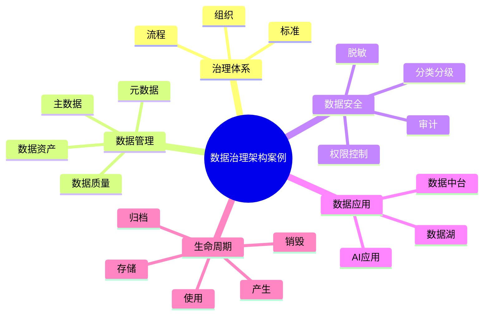

# 39-data-governance-case.md（数据治理架构案例）

> 本文用于系统架构设计师考试案例分析专题 V2 复习。
>
> 本篇重点整理数据治理（Data Governance）架构设计相关案例，包括数据治理体系、数据标准管理、元数据管理、数据质量管理、主数据管理、数据资产管理、数据安全治理、数据中台结合以及企业数据治理平台案例。

---

# 目录

1. 数据治理案例概述
2. 数据治理基本概念
3. 数据治理目标案例
4. 数据治理体系架构案例
5. 数据治理组织体系案例
6. 数据标准管理案例
7. 元数据管理案例
8. 数据质量管理案例
9. 主数据管理MDM案例
10. 数据资产管理案例
11. 数据目录建设案例
12. 数据血缘分析案例
13. 数据安全治理案例
14. 数据生命周期管理案例
15. 数据中台与数据治理结合案例
16. 大数据平台数据治理案例
17. AI数据治理案例
18. 企业数据治理平台案例
19. 案例分析答题模板
20. 高频考点
21. 易错点
22. Mermaid知识结构图
23. 本节小结

---

# 1. 数据治理案例概述

数据治理主要解决：

- 数据标准不统一；
- 数据质量差；
- 数据重复建设；
- 数据无法共享；
- 数据安全风险。

核心思想：

> 通过组织、流程、标准和技术手段，对数据资产进行统一管理，提高数据质量和数据价值。

目标：

```text
数据产生

↓

数据管理

↓

数据治理

↓

数据资产

↓

业务价值
```

---

# 2. 数据治理基本概念

数据治理：

> 对企业数据资产进行规划、管理、监督和控制的一系列活动。

主要内容：

- 数据标准；
- 数据质量；
- 元数据；
- 数据安全；
- 数据资产。

---

# 3. 数据治理目标案例

## 提升数据质量

解决：

- 数据错误；
- 数据缺失；
- 数据重复。

## 实现数据共享

解决：

- 数据孤岛；
- 系统割裂。

## 保障数据安全

实现：

- 数据访问控制；
- 数据保护。

## 发挥数据价值

支持：

- 数据分析；
- AI应用；
- 决策支持。

---

# 4. 数据治理体系架构案例

典型架构：

```text
业务应用层

↓

数据服务层

↓

数据治理平台

↓

数据资源层

↓

基础设施层
```

治理能力：

```text
数据治理平台

├── 数据标准管理

├── 元数据管理

├── 数据质量管理

├── 数据安全管理

├── 数据资产管理

└── 数据目录管理
```

---

# 5. 数据治理组织体系案例

典型组织：

```text
企业管理层

↓

数据治理委员会

↓

数据管理部门

↓

业务数据负责人

↓

数据管理员
```

职责：

- 制定数据战略；
- 制定数据标准；
- 推动数据治理。

---

# 6. 数据标准管理案例

数据标准解决：

- 字段定义不一致；
- 编码规则混乱；
- 数据口径不同。

内容：

- 数据元素标准；
- 数据分类标准；
- 编码标准；
- 指标标准。

案例：

```text
系统A：CUST_ID

系统B：CUSTOMER_NO

↓

统一：

CUSTOMER_ID
```

---

# 7. 元数据管理案例

元数据：

> 描述数据的数据。

包括：

## 技术元数据

例如：

- 表结构；
- 字段类型；
- 数据库信息。

## 业务元数据

例如：

- 指标定义；
- 业务含义。

## 管理元数据

例如：

- 数据责任人；
- 使用权限。

---

# 8. 数据质量管理案例

数据质量维度：

## 完整性

数据是否缺失。

## 准确性

数据是否正确。

## 一致性

不同系统是否一致。

## 唯一性

是否存在重复。

## 时效性

是否及时更新。

流程：

```text
数据采集

↓

质量检测

↓

问题发现

↓

数据修复

↓

质量评估
```

---

# 9. 主数据管理MDM案例

MDM：

Master Data Management。

解决：

企业核心数据统一。

典型数据：

- 客户；
- 产品；
- 组织；
- 员工。

架构：

```text
业务系统A

↓

主数据管理平台

↓

业务系统B
```

优势：

- 消除数据重复；
- 统一数据口径。

---

# 10. 数据资产管理案例

数据资产：

> 企业拥有或控制的数据资源。

管理：

- 数据登记；
- 数据分类；
- 数据价值评估；
- 数据运营。

---

# 11. 数据目录建设案例

数据目录：

> 企业数据资源地图。

包含：

- 数据名称；
- 数据来源；
- 数据负责人；
- 使用权限。

价值：

- 数据发现；
- 数据共享。

---

# 12. 数据血缘分析案例

数据血缘：

描述数据从哪里来，到哪里去。

例如：

```text
业务系统

↓

ODS

↓

数据仓库

↓

数据报表
```

作用：

- 影响分析；
- 数据追踪；
- 问题定位。

---

# 13. 数据安全治理案例

措施：

## 数据分类分级

例如：

- 普通数据；
- 敏感数据；
- 核心数据。

## 访问控制

采用：

- RBAC；
- ABAC。

## 数据脱敏

保护：

- 身份信息；
- 敏感业务数据。

## 数据审计

记录：

- 谁访问；
- 访问什么；
- 访问时间。

---

# 14. 数据生命周期管理案例

生命周期：

```text
产生

↓

存储

↓

使用

↓

归档

↓

销毁
```

治理：

- 控制保存周期；
- 降低存储成本；
- 保证合规。

---

# 15. 数据中台与数据治理结合案例

数据中台：

提供：

- 数据汇聚；
- 数据加工；
- 数据服务。

数据治理：

保证：

- 数据标准；
- 数据质量；
- 数据安全。

结合：

```text
业务系统

↓

数据中台

↓

数据治理平台

↓

数据服务
```

---

# 16. 大数据平台数据治理案例

数据来源：

- 日志；
- IoT；
- 业务系统。

治理：

- 数据采集标准；
- 数据质量检测；
- 数据生命周期。

---

# 17. AI数据治理案例

AI依赖：

高质量数据。

治理：

- 数据清洗；
- 数据标注；
- 数据质量检测；
- 数据偏差控制。

---

# 18. 企业数据治理平台案例

整体架构：

```text
业务应用

↓

数据服务平台

↓

数据治理平台

↓

数据湖/数据仓库

↓

数据资源
```

能力：

- 数据标准；
- 数据质量；
- 数据资产；
- 数据安全。

---

# 19. 案例分析答题模板

## 数据孤岛严重

> 建立统一数据治理体系，通过数据标准、元数据管理和数据共享机制消除数据孤岛。

## 数据质量低

> 建立数据质量管理体系，从完整性、准确性、一致性等方面进行检测和修复。

## 数据口径不一致

> 通过数据标准管理和主数据管理，实现企业核心数据统一。

## 数据安全要求高

> 采用数据分类分级、访问控制、脱敏和审计机制保障数据安全。

---

# 20. 高频考点

重点掌握：

1. 数据治理体系；
2. 数据标准管理；
3. 元数据管理；
4. 数据质量管理；
5. 主数据管理；
6. 数据资产管理；
7. 数据安全治理。

---

# 21. 易错点

| 易错知识 | 正确理解 |
|---|---|
| 数据治理只是技术平台建设 | 还包括组织、流程和标准 |
| 数据越多价值越高 | 高质量数据才具有价值 |
| 数据共享就是复制数据 | 应通过治理实现安全共享 |
| 数据安全等于数据治理全部内容 | 数据安全只是治理的一部分 |

---

# 22. Mermaid知识结构图



---

# 23. 本节小结

数据治理案例核心：

> 通过组织、流程、标准和技术手段，对企业数据资产进行统一管理，提高数据质量、安全性和业务价值。

案例分析重点：

- 建立数据治理体系；
- 统一数据标准；
- 管理元数据和主数据；
- 提升数据质量；
- 实现数据安全共享；
- 支撑数据驱动业务发展。
