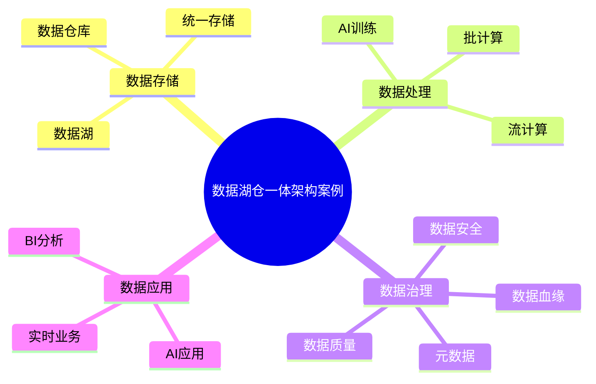

# 40-data-lakehouse-case.md（数据湖仓一体架构案例）

> 本文用于系统架构设计师考试案例分析专题 V2 复习。
>
> 本篇重点整理数据湖仓一体（Data Lakehouse）架构设计相关案例，包括数据湖、数据仓库、湖仓融合架构、数据治理、实时分析、AI数据平台以及企业级数据湖仓案例。

---

# 目录

1. 数据湖仓一体案例概述
2. 数据湖基本概念
3. 数据仓库基本概念
4. 数据湖与数据仓库对比
5. Lakehouse核心思想
6. 数据湖仓一体整体架构
7. 数据采集层案例
8. 数据存储层案例
9. 数据计算引擎案例
10. 数据管理与治理案例
11. 实时数据湖仓案例
12. AI数据湖仓案例
13. 湖仓一体与数据中台结合案例
14. 湖仓一体与数据治理结合案例
15. 湖仓一体安全架构案例
16. 企业级数据湖仓平台案例
17. 湖仓一体应用案例
18. 数据湖仓优化案例
19. 案例分析答题模板
20. 高频考点
21. 易错点
22. Mermaid知识结构图
23. 本节小结

---

# 1. 数据湖仓一体案例概述

数据湖仓一体：

> 将数据湖的大规模低成本存储能力与数据仓库的数据管理和分析能力结合，实现统一的数据平台架构。

主要解决：

- 数据湖治理不足；
- 数据仓库扩展困难；
- 数据复制严重；
- AI与分析平台割裂。

核心流程：

```text
多源数据

↓

统一存储

↓

统一治理

↓

统一计算

↓

数据价值应用
```

---

# 2. 数据湖基本概念

Data Lake：

> 用于存储海量原始数据的数据存储架构。

特点：

- 大规模存储；
- 支持多种数据类型；
- 保留原始数据。

数据类型：

- 结构化数据；
- 半结构化数据；
- 非结构化数据。

---

# 3. 数据仓库基本概念

Data Warehouse：

> 面向分析决策的结构化数据存储系统。

特点：

- 数据经过加工；
- 数据模型稳定；
- 支持BI分析。

典型流程：

```text
业务系统

↓

ETL

↓

数据仓库

↓

报表分析
```

---

# 4. 数据湖与数据仓库对比

| 对比 | 数据湖 | 数据仓库 |
|---|---|---|
| 数据状态 | 原始数据 | 加工数据 |
| 数据类型 | 多类型 | 结构化 |
| 成本 | 较低 | 较高 |
| 用途 | AI、大数据 | BI分析 |

---

# 5. Lakehouse核心思想

Lakehouse：

> 在数据湖基础上增加数据仓库能力，实现统一存储、统一治理和统一分析。

优势：

- 减少数据复制；
- 提升数据利用效率；
- 支持AI和分析统一。

---

# 6. 数据湖仓一体整体架构

典型架构：

```text
数据源

↓

数据采集层

↓

湖仓存储层

↓

计算引擎

↓

治理平台

↓

数据应用
```

组成：

- 数据采集；
- 数据存储；
- 数据计算；
- 数据治理；
- 数据服务。

---

# 7. 数据采集层案例

数据来源：

- 业务系统；
- 日志系统；
- IoT设备；
- 消息队列。

采集方式：

- 批处理；
- 流处理。

---

# 8. 数据存储层案例

特点：

- 海量存储；
- 低成本；
- 弹性扩展。

数据分层：

```text
原始层

↓

明细层

↓

汇总层

↓

应用层
```

---

# 9. 数据计算引擎案例

计算方式：

## 批计算

适合：

- 历史数据分析；
- 大规模计算。

## 流计算

适合：

- 实时数据处理；
- 实时指标分析。

---

# 10. 数据管理与治理案例

湖仓架构必须结合数据治理。

包括：

- 元数据管理；
- 数据质量；
- 数据目录；
- 数据血缘；
- 数据安全。

---

# 11. 实时数据湖仓案例

架构：

```text
实时数据

↓

流计算

↓

湖仓平台

↓

实时应用
```

应用：

- 实时风控；
- 推荐系统；
- 监控分析。

---

# 12. AI数据湖仓案例

AI需要：

- 大规模数据；
- 高质量数据；
- 多类型数据。

架构：

```text
数据湖仓

↓

数据处理

↓

AI训练平台

↓

模型应用
```

支持：

- 特征工程；
- 模型训练；
- 数据标注。

---

# 13. 湖仓一体与数据中台结合案例

数据中台负责：

- 数据服务；
- 业务应用。

湖仓负责：

- 数据存储；
- 数据计算。

架构：

```text
业务系统

↓

数据中台

↓

湖仓平台

↓

数据服务
```

---

# 14. 湖仓一体与数据治理结合案例

治理能力：

- 数据标准；
- 数据质量；
- 数据安全；
- 数据血缘。

目标：

> 实现数据存储与数据治理统一。

---

# 15. 湖仓一体安全架构案例

安全措施：

## 数据安全

- 加密存储；
- 加密传输。

## 访问控制

- RBAC；
- ABAC。

## 审计

记录：

- 数据访问；
- 数据操作。

---

# 16. 企业级数据湖仓平台案例

整体架构：

```text
业务系统

↓

数据采集平台

↓

湖仓平台

↓

数据治理平台

↓

AI/BI应用
```

能力：

- 数据存储；
- 数据分析；
- AI训练；
- 数据服务。

---

# 17. 湖仓一体应用案例

## 金融

- 风险分析；
- 实时风控。

## 制造

- 工业数据分析；
- 预测维护。

## 零售

- 用户画像；
- 推荐系统。

---

# 18. 数据湖仓优化案例

优化方向：

- 数据分层；
- 存储优化；
- 查询优化；
- 生命周期管理。

目标：

- 降低成本；
- 提高性能。

---

# 19. 案例分析答题模板

## 数据湖数据混乱

> 建立湖仓一体架构，引入数据治理能力，实现统一管理和统一分析。

## 数据仓库扩展困难

> 采用数据湖仓一体架构，通过弹性存储和计算能力提升数据处理能力。

## AI和数据分析共用数据

> 建设统一湖仓平台，为BI分析和AI训练提供统一数据基础。

## 实时分析需求

> 引入流计算和实时湖仓架构，实现数据实时采集、处理和分析。

---

# 20. 高频考点

重点掌握：

1. 数据湖与数据仓库区别；
2. Lakehouse核心思想；
3. 湖仓整体架构；
4. 数据治理结合；
5. 实时分析；
6. AI数据平台。

---

# 21. 易错点

| 易错知识 | 正确理解 |
|---|---|
| 数据湖就是数据仓库升级 | 两者定位不同 |
| 湖仓只负责存储 | 同时提供计算和治理能力 |
| 有数据湖就不需要治理 | 数据湖同样需要治理 |
| 湖仓只能用于大数据分析 | 可支持BI和AI统一应用 |

---

# 22. Mermaid知识结构图



---

# 23. 本节小结

数据湖仓一体案例核心：

> 通过融合数据湖和数据仓库能力，构建统一的数据存储、计算、治理和分析平台。

案例分析重点：

- 理解数据湖与数据仓库区别；
- 掌握Lakehouse架构思想；
- 结合数据治理提升数据质量；
- 支撑实时分析和AI应用。
