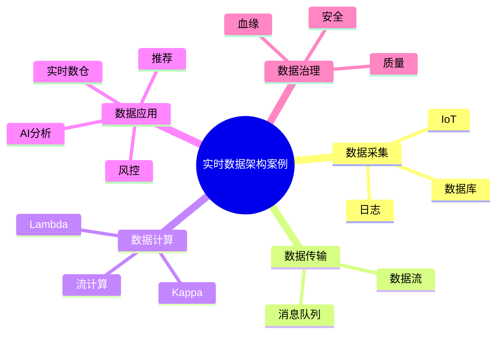

# 41-real-time-data-architecture-case.md（实时数据架构案例）

> 本文用于系统架构设计师考试案例分析专题 V2 复习。
>
> 本篇重点整理实时数据架构（Real-Time Data Architecture）设计相关案例，包括实时数据处理、消息队列、流式计算、Lambda架构、Kappa架构、实时数仓、实时湖仓、IoT实时处理以及实时业务应用案例。

---

# 目录

1. 实时数据架构案例概述
2. 实时数据基本概念
3. 批处理与实时处理对比
4. 实时数据架构整体设计
5. 数据采集层案例
6. 消息队列架构案例
7. 流式计算架构案例
8. Lambda架构案例
9. Kappa架构案例
10. 实时数仓架构案例
11. 实时数据湖仓案例
12. IoT实时数据处理案例
13. 实时风控系统案例
14. 实时推荐系统案例
15. 实时数据治理案例
16. 实时数据安全案例
17. 企业实时数据平台案例
18. 实时架构优化案例
19. 案例分析答题模板
20. 高频考点
21. 易错点
22. Mermaid知识结构图
23. 本节小结

---

# 1. 实时数据架构案例概述

实时数据架构：

> 通过数据实时采集、实时传输、实时计算和实时分析，实现业务快速响应的数据处理体系。

主要解决：

- 数据延迟高；
- 无法实时决策；
- 批处理周期长。

核心流程：

```text
业务事件

↓

实时采集

↓

实时计算

↓

实时分析

↓

实时决策
```

---

# 2. 实时数据基本概念

实时数据：

指产生后需要快速处理的数据。

来源：

- 用户行为；
- 交易数据；
- IoT设备；
- 日志数据。

特点：

- 高时效性；
- 高吞吐量；
- 连续产生。

---

# 3. 批处理与实时处理对比

## 批处理

```text
数据

↓

ETL

↓

数据仓库

↓

分析
```

特点：

- 定时执行；
- 大批量处理。

适合：

- 日报；
- 月报；
- 历史分析。

---

## 实时处理

```text
实时数据

↓

流处理

↓

实时结果

↓

业务系统
```

特点：

- 数据立即处理；
- 快速响应。

---

# 4. 实时数据架构整体设计

典型架构：

```text
数据源

↓

采集层

↓

消息队列

↓

流计算平台

↓

数据存储

↓

业务应用
```

主要组成：

- 数据采集；
- 消息传输；
- 流式计算；
- 实时存储；
- 数据服务。

---

# 5. 数据采集层案例

数据来源：

- 数据库变化；
- 用户行为；
- 设备数据；
- 应用日志。

采集方式：

- 数据同步；
- 日志采集；
- IoT采集。

---

# 6. 消息队列架构案例

消息队列作用：

- 系统解耦；
- 削峰填谷；
- 异步处理。

架构：

```text
生产者

↓

消息队列

↓

消费者
```

---

# 7. 流式计算架构案例

流计算：

> 对持续产生的数据进行实时处理。

流程：

```text
数据流

↓

流计算引擎

↓

实时结果
```

处理能力：

- 数据过滤；
- 聚合计算；
- 窗口计算；
- 状态管理。

---

# 8. Lambda架构案例

Lambda架构：

结合：

- 批处理；
- 实时处理。

结构：

```text
             Batch Layer

数据源  ---------------->

             Speed Layer

数据源  ---------------->

             Serving Layer

                    ↓

                  应用
```

优点：

- 兼顾准确性和实时性。

缺点：

- 两套计算逻辑维护复杂。

---

# 9. Kappa架构案例

Kappa架构：

> 以流处理为核心，所有数据通过流重新计算。

架构：

```text
数据源

↓

消息队列

↓

流计算

↓

结果服务
```

优势：

- 架构简单；
- 避免批流双维护。

---

# 10. 实时数仓架构案例

实时数仓：

支持：

- 秒级分析；
- 实时指标。

架构：

```text
业务数据

↓

实时采集

↓

实时计算

↓

实时数仓

↓

BI分析
```

应用：

- 实时经营分析；
- 实时监控。

---

# 11. 实时数据湖仓案例

结合：

数据湖仓 + 流计算。

架构：

```text
实时数据

↓

流计算

↓

Lakehouse

↓

AI/BI应用
```

优势：

- 实时数据统一管理；
- 支持AI分析。

---

# 12. IoT实时数据处理案例

IoT特点：

- 数据量大；
- 连续产生。

架构：

```text
设备

↓

边缘节点

↓

消息平台

↓

实时计算

↓

业务系统
```

应用：

- 智能制造；
- 智慧城市。

---

# 13. 实时风控系统案例

场景：

金融交易风险检测。

架构：

```text
交易事件

↓

实时计算

↓

风险模型

↓

风险判断

↓

拦截处理
```

能力：

- 秒级识别；
- 实时决策。

---

# 14. 实时推荐系统案例

流程：

```text
用户行为

↓

实时分析

↓

用户画像

↓

推荐模型

↓

推荐结果
```

应用：

- 电商；
- 内容平台。

---

# 15. 实时数据治理案例

治理内容：

- 数据质量检测；
- 数据标准；
- 数据血缘；
- 数据安全。

流程：

```text
实时数据

↓

质量检测

↓

异常发现

↓

自动处理
```

---

# 16. 实时数据安全案例

安全措施：

## 数据传输安全

- 加密传输。

## 访问控制

- 权限管理。

## 数据审计

- 操作记录。

---

# 17. 企业实时数据平台案例

整体架构：

```text
业务系统

↓

数据采集平台

↓

消息队列

↓

流计算平台

↓

实时数据平台

↓

业务应用
```

能力：

- 实时分析；
- 实时监控；
- 实时决策。

---

# 18. 实时架构优化案例

优化方向：

## 性能优化

- 分区；
- 并行计算。

## 稳定性优化

- 容错；
- 重试机制。

## 成本优化

- 数据分层；
- 存储优化。

---

# 19. 案例分析答题模板

## 业务需要实时响应

> 建设实时数据架构，通过数据采集、消息队列和流式计算实现实时分析和业务决策。

## 高并发数据处理

> 引入消息队列进行系统解耦，通过流计算平台提升实时处理能力。

## 批流统一处理

> 根据业务需求采用Lambda或Kappa架构，实现实时与离线数据处理。

## 实时风控需求

> 建立实时数据处理平台，对交易数据进行实时计算和风险识别。

---

# 20. 高频考点

重点掌握：

1. 实时数据架构；
2. 消息队列作用；
3. 流式计算；
4. Lambda架构；
5. Kappa架构；
6. 实时数仓；
7. 实时湖仓。

---

# 21. 易错点

| 易错知识 | 正确理解 |
|---|---|
| 实时系统就是没有延迟 | 实时通常指满足业务时延要求 |
| Lambda没有缺点 | 维护两套计算逻辑较复杂 |
| Kappa适合所有场景 | 复杂历史批处理场景仍需评估 |
| 消息队列只能传消息 | 还可用于解耦和削峰 |

---

# 22. Mermaid知识结构图



---

# 23. 本节小结

实时数据架构案例核心：

> 通过实时采集、消息传输、流式计算和实时分析，实现快速响应的业务数据处理体系。

案例分析重点：

- 掌握实时数据处理流程；
- 理解Lambda和Kappa架构区别；
- 结合消息队列提升系统可靠性；
- 支撑实时风控、推荐和IoT应用。
