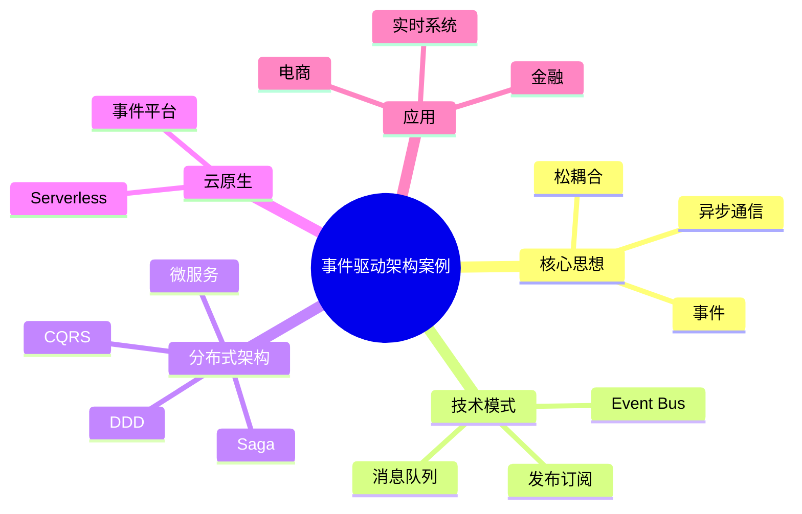

# 42-event-driven-architecture-case.md（事件驱动架构案例）

> 本文用于系统架构设计师考试案例分析专题 V2 复习。
>
> 本篇重点整理事件驱动架构（Event-Driven Architecture，EDA）设计相关案例，包括事件模型、发布订阅、消息队列、事件总线、微服务事件驱动、DDD领域事件、Event Sourcing、CQRS、Saga、云原生事件架构等内容。

---

# 目录

1. 事件驱动架构案例概述
2. 事件驱动基本概念
3. 传统同步架构与事件驱动对比
4. 事件驱动架构整体设计
5. 事件模型设计
6. 发布订阅模式
7. 消息队列架构
8. 事件总线Event Bus
9. 事件流处理
10. 微服务事件驱动
11. DDD与事件驱动结合
12. Event Sourcing事件溯源
13. CQRS架构
14. Saga分布式事务
15. 云原生事件驱动
16. Serverless事件驱动
17. 实时业务系统案例
18. 事件安全治理
19. 企业事件驱动平台
20. 案例分析答题模板
21. 高频考点
22. 易错点
23. Mermaid知识结构图
24. 本节小结

---

# 1. 事件驱动架构案例概述

事件驱动架构：

> 以事件作为系统之间通信和业务处理触发机制的架构模式。

核心思想：

> 系统产生事件，其他服务订阅事件并进行响应。

基本流程：

```text
业务事件

↓

事件产生

↓

事件发布

↓

事件消费

↓

业务处理
```

---

# 2. 事件驱动基本概念

事件（Event）：

表示已经发生的业务事实。

例如：

- 用户注册完成；
- 订单创建成功；
- 支付完成；
- 库存变化。

特点：

- 描述过去事实；
- 不应被修改；
- 可被多个消费者处理。

---

# 3. 传统同步架构与事件驱动对比

## 同步调用

```text
服务A

↓

服务B

↓

服务C
```

问题：

- 强耦合；
- 依赖复杂；
- 扩展困难。

---

## 事件驱动

```text
服务A

↓

发布事件

↓

事件平台

↓

服务B

服务C

服务D
```

优势：

- 松耦合；
- 易扩展；
- 支持异步处理。

---

# 4. 事件驱动架构整体设计

典型架构：

```text
事件生产者

↓

事件总线

↓

事件处理服务

↓

业务系统
```

主要组件：

- Event Producer；
- Event Broker；
- Event Consumer；
- Event Handler。

---

# 5. 事件模型设计

事件包括：

## 事件名称

例如：

```text
OrderCreated
```

## 事件数据

包括：

- 时间；
- 用户；
- 业务ID；
- 状态信息。

## 事件版本管理

保证：

- 兼容升级；
- 系统演进。

---

# 6. 发布订阅模式案例

Pub/Sub：

> 发布者产生事件，订阅者根据需求消费事件。

架构：

```text
发布者

↓

Topic

↓

订阅者A

订阅者B

订阅者C
```

优势：

- 支持多个消费者；
- 降低系统耦合。

---

# 7. 消息队列架构案例

消息队列作用：

- 异步处理；
- 削峰填谷；
- 系统解耦。

架构：

```text
生产者

↓

消息队列

↓

消费者
```

应用：

- 订单系统；
- 支付系统；
- 通知系统。

---

# 8. 事件总线Event Bus案例

Event Bus：

负责事件传输和路由。

能力：

- 事件接收；
- 路由分发；
- 事件过滤；
- 失败处理。

架构：

```text
服务

↓

Event Bus

↓

多个服务
```

---

# 9. 事件流处理案例

事件流：

连续产生的数据事件。

流程：

```text
事件流

↓

流处理引擎

↓

实时结果
```

应用：

- 实时监控；
- 风控；
- 推荐。

---

# 10. 微服务事件驱动案例

微服务问题：

- 服务数量多；
- 调用关系复杂。

事件驱动：

```text
订单服务

↓

OrderCreated事件

↓

库存服务

支付服务

物流服务
```

优势：

- 服务自治；
- 降低依赖。

---

# 11. DDD与事件驱动结合案例

领域驱动设计通过领域事件表达业务变化。

例如：

```text
OrderCreated

OrderPaid

OrderCompleted
```

架构：

```text
领域模型

↓

领域事件

↓

其他服务
```

---

# 12. Event Sourcing事件溯源案例

核心：

> 保存业务状态变化过程，而不是只保存最终状态。

例如：

```text
创建订单

↓

支付成功

↓

发货完成
```

优势：

- 可追溯；
- 支持历史恢复。

---

# 13. CQRS架构案例

CQRS：

Command Query Responsibility Segregation。

核心：

读写分离。

```text
写请求

↓

Command模型

↓

事件存储


读请求

↓

Query模型

↓

查询数据库
```

优势：

- 提升性能；
- 适合复杂业务。

---

# 14. Saga分布式事务案例

解决：

微服务分布式事务问题。

流程：

```text
订单创建

↓

库存扣减

↓

支付完成

↓

物流处理
```

失败时：

执行补偿事务。

---

# 15. 云原生事件驱动案例

特点：

- 弹性扩展；
- 动态资源。

架构：

```text
云服务

↓

事件平台

↓

业务服务
```

---

# 16. Serverless事件驱动案例

架构：

```text
事件

↓

Function

↓

执行结果
```

事件来源：

- HTTP请求；
- 文件上传；
- 定时任务；
- 消息事件。

---

# 17. 实时业务系统案例

## 电商

```text
订单创建

↓

库存更新

↓

支付处理

↓

消息通知
```

## 金融

```text
交易发生

↓

风险检测

↓

风控处理
```

---

# 18. 事件安全治理案例

安全措施：

## 事件认证

保证来源可信。

## 权限控制

限制：

- 谁能发布；
- 谁能消费。

## 审计

记录：

- 事件流转过程。

---

# 19. 企业事件驱动平台案例

整体架构：

```text
业务系统

↓

事件平台

↓

事件处理服务

↓

数据平台

↓

业务应用
```

能力：

- 事件管理；
- 消息路由；
- 流处理；
- 服务集成。

---

# 20. 案例分析答题模板

## 系统耦合严重

> 采用事件驱动架构，通过事件发布订阅机制降低服务之间的直接依赖。

## 高并发业务处理

> 引入消息队列和异步事件处理机制，实现削峰填谷，提高系统稳定性。

## 微服务事务问题

> 采用事件驱动结合Saga模式，实现分布式事务协调。

## 实时业务响应

> 通过事件流处理架构，实现业务事件实时采集、计算和响应。

---

# 21. 高频考点

重点掌握：

1. 事件驱动基本思想；
2. 发布订阅模式；
3. 消息队列作用；
4. Event Bus；
5. DDD领域事件；
6. CQRS；
7. Saga事务。

---

# 22. 易错点

| 易错知识 | 正确理解 |
|---|---|
| 事件驱动就是消息队列 | 消息队列只是实现方式之一 |
| 异步一定比同步好 | 需要根据业务场景选择 |
| 事件不可追踪 | 可通过事件存储实现追溯 |
| 微服务必须同步调用 | 可采用事件驱动降低耦合 |

---

# 23. Mermaid知识结构图



---

# 24. 本节小结

事件驱动架构案例核心：

> 通过事件发布、传递和消费机制，实现系统解耦、异步处理和实时响应。

案例分析重点：

- 理解事件驱动思想；
- 掌握发布订阅和消息队列；
- 理解DDD、CQRS、Saga结合方式；
- 支撑微服务和云原生系统设计。
