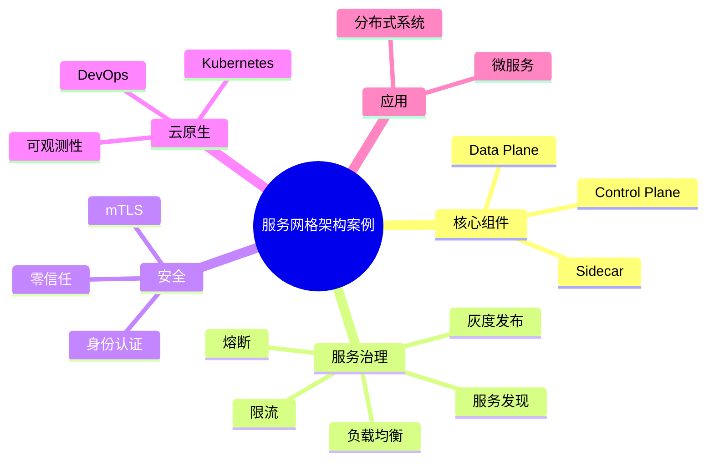

# 43-service-mesh-case.md（服务网格架构案例）

> 本文用于系统架构设计师考试案例分析专题 V2 复习。
>
> 本篇重点整理服务网格（Service Mesh）架构设计相关案例，包括微服务治理、Data Plane与Control Plane、Sidecar代理、服务发现、流量管理、熔断限流、灰度发布、mTLS安全通信、可观测性以及云原生服务治理案例。

---

# 目录

1. 服务网格案例概述
2. 服务网格基本概念
3. 微服务架构演进案例
4. 服务网格整体架构案例
5. Data Plane与Control Plane案例
6. Sidecar代理模式案例
7. 服务发现案例
8. 服务通信治理案例
9. 流量管理案例
10. 熔断与限流案例
11. 灰度发布案例
12. 服务安全通信mTLS案例
13. 服务网格可观测性案例
14. Service Mesh与Kubernetes结合案例
15. Service Mesh与DevOps结合案例
16. 多集群服务治理案例
17. 零信任服务网格案例
18. 企业级服务网格平台案例
19. 服务网格优化案例
20. 案例分析答题模板
21. 高频考点
22. 易错点
23. Mermaid知识结构图
24. 本节小结

---

# 1. 服务网格案例概述

服务网格：

> 在微服务之间增加基础设施层，用于处理服务间通信、治理、安全和可观测性的架构模式。

核心思想：

> 将服务治理能力从业务代码中剥离，由独立基础设施统一管理。

解决：

- 服务调用复杂；
- 治理代码重复；
- 安全能力不足；
- 运维困难。

架构演进：

```text
传统单体

↓

微服务

↓

容器化

↓

服务网格

↓

云原生平台
```

---

# 2. 服务网格基本概念

Service Mesh由两个核心部分组成：

```text
Service Mesh

├── Data Plane 数据平面

└── Control Plane 控制平面
```

---

# 3. 微服务架构演进案例

传统微服务：

```text
服务A

↓

服务B

↓

服务C
```

问题：

- 每个服务实现通信逻辑；
- SDK重复开发；
- 治理能力分散。

服务网格模式：

```text
服务A

↓

Sidecar代理

↓

Sidecar代理

↓

服务B
```

优势：

- 通信统一管理；
- 业务代码简单。

---

# 4. 服务网格整体架构案例

典型架构：

```text
Control Plane

↓

服务A
 |
Sidecar

↔

Sidecar
 |
服务B
```

组成：

- 服务实例；
- Sidecar代理；
- 控制中心。

---

# 5. Data Plane与Control Plane案例

## Data Plane

负责：

- 请求转发；
- 流量控制；
- 服务通信。

组成：

- Sidecar代理。

---

## Control Plane

负责：

- 配置管理；
- 服务发现；
- 策略下发。

关系：

```text
控制平面

↓

配置策略

↓

数据平面

↓

服务通信
```

---

# 6. Sidecar代理模式案例

Sidecar：

> 与业务服务共同部署的代理组件。

架构：

```text
Pod

├── 业务容器

└── Sidecar代理
```

作用：

- 请求转发；
- 流量管理；
- 安全通信；
- 日志采集。

优势：

- 不修改业务代码。

---

# 7. 服务发现案例

服务网格支持：

- 服务注册；
- 服务定位；
- 动态发现。

流程：

```text
服务启动

↓

注册信息

↓

服务发现

↓

请求调用
```

---

# 8. 服务通信治理案例

能力：

## 负载均衡

自动选择服务实例。

## 超时控制

避免长时间等待。

## 重试机制

提高成功率。

## 故障隔离

防止故障扩散。

---

# 9. 流量管理案例

支持：

- 流量分配；
- 请求路由；
- 版本控制。

例如：

```text
用户请求

↓

90%旧版本

10%新版本
```

应用：

- 灰度发布；
- A/B测试。

---

# 10. 熔断与限流案例

## 熔断

目的：

防止故障扩散。

```text
服务异常

↓

触发熔断

↓

停止请求
```

---

## 限流

目的：

保护系统。

方式：

- 请求数量限制；
- 并发控制。

---

# 11. 灰度发布案例

传统发布：

```text
全部切换新版
```

风险：

- 故障影响范围大。

服务网格：

```text
旧版本

↓

部分流量

↓

新版本
```

优势：

- 降低发布风险。

---

# 12. 服务安全通信mTLS案例

mTLS：

双向TLS认证。

实现：

- 服务身份认证；
- 通信加密。

架构：

```text
服务A

↓

加密通信

↓

服务B
```

结合：

- 零信任安全；
- 身份认证。

---

# 13. 服务网格可观测性案例

提供：

## 指标

- 请求数量；
- 延迟；
- 错误率。

## 日志

- 请求过程；
- 调用信息。

## 链路追踪

```text
服务A

↓

服务B

↓

服务C
```

---

# 14. Service Mesh与Kubernetes结合案例

Kubernetes负责：

- 容器调度；
- 生命周期管理。

Service Mesh负责：

- 服务通信；
- 流量治理。

结合：

```text
Kubernetes

↓

Pod

↓

Sidecar

↓

Service Mesh
```

---

# 15. Service Mesh与DevOps结合案例

支持：

- 自动部署；
- 灰度发布；
- 自动回滚。

流程：

```text
代码提交

↓

CI/CD

↓

部署服务

↓

流量控制

↓

发布完成
```

---

# 16. 多集群服务治理案例

企业多个：

- Kubernetes集群；
- 数据中心。

服务网格实现：

- 跨集群通信；
- 统一治理。

---

# 17. 零信任服务网格案例

零信任思想：

> 不默认信任任何服务。

措施：

- 服务身份认证；
- 加密通信；
- 最小权限。

架构：

```text
服务请求

↓

身份验证

↓

策略判断

↓

允许访问
```

---

# 18. 企业级服务网格平台案例

整体架构：

```text
业务服务

↓

Sidecar代理

↓

Service Mesh

↓

控制平台

↓

监控系统
```

能力：

- 服务治理；
- 安全通信；
- 可观测性。

---

# 19. 服务网格优化案例

优化方向：

## 性能优化

- 减少代理开销；
- 优化流量策略。

## 稳定性优化

- 熔断；
- 限流；
- 故障隔离。

## 运维优化

- 自动配置；
- 自动监控。

---

# 20. 案例分析答题模板

## 微服务数量增加导致治理困难

> 引入服务网格，将服务通信、流量管理和安全能力从业务代码中剥离，实现统一治理。

## 服务调用复杂

> 通过Sidecar代理实现服务间通信管理，降低业务服务之间耦合。

## 需要灰度发布

> 利用服务网格流量管理能力，实现按比例路由和版本控制。

## 服务安全要求高

> 采用mTLS实现服务身份认证和通信加密，结合零信任安全模型提升安全性。

---

# 21. 高频考点

重点掌握：

1. Service Mesh基本思想；
2. Data Plane与Control Plane；
3. Sidecar模式；
4. 流量治理；
5. mTLS安全通信；
6. 可观测性；
7. Kubernetes结合。

---

# 22. 易错点

| 易错知识 | 正确理解 |
|---|---|
| 服务网格就是API网关 | 服务网格主要解决服务间通信治理 |
| Sidecar属于业务代码 | Sidecar属于基础设施代理 |
| 服务网格只能用于Kubernetes | 可应用于多种微服务环境 |
| 有服务网格就不需要安全治理 | 仍需要身份认证和权限控制 |

---

# 23. Mermaid知识结构图



---

# 24. 本节小结

服务网格案例核心：

> 通过独立基础设施层管理微服务之间的通信、治理、安全和可观测能力，实现云原生环境下的大规模服务管理。

案例分析重点：

- 理解Service Mesh架构；
- 掌握Sidecar代理模式；
- 理解控制平面和数据平面；
- 掌握流量治理、安全通信和可观测性。
