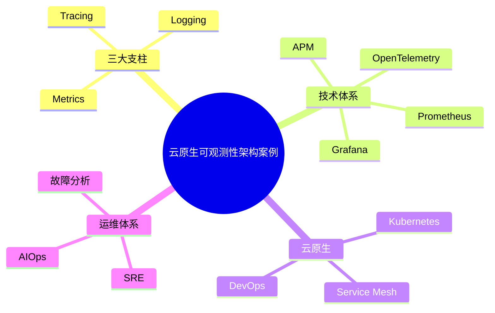

# 44-observability-case.md（云原生可观测性架构案例）

> 本文用于系统架构设计师考试案例分析专题 V2 复习。
>
> 本篇重点整理云原生可观测性（Cloud Native Observability）架构设计相关案例，包括Metrics指标监控、Logging日志体系、Tracing链路追踪、OpenTelemetry、Prometheus、Grafana、APM、Kubernetes可观测性、Service Mesh可观测性以及SRE可靠性工程案例。

---

# 目录

1. 云原生可观测性案例概述
2. 可观测性基本概念
3. Monitoring与Observability区别
4. 可观测性三大支柱
5. Metrics指标监控案例
6. Logging日志体系案例
7. Tracing链路追踪案例
8. 分布式链路追踪架构案例
9. OpenTelemetry架构案例
10. Prometheus监控体系案例
11. Grafana可视化案例
12. APM应用性能管理案例
13. Kubernetes可观测性案例
14. Service Mesh可观测性案例
15. DevOps持续观测案例
16. SRE可靠性工程案例
17. AIOps智能运维案例
18. 企业级可观测平台案例
19. 可观测性安全治理案例
20. 案例分析答题模板
21. 高频考点
22. 易错点
23. Mermaid知识结构图
24. 本节小结

---

# 1. 云原生可观测性案例概述

可观测性：

> 通过系统输出的信息，分析系统内部状态和运行情况的能力。

核心目标：

- 快速发现问题；
- 快速定位故障；
- 提升系统可靠性。

传统监控关注：

> 系统是否正常。

可观测性关注：

> 为什么出现问题。

---

# 2. 可观测性基本概念

系统状态来源：

- 指标；
- 日志；
- 链路；
- 事件。

流程：

```text
系统运行

↓

产生运行数据

↓

采集分析

↓

发现问题

↓

优化系统
```

---

# 3. Monitoring与Observability区别

## Monitoring

关注：

- CPU；
- 内存；
- 磁盘；
- 服务状态。

回答：

> 系统是否异常。

---

## Observability

关注：

- 调用关系；
- 请求链路；
- 业务行为。

回答：

> 为什么异常。

---

# 4. 可观测性三大支柱

```text
Observability

├── Metrics 指标

├── Logging 日志

└── Tracing 链路追踪
```

---

# 5. Metrics指标监控案例

Metrics：

> 描述系统状态的数值数据。

例如：

- QPS；
- CPU使用率；
- 请求延迟；
- 错误率。

架构：

```text
应用

↓

指标采集

↓

监控平台

↓

告警
```

---

# 6. Logging日志体系案例

日志记录：

- 用户请求；
- 服务调用；
- 异常信息。

流程：

```text
应用日志

↓

日志采集

↓

日志存储

↓

查询分析
```

价值：

- 故障排查；
- 安全审计。

---

# 7. Tracing链路追踪案例

分布式请求：

```text
用户请求

↓

服务A

↓

服务B

↓

服务C
```

Tracing记录：

- 调用路径；
- 时间消耗；
- 错误位置。

---

# 8. 分布式链路追踪架构案例

核心概念：

- Trace；
- Span。

架构：

```text
请求

↓

服务调用链

↓

Trace平台
```

---

# 9. OpenTelemetry架构案例

OpenTelemetry：

> 云原生统一可观测性标准。

支持：

- Metrics；
- Logs；
- Traces。

架构：

```text
应用

↓

OpenTelemetry SDK

↓

Collector

↓

分析平台
```

---

# 10. Prometheus监控体系案例

Prometheus特点：

- 指标采集；
- 时间序列存储；
- 告警。

架构：

```text
服务

↓

Exporter

↓

Prometheus

↓

AlertManager

↓

通知系统
```

---

# 11. Grafana可视化案例

Grafana用于：

- 数据展示；
- 监控大屏；
- 趋势分析。

架构：

```text
数据源

↓

Grafana

↓

监控面板
```

---

# 12. APM应用性能管理案例

APM关注：

- 应用性能；
- 请求耗时；
- 服务依赖。

分析：

- 慢请求；
- 性能瓶颈；
- 异常调用。

---

# 13. Kubernetes可观测性案例

需要监控：

- Pod状态；
- 节点资源；
- 服务运行情况。

架构：

```text
Kubernetes

↓

Metrics采集

↓

监控平台

↓

告警
```

---

# 14. Service Mesh可观测性案例

Service Mesh提供：

- 请求指标；
- 服务调用关系；
- 流量数据。

架构：

```text
服务

↓

Sidecar

↓

Metrics/Tracing

↓

分析平台
```

---

# 15. DevOps持续观测案例

流程：

```text
代码提交

↓

自动部署

↓

运行监控

↓

反馈优化
```

实现：

- 快速发现问题；
- 快速恢复。

---

# 16. SRE可靠性工程案例

SRE：

Site Reliability Engineering。

核心：

- 服务可靠性；
- 自动化运维；
- 故障管理。

关键指标：

- SLA；
- SLO；
- SLI。

---

# 17. AIOps智能运维案例

利用AI：

- 异常检测；
- 故障预测；
- 根因分析。

流程：

```text
运行数据

↓

AI分析

↓

异常发现

↓

自动处理
```

---

# 18. 企业级可观测平台案例

架构：

```text
业务系统

↓

数据采集层

↓

可观测平台

↓

分析引擎

↓

运维应用
```

能力：

- 指标监控；
- 日志分析；
- 链路追踪；
- 智能告警。

---

# 19. 可观测性安全治理案例

措施：

## 数据保护

- 敏感信息脱敏。

## 权限控制

- 限制日志访问。

## 审计

- 记录操作行为。

---

# 20. 案例分析答题模板

## 分布式系统故障难定位

> 建立云原生可观测体系，通过Metrics、Logging和Tracing三大能力实现系统状态分析。

## 微服务调用复杂

> 引入分布式链路追踪技术，分析服务调用链和性能瓶颈。

## Kubernetes运维困难

> 建设容器可观测平台，实现节点、Pod和应用运行状态统一监控。

## 提升系统可靠性

> 结合SRE理念，通过指标体系、自动化监控和故障分析提升系统稳定性。

---

# 21. 高频考点

重点掌握：

1. 可观测性三大支柱；
2. Metrics指标体系；
3. Logging日志体系；
4. Tracing链路追踪；
5. OpenTelemetry；
6. Prometheus；
7. SRE可靠性工程。

---

# 22. 易错点

| 易错知识 | 正确理解 |
|---|---|
| 监控等于可观测性 | 可观测性范围更广 |
| 只有指标即可定位问题 | 复杂系统需要日志和链路 |
| 链路追踪只适用于单体系统 | 主要用于分布式系统 |
| AIOps可以替代人工 | AIOps辅助运维决策 |

---

# 23. Mermaid知识结构图



---

# 24. 本节小结

云原生可观测性案例核心：

> 通过指标、日志和链路追踪等手段，实现复杂分布式系统的状态分析、故障定位和可靠性提升。

案例分析重点：

- 理解可观测性三大支柱；
- 掌握Metrics、Logging、Tracing作用；
- 理解云原生监控体系；
- 结合SRE提升系统可靠性。
