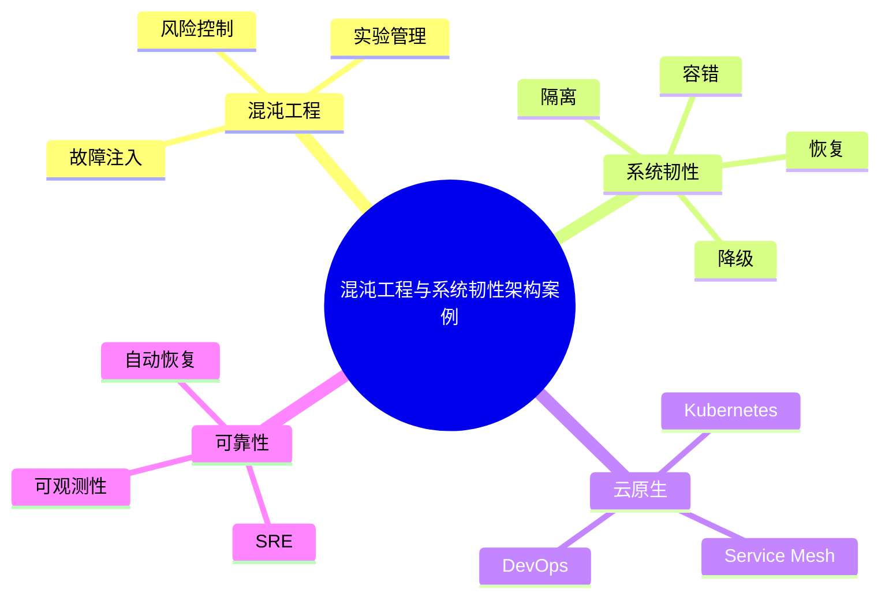

# 45-chaos-engineering-case.md（混沌工程与系统韧性架构案例）

> 本文用于系统架构设计师考试案例分析专题 V2 复习。
>
> 本篇重点整理混沌工程（Chaos Engineering）与系统韧性（Resilience Architecture）设计相关案例，包括故障注入、容错设计、高可用架构、自动恢复、Kubernetes混沌工程、SRE可靠性工程以及云原生系统韧性建设。

---

# 目录

1. 混沌工程案例概述
2. 系统韧性基本概念
3. 传统故障测试与混沌工程对比
4. 混沌工程核心原则
5. 故障注入架构案例
6. 服务故障模拟案例
7. 网络故障注入案例
8. 数据库故障注入案例
9. Kubernetes混沌工程案例
10. Service Mesh韧性治理案例
11. 高可用架构韧性案例
12. 自动恢复机制案例
13. 容错设计案例
14. 弹性伸缩案例
15. SRE与混沌工程结合案例
16. 可观测性与混沌工程结合案例
17. 企业级混沌工程平台案例
18. 混沌实验流程案例
19. 案例分析答题模板
20. 高频考点
21. 易错点
22. Mermaid知识结构图
23. 本节小结

---

# 1. 混沌工程案例概述

混沌工程：

> 通过主动引入故障，验证系统稳定性和恢复能力的方法。

核心思想：

> 在可控范围内制造故障，发现系统弱点，提高系统韧性。

目标：

- 提前发现问题；
- 验证高可用设计；
- 提升故障恢复能力。

流程：

```text
假设系统正常

↓

主动制造故障

↓

观察系统行为

↓

发现问题

↓

优化架构
```

---

# 2. 系统韧性基本概念

系统韧性：

> 系统面对异常、故障和变化时，仍能保持服务能力并快速恢复的能力。

核心能力：

```text
系统韧性

├── 容错能力
├── 恢复能力
├── 隔离能力
├── 降级能力
└── 自愈能力
```

---

# 3. 传统故障测试与混沌工程对比

| |传统测试|混沌工程|
|-|-|-|
|方式|被动测试|主动制造故障|
|范围|固定场景|真实环境模拟|
|目标|验证功能|验证系统韧性|

---

# 4. 混沌工程核心原则

主要原则：

- 建立稳定状态基线；
- 假设系统会发生故障；
- 控制实验范围；
- 自动化执行；
- 持续改进。

---

# 5. 故障注入架构案例

整体架构：

```text
混沌实验平台

↓

故障注入模块

↓

目标系统

↓

监控分析平台
```

组成：

- 实验管理；
- 故障模拟；
- 数据采集；
- 分析评估。

---

# 6. 服务故障模拟案例

模拟：

- 服务停止；
- 服务延迟；
- 服务异常。

验证：

- 熔断；
- 重试；
- 降级。

---

# 7. 网络故障注入案例

模拟：

- 网络延迟；
- 丢包；
- 网络断开。

验证：

- 超时机制；
- 服务隔离；
- 容错能力。

---

# 8. 数据库故障注入案例

模拟：

- 数据库不可用；
- 查询变慢；
- 主节点故障。

验证：

- 主备切换；
- 数据恢复；
- 服务降级。

---

# 9. Kubernetes混沌工程案例

容器环境故障：

- Pod删除；
- 节点故障；
- 资源压力。

流程：

```text
Pod异常

↓

Kubernetes检测

↓

自动重启

↓

服务恢复
```

---

# 10. Service Mesh韧性治理案例

结合：

- 熔断；
- 限流；
- 重试；
- 故障隔离。

架构：

```text
服务A

↓

Sidecar

↓

故障模拟

↓

服务B
```

---

# 11. 高可用架构韧性案例

高可用设计包括：

- 冗余；
- 故障转移；
- 数据备份；
- 服务降级。

目标：

保证核心业务持续运行。

---

# 12. 自动恢复机制案例

自愈流程：

```text
故障发生

↓

自动检测

↓

自动处理

↓

服务恢复

↓

记录分析
```

技术：

- 自动重启；
- 自动扩容；
- 自动切换。

---

# 13. 容错设计案例

常见机制：

## 超时

避免无限等待。

## 重试

提高成功概率。

## 熔断

阻止故障传播。

## 降级

保证核心功能。

---

# 14. 弹性伸缩案例

流程：

```text
压力增加

↓

监控发现

↓

自动扩容

↓

恢复性能
```

---

# 15. SRE与混沌工程结合案例

SRE关注：

- 服务可靠性；
- 自动化运维；
- 故障管理。

结合：

```text
SRE目标

↓

混沌实验

↓

发现风险

↓

优化系统
```

---

# 16. 可观测性与混沌工程结合案例

混沌实验依赖：

- Metrics；
- Logs；
- Tracing。

流程：

```text
故障注入

↓

指标变化

↓

链路分析

↓

定位问题
```

---

# 17. 企业级混沌工程平台案例

架构：

```text
实验管理平台

↓

故障注入平台

↓

业务系统

↓

可观测平台

↓

分析报告
```

能力：

- 实验管理；
- 风险控制；
- 自动执行。

---

# 18. 混沌实验流程案例

标准流程：

```text
定义目标

↓

设计实验

↓

风险评估

↓

执行故障

↓

观察结果

↓

优化系统
```

---

# 19. 案例分析答题模板

## 系统可靠性要求高

> 采用混沌工程主动注入故障，验证系统容错能力和自动恢复能力，提高系统韧性。

## 分布式系统故障复杂

> 结合可观测性平台，通过故障注入和链路分析定位系统薄弱环节。

## Kubernetes稳定性要求高

> 通过容器故障模拟验证自动恢复、弹性伸缩和服务高可用能力。

## 微服务故障传播风险

> 结合服务网格的熔断、限流和隔离机制，提高系统抗故障能力。

---

# 20. 高频考点

重点掌握：

1. 混沌工程思想；
2. 故障注入；
3. 系统韧性；
4. 容错设计；
5. 自动恢复；
6. SRE结合。

---

# 21. 易错点

| 易错知识 | 正确理解 |
|-|-|
| 混沌工程就是制造故障 | 需要可控、可验证 |
| 故障越大越好 | 应根据风险控制范围 |
| 高可用等于没有故障 | 高可用强调故障下持续服务 |
| 混沌工程不需要监控 | 必须依赖可观测能力 |

---

# 22. Mermaid知识结构图



---

# 23. 本节小结

混沌工程案例核心：

> 通过主动制造故障，验证系统容错能力和恢复能力，提高分布式系统的可靠性和韧性。

案例分析重点：

- 理解混沌工程思想；
- 掌握故障注入方法；
- 结合高可用和SRE体系；
- 利用可观测性分析故障影响。
