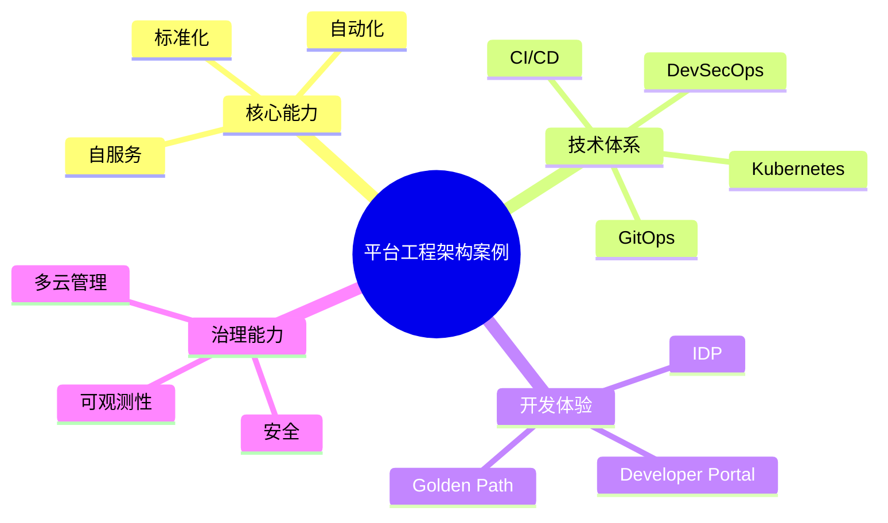

# 46-platform-engineering-case.md（平台工程架构案例）

> 本文用于系统架构设计师考试案例分析专题 V2 复习。
>
> 本篇重点整理平台工程（Platform Engineering）架构设计相关案例，包括内部开发者平台（IDP）、DevOps演进、Kubernetes平台治理、CI/CD、GitOps、Golden Path、DevSecOps、软件供应链安全以及企业级云原生平台建设。

---

# 目录

1. 平台工程案例概述
2. 平台工程基本概念
3. DevOps到平台工程演进
4. Internal Developer Platform（IDP）
5. 平台工程整体架构
6. 开发者自服务平台
7. Kubernetes平台工程
8. CI/CD流水线平台
9. GitOps持续交付
10. Golden Path标准化交付
11. DevSecOps平台
12. 软件供应链管理
13. 多云平台治理
14. 云资源自动化管理
15. 平台工程可观测性
16. 平台工程安全治理
17. 企业级开发者平台
18. 平台工程运营优化
19. 案例分析答题模板
20. 高频考点
21. 易错点
22. Mermaid知识结构图
23. 本节小结

---

# 1. 平台工程案例概述

平台工程：

> 通过建设统一的软件交付平台，为开发团队提供标准化、自服务、自动化的软件开发和运行能力。

核心目标：

- 提升开发效率；
- 降低运维复杂度；
- 统一技术规范；
- 提升交付质量。

基本架构：

```text
开发人员

↓

内部开发平台

↓

云原生基础设施

↓

业务应用
```

---

# 2. 平台工程基本概念

平台工程关注：

## 开发体验

提供：

- 模板；
- 工具；
- 自动化流程。

## 基础设施抽象

隐藏：

- Kubernetes复杂性；
- 云资源配置。

## 自服务能力

支持：

- 创建环境；
- 部署应用；
- 查看运行状态。

---

# 3. DevOps到平台工程演进

传统模式：

```text
开发

↓

运维

↓

手工部署
```

DevOps：

```text
开发

+

运维

↓

CI/CD自动化
```

平台工程：

```text
开发团队

↓

Developer Platform

↓

自动化交付
```

---

# 4. Internal Developer Platform（IDP）案例

IDP：

> 面向开发人员的内部开发平台。

提供：

- 应用创建；
- 环境管理；
- 部署发布；
- 运行查看。

架构：

```text
开发人员

↓

IDP平台

↓

Kubernetes

↓

云资源
```

---

# 5. 平台工程整体架构

典型架构：

```text
开发者入口

↓

开发者平台

↓

自动化服务层

↓

云原生基础设施

↓

业务应用
```

组成：

- 门户层；
- 自动化层；
- 基础设施层；
- 治理层。

---

# 6. 开发者自服务平台

目标：

减少开发人员对运维团队依赖。

能力：

- 创建项目；
- 创建环境；
- 发布应用；
- 查询资源。

流程：

```text
开发申请

↓

平台自动处理

↓

环境生成

↓

应用部署
```

---

# 7. Kubernetes平台工程

平台封装：

- 集群管理；
- Namespace管理；
- 应用部署；
- 资源控制。

架构：

```text
IDP

↓

Kubernetes

↓

Container

↓

Application
```

---

# 8. CI/CD流水线平台

自动化流程：

```text
代码提交

↓

自动构建

↓

自动测试

↓

自动部署

↓

运行监控
```

能力：

- 自动化交付；
- 快速反馈。

---

# 9. GitOps持续交付

GitOps：

> 使用Git作为基础设施和应用配置的统一来源。

流程：

```text
Git仓库

↓

自动同步

↓

部署环境

↓

运行系统
```

优势：

- 可追踪；
- 可回滚；
- 自动化。

---

# 10. Golden Path标准化交付

Golden Path：

> 为开发人员提供推荐的软件开发和部署路径。

包括：

- 标准模板；
- 技术规范；
- 自动化流程。

作用：

- 减少重复建设；
- 避免技术混乱。

---

# 11. DevSecOps平台

安全融入开发流程：

```text
开发

↓

安全扫描

↓

测试

↓

部署
```

包括：

- 代码扫描；
- 镜像扫描；
- 漏洞检测。

---

# 12. 软件供应链管理

关注：

- 代码来源；
- 依赖安全；
- 镜像安全。

措施：

- SBOM；
- 镜像扫描；
- 签名验证。

---

# 13. 多云平台治理

支持：

- 公有云；
- 私有云；
- 混合云。

提供：

- 统一入口；
- 统一管理；
- 统一策略。

---

# 14. 云资源自动化管理

自动化：

- 资源创建；
- 配置管理；
- 生命周期管理。

结合：

- IaC基础设施即代码。

---

# 15. 平台工程可观测性

监控：

- 应用状态；
- 平台性能；
- 资源使用。

结合：

- Metrics；
- Logging；
- Tracing。

---

# 16. 平台工程安全治理

安全能力：

## 身份管理

- 用户认证；
- 权限控制。

## 资源隔离

- Namespace；
- 租户隔离。

## 审计

- 操作记录。

---

# 17. 企业级开发者平台

整体架构：

```text
开发人员

↓

Developer Portal

↓

IDP平台

↓

Kubernetes

↓

云基础设施

↓

业务系统
```

能力：

- 自服务；
- 自动部署；
- 统一治理。

---

# 18. 平台工程运营优化

优化方向：

## 提升开发体验

- 简化流程；
- 提供模板。

## 提升自动化

- 减少人工操作。

## 提升治理能力

- 统一规范。

---

# 19. 案例分析答题模板

## DevOps工具过多，维护困难

> 建设内部开发平台，对工具链进行统一封装，提高开发和交付效率。

## 开发人员依赖运维部署

> 通过IDP提供自服务能力，实现应用创建、部署和环境管理自动化。

## Kubernetes使用复杂

> 通过平台工程封装Kubernetes能力，降低开发人员使用成本。

## 企业需要统一交付规范

> 建立Golden Path标准化交付流程，提高软件交付质量。

---

# 20. 高频考点

重点掌握：

1. 平台工程思想；
2. IDP内部开发平台；
3. DevOps演进；
4. Kubernetes平台治理；
5. GitOps；
6. DevSecOps；
7. 软件供应链安全。

---

# 21. 易错点

| 易错知识 | 正确理解 |
|-|-|
| 平台工程替代DevOps | 平台工程是DevOps演进增强 |
| IDP只是部署工具 | IDP提供完整开发体验 |
| 平台只负责运维 | 平台服务开发全流程 |
| Kubernetes就是平台工程 | Kubernetes只是基础设施之一 |

---

# 22. Mermaid知识结构图



---

# 23. 本节小结

平台工程案例核心：

> 通过建设内部开发平台，将云原生基础设施、自动化交付流程和治理能力统一封装，为开发团队提供高效、安全、标准化的软件交付能力。

案例分析重点：

- 理解平台工程与DevOps关系；
- 掌握IDP架构；
- 理解GitOps和Golden Path；
- 结合Kubernetes和云原生治理体系。
