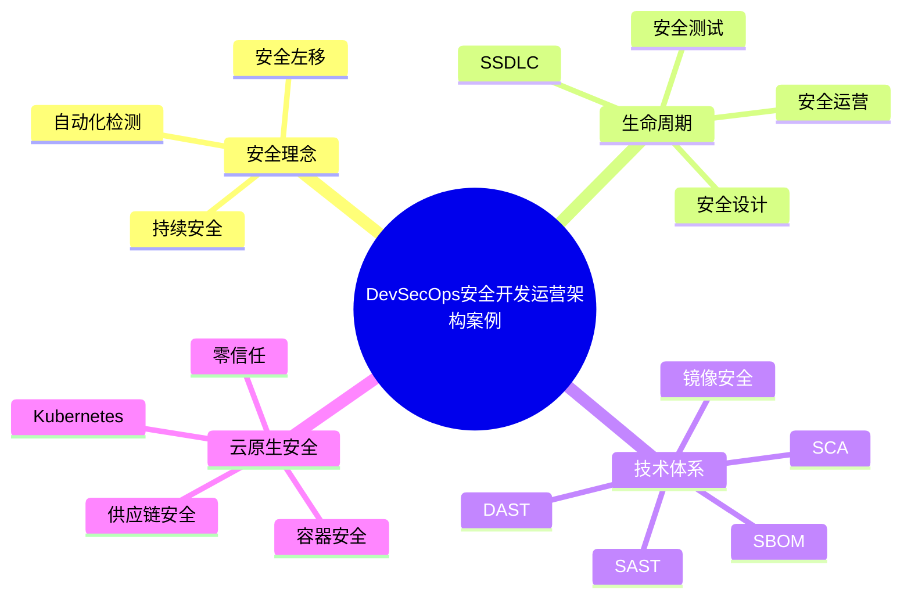

# 47-devsecops-case.md（DevSecOps安全开发运营架构案例）

> 本文用于系统架构设计师考试案例分析专题 V2 复习。
>
> 本篇重点整理 DevSecOps（Development Security Operations）安全开发运营架构设计相关案例，包括安全左移、SSDLC、安全流水线、代码扫描、SCA、容器安全、Kubernetes安全、软件供应链安全、SBOM以及云原生安全治理。

---

# 目录

1. DevSecOps案例概述
2. DevSecOps基本概念
3. DevOps到DevSecOps演进
4. 安全左移案例
5. SSDLC安全开发生命周期
6. DevSecOps整体架构
7. CI/CD安全流水线
8. 代码安全扫描
9. 软件成分分析SCA
10. 容器安全
11. Kubernetes安全
12. 软件供应链安全
13. SBOM软件物料清单
14. 镜像安全管理
15. 云原生安全治理
16. 零信任安全融合
17. DevSecOps自动化运营
18. 企业级DevSecOps平台
19. 案例分析答题模板
20. 高频考点
21. 易错点
22. Mermaid知识结构图
23. 本节小结

---

# 1. DevSecOps案例概述

DevSecOps：

> 将安全能力融入DevOps全过程，实现开发、测试、部署和运行阶段持续安全保障。

传统模式：

```text
开发

↓

测试

↓

部署

↓

安全检查
```

DevSecOps：

```text
开发

↓

安全

↓

测试

↓

部署

↓

运行
```

核心目标：

- 安全左移；
- 自动化安全检测；
- 持续安全治理。

---

# 2. DevSecOps基本概念

核心思想：

## 安全左移

提前发现安全问题。

## 自动化安全

通过工具集成安全检测。

## 持续安全

覆盖软件全生命周期。

---

# 3. DevOps到DevSecOps演进

```text
传统开发

↓

DevOps

↓

DevSecOps

↓

云原生安全体系
```

区别：

|模式|特点|
|-|-|
|DevOps|快速交付|
|DevSecOps|快速交付+持续安全|

---

# 4. 安全左移案例

传统方式：

```text
开发完成

↓

安全测试

↓

发现问题
```

安全左移：

```text
编码阶段

↓

安全检测

↓

及时修复
```

优势：

- 降低修复成本；
- 提升软件质量。

---

# 5. SSDLC安全开发生命周期

SSDLC：

Secure Software Development Life Cycle。

流程：

```text
需求分析

↓

安全设计

↓

安全编码

↓

安全测试

↓

安全部署

↓

安全运营
```

安全活动：

- 威胁建模；
- 安全评审；
- 漏洞扫描；
- 安全测试。

---

# 6. DevSecOps整体架构

```text
开发人员

↓

代码仓库

↓

CI/CD流水线

↓

安全检测平台

↓

部署平台

↓

运行监控
```

组成：

- 开发平台；
- 自动化流水线；
- 安全工具链；
- 运行安全平台。

---

# 7. CI/CD安全流水线

流程：

```text
代码提交

↓

代码扫描

↓

安全测试

↓

镜像扫描

↓

部署

↓

运行检测
```

能力：

- 自动发现风险；
- 自动阻断高危问题。

---

# 8. 代码安全扫描

主要方式：

## SAST静态分析

分析：

- 源代码漏洞；
- 编码安全问题。

例如：

- 注入漏洞；
- 权限问题。

## DAST动态分析

针对运行环境：

- Web漏洞；
- 接口安全。

---

# 9. 软件成分分析SCA

SCA：

Software Composition Analysis。

作用：

分析：

- 第三方组件；
- 开源依赖。

发现：

- 已知漏洞；
- 许可证风险。

---

# 10. 容器安全案例

生命周期：

```text
镜像构建

↓

镜像扫描

↓

部署运行

↓

安全监控
```

措施：

- 镜像漏洞扫描；
- 镜像签名；
- 权限控制。

---

# 11. Kubernetes安全案例

安全范围：

## 集群安全

- API Server保护；
- 权限控制。

## 工作负载安全

- Pod安全；
- 资源隔离。

## 网络安全

- 网络策略；
- 服务访问控制。

---

# 12. 软件供应链安全案例

风险：

- 第三方依赖漏洞；
- 恶意代码注入；
- 镜像污染。

措施：

- 依赖管理；
- 安全扫描；
- 签名验证。

---

# 13. SBOM软件物料清单

SBOM：

> 软件组成成分清单。

记录：

- 软件组件；
- 版本信息；
- 依赖关系。

价值：

- 漏洞追踪；
- 软件供应链管理。

---

# 14. 镜像安全管理

流程：

```text
代码

↓

镜像构建

↓

漏洞扫描

↓

签名验证

↓

部署运行
```

---

# 15. 云原生安全治理

包括：

- 容器安全；
- Kubernetes安全；
- 服务安全；
- 数据安全。

架构：

```text
云原生平台

↓

安全治理平台

↓

应用服务
```

---

# 16. 零信任安全融合

零信任思想：

> 不默认信任任何用户、设备和服务。

措施：

- 身份认证；
- 最小权限；
- 持续验证。

结合：

- Service Mesh；
- DevSecOps；
- 云安全。

---

# 17. DevSecOps自动化运营

自动化：

- 漏洞发现；
- 风险评估；
- 安全修复。

流程：

```text
发现风险

↓

自动分析

↓

修复漏洞

↓

重新验证
```

---

# 18. 企业级DevSecOps平台

架构：

```text
开发人员

↓

代码平台

↓

CI/CD平台

↓

安全检测平台

↓

云原生平台

↓

安全运营中心
```

能力：

- 安全开发；
- 自动检测；
- 持续运营。

---

# 19. 案例分析答题模板

## 安全介入过晚

> 采用DevSecOps模式，将安全能力融入开发生命周期，实现安全左移。

## 软件供应链风险

> 建立软件供应链安全体系，通过SBOM、依赖扫描和镜像安全检测保障软件安全。

## 云原生环境安全复杂

> 建立云原生安全治理体系，加强容器、Kubernetes和服务通信安全。

## CI/CD需要安全控制

> 在流水线中集成自动化安全检测，实现持续安全验证。

---

# 20. 高频考点

重点掌握：

1. DevSecOps思想；
2. 安全左移；
3. SSDLC；
4. CI/CD安全；
5. SCA；
6. SBOM；
7. 云原生安全。

---

# 21. 易错点

|易错知识|正确理解|
|-|-|
|DevSecOps替代DevOps|DevSecOps是DevOps安全增强|
|安全只能在上线前测试|应该贯穿整个生命周期|
|扫描工具越多越安全|需要结合流程治理|
|供应链只关注代码|还包括依赖、镜像和构建过程|

---

# 22. Mermaid知识结构图



---

# 23. 本节小结

DevSecOps案例核心：

> 将安全能力融入软件开发和运营全过程，实现快速交付与持续安全保障。

案例分析重点：

- 理解安全左移思想；
- 掌握SSDLC流程；
- 理解CI/CD安全集成；
- 掌握软件供应链和云原生安全治理。
