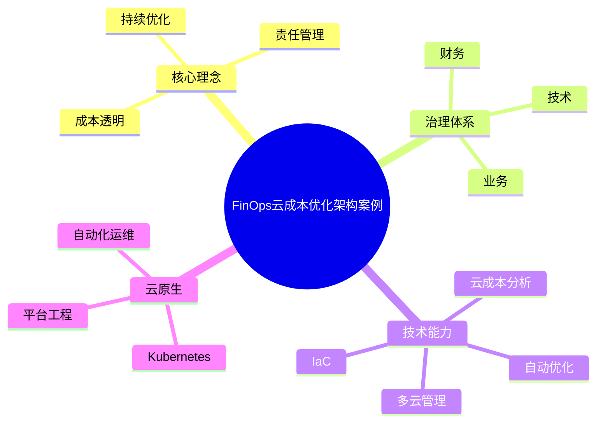

# 48-finops-case.md（云成本优化与FinOps架构案例）

> 本文用于系统架构设计师考试案例分析专题 V2 复习。
>
> 本篇重点整理FinOps（Cloud Financial Operations）云成本优化架构设计相关案例，包括云成本治理、成本透明化、资源优化、多云成本管理、Kubernetes成本治理、IaC结合以及企业级FinOps平台建设。

---

# 目录

1. FinOps案例概述
2. FinOps基本概念
3. 云计算成本管理挑战案例
4. FinOps生命周期案例
5. FinOps整体架构案例
6. 云资源成本采集案例
7. 成本可视化分析案例
8. 成本分摊与责任管理案例
9. 云资源优化案例
10. 弹性伸缩成本优化案例
11. Kubernetes成本治理案例
12. 多云成本管理案例
13. IaC与FinOps结合案例
14. 自动化成本优化案例
15. 预算管理与成本预测案例
16. 云成本安全治理案例
17. 企业级FinOps平台案例
18. FinOps与平台工程结合案例
19. 案例分析答题模板
20. 高频考点
21. 易错点
22. Mermaid知识结构图
23. 本节小结

---

# 1. FinOps案例概述

FinOps：

> 云财务运营，是连接技术、财务和业务团队的云成本治理方法。

核心目标：

- 降低资源浪费；
- 提升资源利用率；
- 优化云投入产出比。

基本流程：

```text
云资源使用

↓

成本采集

↓

分析优化

↓

持续治理

↓

业务价值提升
```

---

# 2. FinOps基本概念

FinOps需要多个角色协同：

## 技术团队

负责：

- 资源规划；
- 架构优化；
- 成本控制。

## 财务团队

负责：

- 成本分析；
- 预算管理。

## 业务团队

负责：

- 价值评估；
- 投入产出分析。

---

# 3. 云计算成本管理挑战案例

常见问题：

## 资源浪费

例如：

- 空闲服务器；
- 未使用存储。

## 成本不可见

无法明确：

- 谁使用资源；
- 使用多少；
- 成本归属。

## 多云复杂

不同云平台：

- 计费方式不同；
- 管理困难。

---

# 4. FinOps生命周期案例

典型生命周期：

```text
了解成本

↓

优化成本

↓

持续运营
```

三个阶段：

## Inform

成本透明化。

## Optimize

资源优化。

## Operate

持续治理。

---

# 5. FinOps整体架构案例

架构：

```text
云资源平台

↓

成本采集层

↓

成本分析平台

↓

优化策略

↓

自动执行
```

组成：

- 数据采集；
- 成本分析；
- 优化引擎；
- 治理平台。

---

# 6. 云资源成本采集案例

采集内容：

- 计算资源；
- 存储资源；
- 网络资源；
- 数据服务。

流程：

```text
云服务

↓

账单数据

↓

成本分析系统
```

---

# 7. 成本可视化分析案例

通过：

- Dashboard；
- 报表；
- 趋势分析。

展示：

- 成本变化；
- 使用情况；
- 优化空间。

---

# 8. 成本分摊与责任管理案例

目标：

> 明确资源使用者和成本责任。

方式：

- 标签管理；
- 项目归属；
- 部门分摊。

示例：

```text
订单系统

↓

业务部门

↓

成本统计
```

---

# 9. 云资源优化案例

优化方式：

## 删除闲置资源

减少无效支出。

## 调整资源规格

避免配置过高。

## 使用弹性资源

按业务需求调整。

---

# 10. 弹性伸缩成本优化案例

流程：

```text
业务增长

↓

自动扩容

↓

业务下降

↓

自动缩容
```

优势：

- 满足业务需求；
- 减少资源浪费。

---

# 11. Kubernetes成本治理案例

问题：

- 资源申请过大；
- Pod长期空闲；
- 集群利用率低。

治理：

- Resource Request/Limits；
- Namespace成本统计；
- 工作负载优化。

架构：

```text
Kubernetes

↓

资源监控

↓

成本分析

↓

优化策略
```

---

# 12. 多云成本管理案例

多云环境：

- 公有云；
- 私有云；
- 混合云。

FinOps提供：

- 统一账单；
- 统一分析；
- 统一优化。

---

# 13. IaC与FinOps结合案例

IaC：

Infrastructure as Code。

流程：

```text
代码定义资源

↓

自动创建资源

↓

成本自动评估
```

优势：

- 标准化；
- 可审计；
- 易优化。

---

# 14. 自动化成本优化案例

自动化：

- 自动关闭闲置资源；
- 自动调整规格；
- 自动执行优化策略。

流程：

```text
发现浪费

↓

生成策略

↓

自动执行

↓

验证效果
```

---

# 15. 预算管理与成本预测案例

能力：

- 预算设置；
- 成本预测；
- 超支告警。

流程：

```text
历史数据

↓

模型分析

↓

预测未来成本
```

---

# 16. 云成本安全治理案例

措施：

- 权限控制；
- 资源审批；
- 操作审计。

避免：

- 未授权资源创建；
- 成本异常增长。

---

# 17. 企业级FinOps平台案例

架构：

```text
云平台

↓

数据采集

↓

FinOps平台

↓

成本分析

↓

优化执行

↓

业务价值分析
```

能力：

- 成本透明；
- 自动优化；
- 持续治理。

---

# 18. FinOps与平台工程结合案例

结合：

```text
开发人员

↓

内部开发平台

↓

自动创建资源

↓

FinOps成本控制
```

价值：

- 标准化资源申请；
- 自动成本控制；
- 提升资源利用率。

---

# 19. 案例分析答题模板

## 云资源成本不可控

> 建立FinOps治理体系，实现云成本透明化、责任化和持续优化。

## 云资源利用率低

> 通过资源分析、规格优化和自动伸缩，提高云资源利用效率。

## 多云环境成本复杂

> 建立统一FinOps平台，实现多云成本统一管理和分析。

## 企业需要降低云成本

> 结合平台工程和自动化治理，实现资源创建、使用和优化全过程管理。

---

# 20. 高频考点

重点掌握：

1. FinOps核心思想；
2. 云成本透明化；
3. 成本分摊管理；
4. 云资源优化；
5. 多云成本治理；
6. IaC结合；
7. 平台工程结合。

---

# 21. 易错点

|易错知识|正确理解|
|-|-|
|FinOps只是财务管理|FinOps需要技术、财务、业务协同|
|降低成本就是减少资源|核心是提升资源价值|
|云资源越多越好|需要持续优化利用率|
|成本治理只靠人工|应结合自动化平台|

---

# 22. Mermaid知识结构图



---

# 23. 本节小结

FinOps案例核心：

> 通过技术、财务和业务协同，实现云资源成本透明化、资源优化和业务价值最大化。

案例分析重点：

- 理解FinOps治理思想；
- 掌握云成本优化方法；
- 理解多云和Kubernetes成本治理；
- 结合平台工程实现自动化成本管理。
