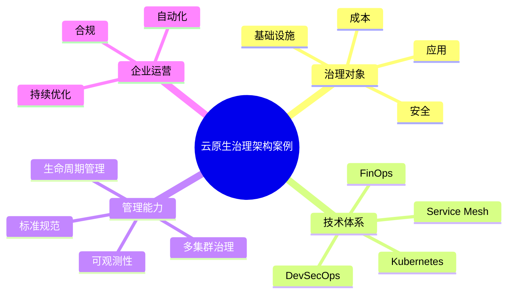

# 49-cloud-native-governance-case.md（云原生治理架构案例）

> 本文用于系统架构设计师考试案例分析专题 V2 复习。
>
> 本篇重点整理云原生治理（Cloud Native Governance）架构设计相关案例，包括多集群治理、Kubernetes治理、应用生命周期治理、安全治理、合规治理、资源治理、FinOps结合、可观测治理、DevSecOps治理以及企业级云原生治理平台建设。

---

# 目录

1. 云原生治理案例概述
2. 云原生治理基本概念
3. 企业云原生治理挑战案例
4. 云原生治理整体架构案例
5. 多集群治理案例
6. Kubernetes集群治理案例
7. 云原生标准规范治理案例
8. 应用生命周期治理案例
9. 配置管理治理案例
10. 服务治理案例
11. 安全治理案例
12. 合规治理案例
13. 资源治理案例
14. FinOps成本治理结合案例
15. 可观测治理案例
16. DevSecOps治理案例
17. 多云统一治理案例
18. 企业级云原生治理平台案例
19. 案例分析答题模板
20. 高频考点
21. 易错点
22. Mermaid知识结构图
23. 本节小结

---

# 1. 云原生治理案例概述

云原生治理：

> 通过统一规则、流程和技术平台，对云原生应用、基础设施和运行环境进行管理和控制。

核心目标：

- 标准化；
- 自动化；
- 安全化；
- 可持续运营。

基本流程：

```text
云原生资源

↓

治理策略

↓

自动执行

↓

持续优化
```

---

# 2. 云原生治理基本概念

治理对象：

## 基础设施治理

包括：

- 云资源；
- Kubernetes集群；
- 网络资源。

## 应用治理

包括：

- 服务部署；
- 生命周期管理；
- 版本管理。

## 安全治理

包括：

- 身份认证；
- 权限控制；
- 合规检查。

## 成本治理

包括：

- 资源使用；
- 成本分析；
- 优化策略。

---

# 3. 企业云原生治理挑战案例

常见问题：

## 集群规模扩大

问题：

- 多集群管理困难；
- 配置不一致。

## 技术标准不统一

问题：

- 部署方式不同；
- 运维方式不同。

## 安全策略分散

问题：

- 权限管理复杂；
- 风险难控制。

## 成本不可控

问题：

- 资源浪费；
- 使用情况不透明。

---

# 4. 云原生治理整体架构案例

整体架构：

```text
业务应用

↓

云原生治理平台

↓

Kubernetes集群

↓

云基础设施
```

治理能力：

- 资源管理；
- 应用管理；
- 安全管理；
- 成本管理；
- 监控管理。

---

# 5. 多集群治理案例

企业环境：

可能存在：

- 开发集群；
- 测试集群；
- 生产集群；
- 多地域集群。

治理：

```text
统一控制平台

↓

多个Kubernetes集群
```

能力：

- 集群统一管理；
- 策略统一下发；
- 配置统一控制。

---

# 6. Kubernetes集群治理案例

治理内容：

## 集群资源

- Node管理；
- Namespace管理。

## 工作负载

- Deployment；
- Service；
- Pod。

## 配置管理

- ConfigMap；
- Secret。

---

# 7. 云原生标准规范治理案例

建立：

- 应用模板；
- 部署规范；
- 资源规范。

例如：

```text
应用模板

↓

标准部署流程

↓

统一运行环境
```

价值：

- 降低维护成本；
- 提高交付效率。

---

# 8. 应用生命周期治理案例

生命周期：

```text
创建

↓

部署

↓

运行

↓

升级

↓

下线
```

治理：

- 自动部署；
- 版本控制；
- 生命周期管理。

---

# 9. 配置管理治理案例

问题：

- 配置分散；
- 环境差异大。

治理：

- 配置中心；
- Git管理；
- 自动同步。

---

# 10. 服务治理案例

结合：

- 微服务；
- Service Mesh。

能力：

- 服务发现；
- 流量控制；
- 熔断限流；
- 服务监控。

---

# 11. 安全治理案例

安全体系：

## 身份治理

- 用户认证；
- 服务身份。

## 权限治理

- RBAC；
- 最小权限。

## 网络安全

- 网络策略；
- 服务隔离。

---

# 12. 合规治理案例

包括：

- 安全审计；
- 配置检查；
- 合规扫描。

目标：

满足：

- 企业规范；
- 行业要求。

---

# 13. 资源治理案例

资源治理：

包括：

- CPU；
- 内存；
- 存储；
- 网络。

措施：

- Resource Request/Limits；
- 配额管理；
- 资源监控。

---

# 14. FinOps成本治理结合案例

结合：

```text
云资源

↓

成本采集

↓

成本分析

↓

资源优化
```

实现：

- 成本透明；
- 责任分摊；
- 自动优化。

---

# 15. 可观测治理案例

治理体系：

包括：

- Metrics；
- Logging；
- Tracing。

目标：

实现：

- 状态感知；
- 故障定位；
- 性能优化。

---

# 16. DevSecOps治理案例

安全治理融入：

```text
代码

↓

构建

↓

部署

↓

运行
```

包括：

- 漏洞扫描；
- 镜像安全；
- 供应链安全。

---

# 17. 多云统一治理案例

支持：

- 公有云；
- 私有云；
- 混合云。

能力：

- 统一入口；
- 统一策略；
- 统一监控。

---

# 18. 企业级云原生治理平台案例

整体架构：

```text
开发人员

↓

云原生治理平台

↓

Kubernetes集群

↓

云基础设施
```

能力：

- 应用管理；
- 安全治理；
- 成本管理；
- 可观测管理。

---

# 19. 案例分析答题模板

## Kubernetes集群越来越多

> 建立云原生治理平台，实现多集群统一管理、策略统一下发和资源统一治理。

## 企业需要规范化部署

> 建立标准化应用模板和自动化交付流程，提高云原生应用管理效率。

## 云资源成本不可控

> 结合FinOps治理，实现资源使用透明化和成本持续优化。

## 云原生安全要求提高

> 建立DevSecOps和零信任安全治理体系，实现持续安全控制。

---

# 20. 高频考点

重点掌握：

1. 云原生治理思想；
2. 多集群管理；
3. Kubernetes治理；
4. 应用生命周期管理；
5. 安全与合规治理；
6. FinOps成本治理；
7. 可观测治理。

---

# 21. 易错点

|易错知识|正确理解|
|-|-|
|云原生治理只是Kubernetes管理|治理范围包括应用、资源、安全和成本|
|治理就是限制开发|治理目标是提高效率和规范化|
|多集群只需要统一部署|还需要统一策略和安全管理|
|安全治理独立于云原生治理|安全应贯穿整个治理体系|

---

# 22. Mermaid知识结构图



---

# 23. 本节小结

云原生治理案例核心：

> 通过统一治理体系，对云原生应用、基础设施、安全和成本进行全面管理，实现企业云原生环境的规范化、自动化和持续优化。

案例分析重点：

- 理解云原生治理目标；
- 掌握多集群和Kubernetes治理；
- 理解安全、成本、可观测性融合治理；
- 结合平台工程构建企业级云原生治理体系。
