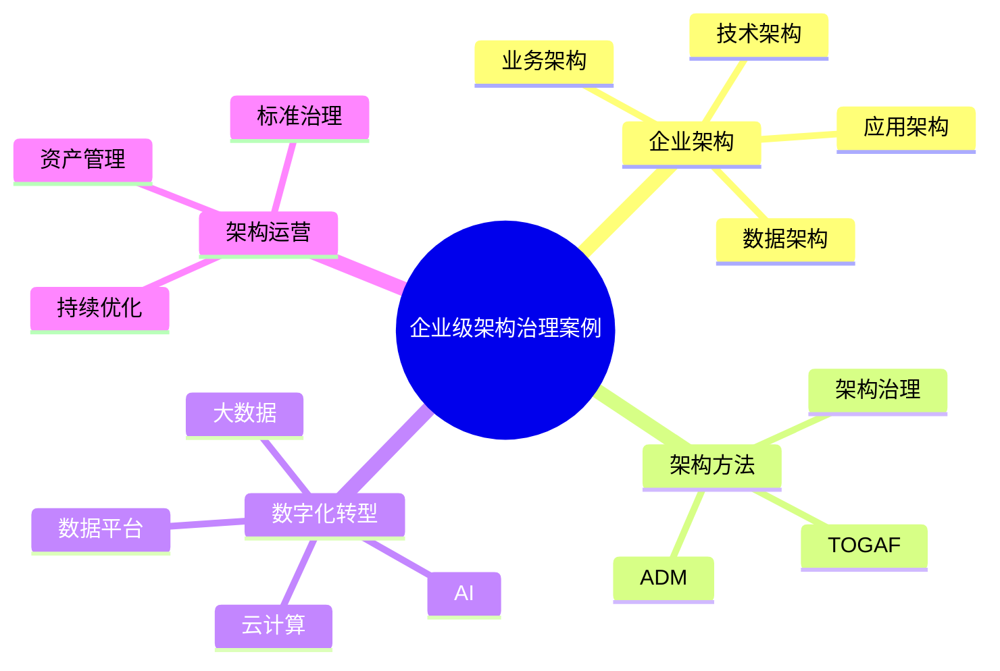

# 50-enterprise-architecture-case.md（企业级架构治理案例）

> 本文用于系统架构设计师考试案例分析专题 V2 复习。
>
> 本篇重点整理企业级架构（Enterprise Architecture，EA）治理案例，包括业务架构、数据架构、应用架构、技术架构、TOGAF方法、架构治理、数字化转型以及企业架构演进。

---

# 目录

1. 企业级架构案例概述
2. 企业架构基本概念
3. 企业架构四大域案例
4. TOGAF架构方法案例
5. 业务架构设计案例
6. 数据架构设计案例
7. 应用架构设计案例
8. 技术架构设计案例
9. 企业架构治理流程案例
10. 架构评审机制案例
11. 架构原则治理案例
12. 企业数字化转型案例
13. 业务与IT融合案例
14. 数据驱动企业架构案例
15. 云原生企业架构案例
16. 企业架构演进案例
17. 架构资产管理案例
18. 企业架构治理平台案例
19. 案例分析答题模板
20. 高频考点
21. 易错点
22. Mermaid知识结构图
23. 本节小结

---

# 1. 企业级架构案例概述

企业架构：

> 从企业整体角度，对业务、信息、应用和技术进行统一规划的方法。

目标：

- 支撑企业战略；
- 统一IT规划；
- 降低系统复杂度；
- 提升企业敏捷能力。

架构关系：

```text
企业战略

↓

企业架构

↓

IT系统建设

↓

业务价值实现
```

---

# 2. 企业架构基本概念

企业架构主要包括：

- 战略层；
- 架构层；
- 实施层。

架构层包含：

- 业务架构；
- 数据架构；
- 应用架构；
- 技术架构。

---

# 3. 企业架构四大域案例

```text
企业架构

├── 业务架构

├── 数据架构

├── 应用架构

└── 技术架构
```

---

# 4. TOGAF架构方法案例

TOGAF：

> 企业架构开发框架。

核心方法：

ADM（Architecture Development Method）。

流程：

```text
架构愿景

↓

业务架构

↓

信息系统架构

↓

技术架构

↓

实施治理

↓

变更管理
```

---

# 5. 业务架构设计案例

关注：

- 企业业务能力；
- 业务流程；
- 组织结构。

目标：

实现业务战略与IT建设一致。

```text
业务战略

↓

业务能力

↓

业务流程

↓

信息系统支持
```

---

# 6. 数据架构设计案例

关注：

- 数据模型；
- 数据流；
- 数据治理。

包括：

- 主数据管理；
- 数据标准；
- 数据质量。

```text
业务数据

↓

数据平台

↓

数据服务

↓

业务应用
```

---

# 7. 应用架构设计案例

关注：

- 系统划分；
- 应用集成；
- 服务设计。

演进：

```text
单体应用

↓

SOA

↓

微服务

↓

云原生应用
```

---

# 8. 技术架构设计案例

技术架构包括：

- 基础设施；
- 网络；
- 中间件；
- 云平台。

```text
业务应用

↓

中间件平台

↓

计算存储网络

↓

云基础设施
```

---

# 9. 企业架构治理流程案例

治理流程：

```text
架构规划

↓

架构设计

↓

架构评审

↓

项目实施

↓

架构监督

↓

持续优化
```

---

# 10. 架构评审机制案例

评审内容：

- 技术选型；
- 架构合理性；
- 安全性；
- 可扩展性。

目标：

避免：

- 重复建设；
- 技术失控。

---

# 11. 架构原则治理案例

常见原则：

## 标准化原则

统一技术规范。

## 复用原则

减少重复建设。

## 开放原则

支持系统集成。

## 安全原则

保障系统安全。

---

# 12. 企业数字化转型案例

数字化转型：

```text
传统业务

↓

数字化能力

↓

智能化运营
```

支撑技术：

- 云计算；
- 大数据；
- AI；
- 数据平台。

---

# 13. 业务与IT融合案例

解决：

- IT建设无法支撑业务发展。

方法：

- 业务能力建模；
- 领域驱动设计；
- 架构协同。

---

# 14. 数据驱动企业架构案例

数据成为企业核心资产：

```text
业务系统

↓

数据治理

↓

数据平台

↓

智能应用
```

结合：

- 数据中台；
- 数据湖；
- AI分析。

---

# 15. 云原生企业架构案例

演进：

```text
传统架构

↓

SOA

↓

微服务

↓

云原生架构
```

结合：

- Kubernetes；
- Service Mesh；
- DevOps；
- 平台工程。

---

# 16. 企业架构演进案例

原则：

- 平滑迁移；
- 分阶段建设；
- 持续优化。

避免：

- 一次性大规模重构。

---

# 17. 架构资产管理案例

管理：

- 架构文档；
- 模型；
- 标准；
- 组件。

形成：

> 企业架构知识库。

---

# 18. 企业架构治理平台案例

能力：

- 架构模型管理；
- 标准管理；
- 影响分析；
- 项目治理。

---

# 19. 案例分析答题模板

## 企业系统缺少统一规划

> 建立企业架构治理体系，从业务、数据、应用和技术四个方面进行统一规划。

## 业务与IT脱节

> 通过业务架构和IT架构融合，实现企业战略与信息系统建设一致。

## 系统重复建设严重

> 建立架构治理机制，通过标准化和复用降低系统建设成本。

## 企业数字化转型

> 以企业架构为指导，结合云计算、大数据和AI技术推动数字化转型。

---

# 20. 高频考点

重点掌握：

1. 企业架构概念；
2. 四大架构域；
3. TOGAF ADM；
4. 架构治理流程；
5. 数字化转型；
6. 云原生企业架构。

---

# 21. 易错点

|易错知识|正确理解|
|-|-|
|企业架构只是技术架构|企业架构包含业务、数据、应用和技术|
|架构设计完成即可|需要持续治理和演进|
|TOGAF只关注技术|TOGAF覆盖企业整体架构|
|数字化转型只是系统升级|核心是业务模式和能力提升|

---

# 22. Mermaid知识结构图



---

# 23. 本节小结

企业级架构治理案例核心：

> 通过企业架构方法，对业务、数据、应用和技术进行统一规划，实现企业战略与信息系统建设的一致。

案例分析重点：

- 掌握企业架构四大域；
- 理解TOGAF架构方法；
- 掌握架构治理流程；
- 结合数字化转型和云原生演进。
