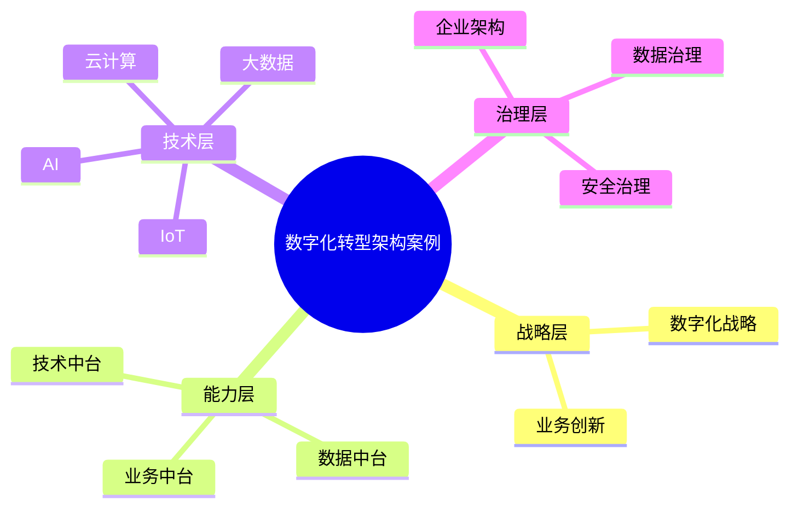

# 51-digital-transformation-case.md（数字化转型架构案例）

> 本文用于系统架构设计师考试案例分析专题 V2 复习。
>
> 本篇重点整理数字化转型（Digital Transformation）架构设计案例，包括数字化战略、业务数字化、数据驱动转型、数据中台、业务中台、技术中台、云平台、AI智能化应用以及企业数字化治理。

---

# 目录

1. 数字化转型案例概述
2. 数字化转型基本概念
3. 企业数字化转型挑战案例
4. 数字化转型整体架构案例
5. 数字化战略规划案例
6. 业务数字化案例
7. 管理数字化案例
8. 数据驱动转型案例
9. 数据中台架构案例
10. 业务中台架构案例
11. 技术中台架构案例
12. 云平台支撑案例
13. AI智能化应用案例
14. IoT物联网融合案例
15. 企业数字化平台案例
16. 数字化转型治理案例
17. 数字化成熟度模型案例
18. 企业级数字化转型案例
19. 案例分析答题模板
20. 高频考点
21. 易错点
22. Mermaid知识结构图
23. 本节小结

---

# 1. 数字化转型案例概述

数字化转型：

> 利用数字技术推动企业业务模式、组织流程和运营方式变革，实现业务创新和价值提升。

核心目标：

- 提升业务效率；
- 优化用户体验；
- 实现智能决策；
- 创造新的商业模式。

演进：

```text
传统企业

↓

数字化建设

↓

数据驱动

↓

智能化运营
```

---

# 2. 数字化转型基本概念

数字化转型包括：

## 业务数字化

实现：

- 流程在线化；
- 服务数字化；
- 自动化运营。

## 管理数字化

包括：

- ERP；
- CRM；
- OA。

## 数据智能化

利用数据：

- 分析业务；
- 支撑决策；
- 预测趋势。

---

# 3. 企业数字化转型挑战案例

主要问题：

- 信息系统孤岛；
- 数据质量不足；
- 技术架构老旧；
- IT与业务脱节。

---

# 4. 数字化转型整体架构案例

```text
业务战略

↓

数字化平台

↓

数据能力

↓

技术基础设施

↓

业务应用
```

组成：

- 业务层；
- 数据层；
- 平台层；
- 技术层。

---

# 5. 数字化战略规划案例

规划过程：

```text
企业战略

↓

数字化目标

↓

建设路线

↓

实施计划
```

原则：

- 业务驱动；
- 技术支撑；
- 分阶段建设。

---

# 6. 业务数字化案例

目标：

提升业务效率。

方式：

- 流程在线化；
- 服务数字化；
- 智能运营。

---

# 7. 管理数字化案例

主要系统：

- ERP企业资源管理；
- CRM客户关系管理；
- OA办公自动化。

目标：

提升管理效率和协作能力。

---

# 8. 数据驱动转型案例

核心：

> 数据成为企业核心资产。

架构：

```text
业务系统

↓

数据治理

↓

数据平台

↓

数据应用

↓

业务价值
```

---

# 9. 数据中台架构案例

数据中台：

> 通过统一数据能力支撑多个业务应用。

架构：

```text
数据采集

↓

数据治理

↓

数据服务

↓

业务应用
```

能力：

- 数据整合；
- 数据共享；
- 数据分析。

---

# 10. 业务中台架构案例

业务中台：

沉淀：

- 通用业务能力；
- 核心业务服务。

架构：

```text
前台业务

↓

业务中台

↓

后台资源
```

价值：

- 能力复用；
- 快速创新。

---

# 11. 技术中台架构案例

提供：

- 基础技术能力；
- 通用技术服务。

包括：

- 微服务平台；
- 云平台；
- DevOps平台。

---

# 12. 云平台支撑案例

云计算提供：

- 弹性资源；
- 快速部署；
- 按需扩展。

架构：

```text
业务应用

↓

云平台

↓

基础设施
```

---

# 13. AI智能化应用案例

AI应用：

- 智能推荐；
- 智能客服；
- 风险预测；
- 自动决策。

流程：

```text
数据

↓

AI模型

↓

智能应用
```

---

# 14. IoT物联网融合案例

架构：

```text
设备

↓

IoT平台

↓

数据平台

↓

业务应用
```

能力：

- 数据采集；
- 实时感知；
- 智能控制。

---

# 15. 企业数字化平台案例

整体架构：

```text
用户

↓

数字化平台

↓

业务能力

↓

数据能力

↓

云基础设施
```

---

# 16. 数字化转型治理案例

治理包括：

## 架构治理

统一技术路线。

## 数据治理

保证数据质量。

## 安全治理

保障业务安全。

## 项目治理

控制建设过程。

---

# 17. 数字化成熟度模型案例

演进：

```text
信息化

↓

数字化

↓

数据驱动

↓

智能化
```

---

# 18. 企业级数字化转型案例

综合架构：

```text
企业战略

↓

企业架构

↓

数字化平台

↓

数据智能

↓

业务创新
```

---

# 19. 案例分析答题模板

## 企业系统孤立

> 建设数字化平台，实现业务系统整合和数据共享。

## 数据价值无法发挥

> 建立数据治理体系和数据中台，提高数据资产利用能力。

## 企业需要智能化升级

> 结合云计算、大数据和人工智能技术，推动业务智能化。

## 传统企业转型

> 以企业架构为指导，通过数字化平台建设实现业务、数据和技术融合。

---

# 20. 高频考点

重点掌握：

1. 数字化转型概念；
2. 数字化战略规划；
3. 数据驱动转型；
4. 中台架构；
5. 云平台支撑；
6. AI智能应用。

---

# 21. 易错点

|易错知识|正确理解|
|-|-|
|数字化转型只是系统升级|核心是业务模式和能力提升|
|数据中台只是数据仓库|数据中台提供数据服务能力|
|技术建设优先于业务|数字化转型应业务驱动|
|云计算等于数字化转型|云计算只是支撑技术之一|

---

# 22. Mermaid知识结构图



---

# 23. 本节小结

数字化转型案例核心：

> 通过数字技术推动企业业务、流程和组织变革，实现数据驱动和智能化运营。

案例分析重点：

- 理解数字化转型目标；
- 掌握中台和数据驱动架构；
- 理解云计算、AI、IoT融合；
- 结合企业架构进行整体规划。
