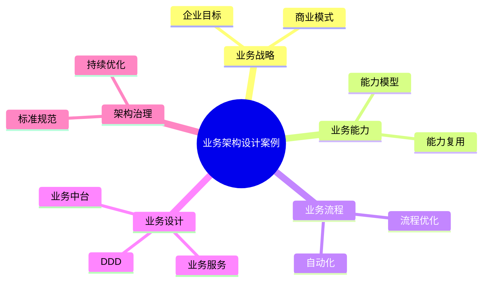

# 52-business-architecture-case.md（业务架构设计案例）

> 本文用于系统架构设计师考试案例分析专题 V2 复习。
>
> 本篇重点整理业务架构（Business Architecture）设计相关案例，包括业务战略、业务能力模型、业务流程建模、领域驱动设计DDD、业务服务、业务中台以及业务架构治理。

---

# 目录

1. 业务架构案例概述
2. 业务架构基本概念
3. 企业业务架构挑战案例
4. 业务架构整体设计案例
5. 业务战略分析案例
6. 业务能力模型案例
7. 业务流程建模案例
8. 业务领域建模案例
9. 领域驱动设计DDD案例
10. 业务服务设计案例
11. 业务中台架构案例
12. 业务架构与应用架构融合案例
13. 业务架构与数据架构融合案例
14. 业务架构治理案例
15. 业务架构演进案例
16. 数字化业务创新案例
17. 企业级业务架构案例
18. 业务架构管理平台案例
19. 案例分析答题模板
20. 高频考点
21. 易错点
22. Mermaid知识结构图
23. 本节小结

---

# 1. 业务架构案例概述

业务架构：

> 从企业业务视角描述企业如何创造价值，包括业务能力、业务流程、组织和业务规则。

目标：

- 支撑企业战略；
- 明确业务能力；
- 指导系统建设；
- 提升业务敏捷性。

关系：

```text
企业战略

↓

业务架构

↓

应用系统

↓

技术实现
```

---

# 2. 业务架构基本概念

主要组成：

## 业务战略

包括：

- 企业目标；
- 发展方向；
- 商业模式。

## 业务能力

描述企业能够完成什么。

例如：

- 客户管理能力；
- 订单处理能力；
- 风险控制能力。

## 业务流程

描述企业如何完成业务。

例如：

- 销售流程；
- 采购流程；
- 服务流程。

## 业务组织

描述：

- 部门；
- 角色；
- 职责。

---

# 3. 企业业务架构挑战案例

常见问题：

- 业务战略无法落地；
- IT建设与业务目标不一致；
- 业务流程复杂；
- 系统重复建设；
- 业务能力无法复用。

---

# 4. 业务架构整体设计案例

```text
企业战略

↓

业务能力模型

↓

业务流程模型

↓

业务服务

↓

信息系统支撑
```

---

# 5. 业务战略分析案例

过程：

```text
战略目标

↓

业务目标

↓

业务能力

↓

系统建设
```

原则：

- 业务驱动；
- 战略导向；
- 分阶段实施。

---

# 6. 业务能力模型案例

业务能力：

> 企业完成业务目标所需要具备的能力。

示例：

```text
业务能力

├── 商品管理

├── 用户管理

├── 订单管理

├── 支付管理

└── 物流管理
```

价值：

- 指导系统拆分；
- 支撑能力复用。

---

# 7. 业务流程建模案例

业务流程描述业务执行过程。

示例：

```text
客户下单

↓

订单审核

↓

库存检查

↓

支付

↓

发货
```

优化目标：

- 流程标准化；
- 提升效率；
- 自动化处理。

---

# 8. 业务领域建模案例

领域建模识别：

- 业务对象；
- 业务关系；
- 业务规则。

示例：

```text
订单领域

├── 商品

├── 用户

├── 支付

└── 配送
```

---

# 9. 领域驱动设计DDD案例

DDD：

Domain Driven Design。

核心：

> 以业务领域为核心设计软件系统。

主要概念：

- 领域；
- 子域；
- 限界上下文；
- 聚合。

关系：

```text
业务领域

↓

领域模型

↓

软件设计
```

---

# 10. 业务服务设计案例

业务服务：

将业务能力封装为服务。

例如：

```text
订单服务

↓

订单创建

↓

订单查询

↓

订单管理
```

优势：

- 能力复用；
- 服务组合；
- 支撑业务创新。

---

# 11. 业务中台架构案例

业务中台：

> 将企业通用业务能力沉淀为共享服务。

架构：

```text
前台应用

↓

业务中台

↓

后台资源
```

典型能力：

- 用户中心；
- 商品中心；
- 订单中心。

---

# 12. 业务架构与应用架构融合案例

关系：

```text
业务能力

↓

应用系统

↓

软件模块
```

原则：

> 应用系统应支撑业务能力，而不是限制业务发展。

---

# 13. 业务架构与数据架构融合案例

关系：

```text
业务流程

↓

业务数据

↓

数据治理

↓

数据应用
```

---

# 14. 业务架构治理案例

治理内容：

- 业务标准；
- 流程规范；
- 能力管理。

流程：

```text
规划

↓

设计

↓

评审

↓

实施

↓

优化
```

---

# 15. 业务架构演进案例

演进：

```text
传统业务

↓

流程数字化

↓

业务平台化

↓

智能业务
```

---

# 16. 数字化业务创新案例

结合：

- 云计算；
- 大数据；
- AI。

实现：

- 个性化服务；
- 智能决策；
- 自动运营。

---

# 17. 企业级业务架构案例

整体：

```text
企业战略

↓

业务架构

↓

应用架构

↓

技术架构
```

作用：

连接企业战略和IT实现。

---

# 18. 业务架构管理平台案例

能力：

- 业务模型管理；
- 流程管理；
- 能力地图管理；
- 架构分析。

---

# 19. 案例分析答题模板

## IT建设无法支撑业务

> 建立业务架构体系，从业务能力和流程角度指导信息系统建设。

## 企业业务流程复杂

> 通过业务流程建模和优化，实现流程标准化和自动化。

## 系统重复建设严重

> 基于业务能力模型进行系统规划，提高业务能力复用。

## 微服务拆分困难

> 采用DDD方法，根据业务领域划分服务边界。

---

# 20. 高频考点

重点掌握：

1. 业务架构概念；
2. 业务能力模型；
3. 业务流程建模；
4. DDD领域建模；
5. 业务中台；
6. 业务与IT融合。

---

# 21. 易错点

|易错知识|正确理解|
|-|-|
|业务架构只是流程设计|还包括能力、组织和规则|
|DDD只是技术设计方法|核心是业务领域分析|
|业务架构不影响系统设计|业务架构指导应用架构|
|中台就是堆技术|中台核心是能力复用|

---

# 22. Mermaid知识结构图



---

# 23. 本节小结

业务架构案例核心：

> 从业务视角规划企业能力、流程和服务，为应用架构和技术架构提供指导。

案例分析重点：

- 理解业务架构作用；
- 掌握业务能力模型；
- 理解DDD领域建模；
- 掌握业务架构与应用架构融合方法。
