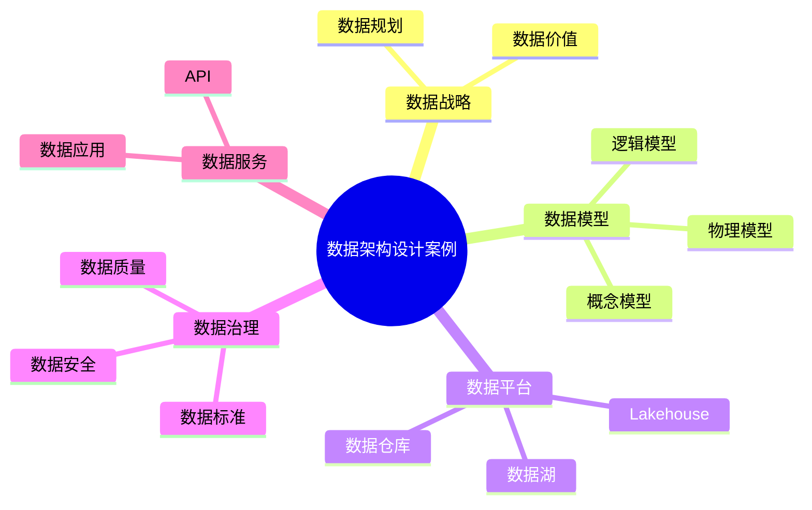

# 53-data-architecture-case.md（数据架构设计案例）

> 本文用于系统架构设计师考试案例分析专题 V2 复习。
>
> 本篇重点整理数据架构（Data Architecture）设计相关案例，包括数据战略、数据模型、数据流、数据存储、数据集成、数据仓库、数据湖、数据湖仓一体、数据中台、主数据管理以及数据治理。

---

# 目录

1. 数据架构案例概述
2. 数据架构基本概念
3. 企业数据架构挑战案例
4. 数据架构整体设计案例
5. 数据战略规划案例
6. 数据模型设计案例
7. 数据流设计案例
8. 数据存储架构案例
9. 数据集成架构案例
10. 数据仓库架构案例
11. 数据湖架构案例
12. 数据湖仓一体架构案例
13. 数据中台架构案例
14. 主数据管理案例
15. 数据治理融合案例
16. 数据服务架构案例
17. 数据安全架构案例
18. 企业级数据架构案例
19. 案例分析答题模板
20. 高频考点
21. 易错点
22. Mermaid知识结构图
23. 本节小结

---

# 1. 数据架构案例概述

数据架构：

> 对企业数据资产进行规划、组织、存储、管理和使用的整体设计。

目标：

- 数据统一管理；
- 数据共享复用；
- 提升数据价值；
- 支撑业务创新。

整体关系：

```text
业务需求

↓

数据架构

↓

数据平台

↓

数据应用

↓

业务价值
```

---

# 2. 数据架构基本概念

数据架构主要包括：

## 数据战略

明确：

- 数据目标；
- 数据价值；
- 数据管理方向。

## 数据模型

描述：

- 数据结构；
- 数据关系；
- 数据约束。

## 数据存储

包括：

- 数据库；
- 数据仓库；
- 数据湖。

## 数据服务

提供：

- 数据查询；
- 数据分析；
- 数据共享。

---

# 3. 企业数据架构挑战案例

常见问题：

## 数据孤岛

表现：

- 系统之间数据无法共享。

## 数据标准不统一

表现：

- 同一业务存在不同定义。

## 数据质量不足

包括：

- 数据缺失；
- 数据错误；
- 数据重复。

## 数据价值无法释放

表现：

- 数据无法支撑业务决策。

---

# 4. 数据架构整体设计案例

整体架构：

```text
业务系统

↓

数据采集

↓

数据存储

↓

数据处理

↓

数据服务

↓

数据应用
```

组成：

- 数据源层；
- 数据处理层；
- 数据服务层；
- 数据应用层。

---

# 5. 数据战略规划案例

规划过程：

```text
企业战略

↓

数据战略

↓

数据架构

↓

数据建设
```

原则：

- 统一规划；
- 分步实施；
- 持续治理。

---

# 6. 数据模型设计案例

数据模型包括：

## 概念模型

描述：

- 业务实体；
- 业务关系。

## 逻辑模型

描述：

- 数据结构；
- 属性关系。

## 物理模型

描述：

- 数据表；
- 索引；
- 存储结构。

---

# 7. 数据流设计案例

数据流描述：

- 数据来源；
- 数据转换；
- 数据流向。

示例：

```text
业务系统

↓

数据采集

↓

数据加工

↓

数据服务

↓

业务应用
```

---

# 8. 数据存储架构案例

## 关系数据库

适合：

- 事务处理；
- 核心业务数据。

## 数据仓库

适合：

- 分析查询；
- BI应用。

## 数据湖

适合：

- 海量数据；
- 多类型数据。

---

# 9. 数据集成架构案例

数据集成方式：

- ETL；
- ELT；
- 数据同步；
- 消息流。

架构：

```text
多个业务系统

↓

数据集成平台

↓

统一数据平台
```

---

# 10. 数据仓库架构案例

经典架构：

```text
数据源

↓

ETL

↓

ODS

↓

数据仓库

↓

数据集市

↓

BI分析
```

作用：

- 企业分析；
- 决策支持。

---

# 11. 数据湖架构案例

数据湖：

> 面向海量、多类型数据存储和分析的平台。

特点：

- 保存原始数据；
- 支持多种分析场景。

架构：

```text
数据源

↓

数据湖

↓

计算分析

↓

数据应用
```

---

# 12. 数据湖仓一体架构案例

Lakehouse：

结合：

- 数据湖；
- 数据仓库。

优势：

- 统一存储；
- 统一分析；
- 支持AI应用。

---

# 13. 数据中台架构案例

数据中台：

> 将企业数据能力封装为共享服务。

架构：

```text
数据采集

↓

数据治理

↓

数据资产

↓

数据服务

↓

业务应用
```

能力：

- 数据整合；
- 数据共享；
- 数据服务。

---

# 14. 主数据管理案例

主数据：

企业核心业务数据。

例如：

- 客户；
- 商品；
- 组织。

目标：

保证：

- 唯一性；
- 一致性；
- 准确性。

---

# 15. 数据治理融合案例

数据治理包括：

- 数据标准；
- 数据质量；
- 数据安全；
- 元数据管理。

流程：

```text
数据产生

↓

数据治理

↓

数据服务

↓

数据应用
```

---

# 16. 数据服务架构案例

数据服务：

提供：

- API接口；
- 数据查询；
- 数据分析能力。

架构：

```text
数据平台

↓

数据服务层

↓

业务应用
```

---

# 17. 数据安全架构案例

包括：

- 数据分类分级；
- 数据加密；
- 访问控制；
- 审计管理。

---

# 18. 企业级数据架构案例

综合架构：

```text
企业战略

↓

数据战略

↓

数据架构

↓

数据平台

↓

数据应用
```

目标：

实现：

- 数据资产化；
- 数据服务化；
- 数据智能化。

---

# 19. 案例分析答题模板

## 企业数据孤岛严重

> 建立统一数据架构，通过数据集成和数据治理实现数据共享。

## 数据质量不足

> 建立数据治理体系，加强数据标准、质量管理和元数据管理。

## 企业需要数据驱动决策

> 建设数据平台和数据服务体系，提高数据分析和应用能力。

## AI应用缺少数据支撑

> 建立统一数据架构，为人工智能模型提供高质量数据基础。

---

# 20. 高频考点

重点掌握：

1. 数据架构概念；
2. 数据模型设计；
3. 数据仓库与数据湖；
4. 数据湖仓一体；
5. 数据中台；
6. 数据治理。

---

# 21. 易错点

|易错知识|正确理解|
|-|-|
|数据架构只是数据库设计|数据架构覆盖数据全生命周期|
|数据仓库等于数据湖|二者定位和使用场景不同|
|数据治理只是清洗数据|治理包括标准、安全、质量和管理|
|数据中台只是存储平台|核心是数据能力服务化|

---

# 22. Mermaid知识结构图



---

# 23. 本节小结

数据架构案例核心：

> 通过统一的数据架构规划，实现数据采集、存储、治理、服务和应用的全过程管理。

案例分析重点：

- 理解数据架构作用；
- 掌握数据模型设计；
- 理解数据仓库、数据湖和湖仓一体；
- 掌握数据治理与数据服务体系。
