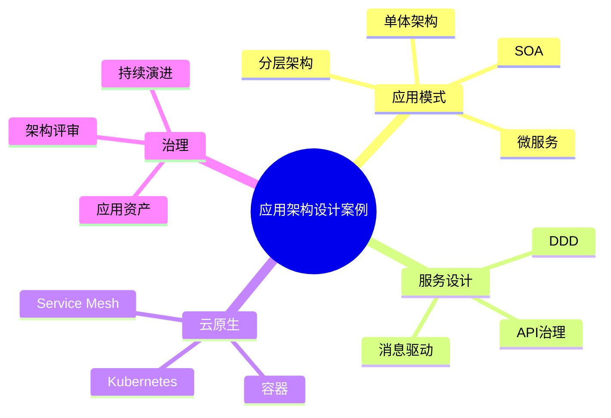

# 54-application-architecture-case.md（应用架构设计案例）

> 本文用于系统架构设计师考试案例分析专题 V2 复习。

# 目录

1. 应用架构案例概述
2. 应用架构基本概念
3. 企业应用架构挑战案例
4. 应用架构整体设计案例
5. 应用系统分类案例
6. 应用分层架构案例
7. 单体应用架构案例
8. SOA架构案例
9. 微服务架构案例
10. DDD与微服务拆分案例
11. API治理架构案例
12. 应用集成架构案例
13. 消息驱动架构案例
14. 应用中台架构案例
15. 云原生应用架构案例
16. 应用架构演进案例
17. 企业级应用架构案例
18. 应用架构治理平台案例
19. 案例分析答题模板
20. 高频考点
21. 易错点
22. Mermaid知识结构图
23. 本节小结

---

# 1. 应用架构案例概述

应用架构：

> 从应用系统角度描述系统组成、职责划分以及系统之间交互关系。

目标：

- 支撑业务能力；
- 提升系统扩展性；
- 降低系统复杂度；
- 提高应用复用能力。

关系：

```text
业务架构

↓

应用架构

↓

技术架构
```

---

# 2. 应用架构基本概念

主要包括：

- 应用系统；
- 应用组件；
- 应用接口；
- 应用关系。

应用架构关注系统边界、服务职责和交互方式。

---

# 3. 企业应用架构挑战案例

常见问题：

- 烟囱式建设；
- 应用重复建设；
- 系统耦合严重；
- 扩展能力不足。

---

# 4. 应用架构整体设计案例

```text
业务能力

↓

应用系统

↓

应用服务

↓

技术平台
```

---

# 5. 应用分层架构案例

经典分层：

```text
表现层

↓

业务逻辑层

↓

数据访问层

↓

数据库
```

优势：

- 职责清晰；
- 易维护；
- 易扩展。

---

# 6. 单体应用架构案例

特点：

所有功能集中在一个应用中。

优点：

- 开发简单；
- 部署方便。

缺点：

- 扩展困难；
- 发布风险高。

---

# 7. SOA架构案例

SOA：

Service Oriented Architecture。

核心：

> 将业务能力封装为服务。

架构：

```text
业务应用

↓

ESB服务总线

↓

服务组件
```

特点：

- 服务复用；
- 松耦合；
- 企业集成能力强。

---

# 8. 微服务架构案例

微服务将系统拆分为独立服务。

```text
客户端

↓

API Gateway

↓

多个微服务

↓

数据库
```

优势：

- 独立部署；
- 独立扩展；
- 快速交付。

挑战：

- 服务治理；
- 数据一致性；
- 运维复杂。

---

# 9. DDD与微服务拆分案例

DDD：

Domain Driven Design。

核心：

> 根据业务领域设计系统边界。

流程：

```text
业务分析

↓

领域划分

↓

限界上下文

↓

微服务设计
```

---

# 10. API治理架构案例

API治理包括：

- API设计规范；
- 生命周期管理；
- 安全控制。

API网关能力：

- 路由；
- 鉴权；
- 限流；
- 监控。

---

# 11. 应用集成架构案例

集成方式：

- 点对点集成；
- ESB集成；
- API集成。

目标：

降低系统之间耦合。

---

# 12. 消息驱动架构案例

```text
生产者

↓

消息队列

↓

消费者
```

优势：

- 解耦；
- 削峰；
- 异步处理。

---

# 13. 应用中台架构案例

应用中台：

> 将企业通用业务能力沉淀为共享服务。

```text
前台应用

↓

业务中台

↓

后台资源
```

---

# 14. 云原生应用架构案例

演进：

```text
单体应用

↓

SOA

↓

微服务

↓

云原生应用
```

结合：

- 容器；
- Kubernetes；
- DevOps；
- Service Mesh。

---

# 15. 案例分析答题模板

## 系统耦合严重

采用SOA或微服务架构，通过服务化设计降低系统耦合。

## 业务变化频繁

采用DDD方法，根据业务领域划分服务边界，提高系统灵活性。

## 系统集成困难

建立API治理体系，通过统一接口规范实现系统集成。

## 老系统升级改造

采用渐进式演进策略，逐步完成单体向微服务和云原生架构迁移。

---

# 16. 高频考点

重点掌握：

1. 应用架构定位；
2. 分层架构；
3. SOA；
4. 微服务；
5. DDD；
6. API治理；
7. 云原生应用演进。

---

# 17. 易错点

|易错知识|正确理解|
|-|-|
|应用架构等于代码结构|应用架构关注系统级组织关系|
|微服务拆分越细越好|应根据业务边界合理拆分|
|SOA已经过时|SOA思想仍用于企业集成|
|API网关只是转发工具|还承担治理、安全和流量控制|

---

# 18. Mermaid知识结构图



---

# 19. 本节小结

应用架构案例核心：

> 通过合理规划应用系统、服务边界和集成方式，使应用体系能够持续支撑企业业务发展。

案例分析重点：

- 理解应用架构定位；
- 掌握SOA和微服务演进；
- 理解DDD服务拆分方法；
- 掌握API治理和云原生应用架构。
