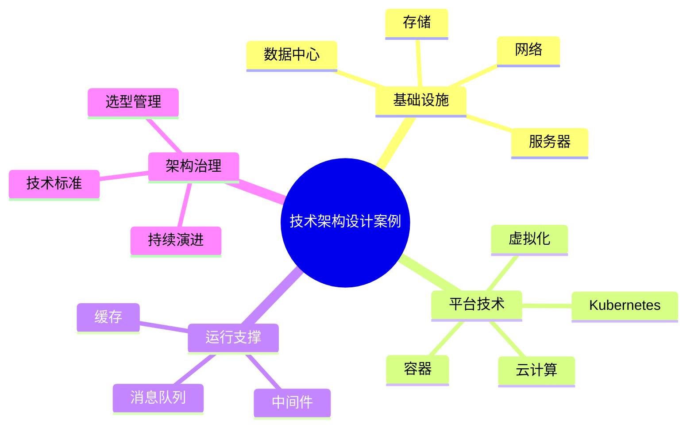

# 55-technology-architecture-case.md（技术架构设计案例）

> 本文用于系统架构设计师考试案例分析专题 V2 复习。
>
> 本篇重点整理技术架构（Technology Architecture）设计相关案例，包括基础设施、计算架构、存储架构、网络架构、云计算、虚拟化、容器、Kubernetes、中间件、高可用以及技术架构治理。

---

# 目录

1. 技术架构案例概述
2. 技术架构基本概念
3. 企业技术架构挑战案例
4. 技术架构整体设计案例
5. 基础设施架构案例
6. 计算架构设计案例
7. 存储架构设计案例
8. 网络架构设计案例
9. 数据中心架构案例
10. 云计算架构案例
11. 虚拟化架构案例
12. 容器化架构案例
13. Kubernetes平台架构案例
14. 中间件架构案例
15. 高可用技术架构案例
16. 技术选型案例
17. 技术架构演进案例
18. 企业级技术架构案例
19. 技术架构治理平台案例
20. 案例分析答题模板
21. 高频考点
22. 易错点
23. Mermaid知识结构图
24. 本节小结

---

# 1. 技术架构案例概述

技术架构：

> 描述企业信息系统运行所依赖的技术基础环境，包括基础设施、平台、中间件和运行环境。

目标：

- 支撑业务发展；
- 保证系统稳定；
- 提升扩展能力；
- 降低技术复杂度。

整体关系：

```text
业务架构

↓

应用架构

↓

技术架构

↓

基础设施
```

---

# 2. 技术架构基本概念

技术架构主要包括：

## 基础设施层

包括：

- 服务器；
- 网络；
- 存储；
- 数据中心。

## 平台层

包括：

- 操作系统；
- 数据库；
- 中间件；
- 云平台。

## 应用运行环境

包括：

- 虚拟化；
- 容器；
- Kubernetes。

---

# 3. 企业技术架构挑战案例

常见问题：

- 技术体系混乱；
- 基础设施扩展困难；
- 系统性能不足；
- 高可用能力不足；
- 技术债务严重。

---

# 4. 技术架构整体设计案例

```text
业务应用

↓

应用平台

↓

中间件平台

↓

计算存储网络

↓

基础设施
```

---

# 5. 基础设施架构案例

基础设施包括：

- 服务器；
- 网络设备；
- 存储设备；
- 数据中心。

设计目标：

- 高性能；
- 高可靠；
- 可扩展。

---

# 6. 计算架构设计案例

计算资源包括：

- 物理服务器；
- 虚拟机；
- 容器。

演进：

```text
物理机

↓

虚拟机

↓

容器

↓

云原生平台
```

---

# 7. 存储架构设计案例

主要类型：

## 本地存储

特点：

- 性能高；
- 扩展有限。

## 网络存储

包括：

- NAS；
- SAN。

## 云存储

特点：

- 弹性扩展；
- 按需使用。

---

# 8. 网络架构设计案例

网络设计包括：

- 接入层；
- 汇聚层；
- 核心层。

典型访问：

```text
用户

↓

负载均衡

↓

应用服务

↓

数据库
```

---

# 9. 数据中心架构案例

包括：

- 机房；
- 网络；
- 电力；
- 制冷；
- 安全。

目标：

- 稳定运行；
- 容灾保障。

---

# 10. 云计算架构案例

云计算特点：

- 弹性；
- 资源池化；
- 按需服务。

架构：

```text
云服务

↓

云平台

↓

虚拟化资源

↓

物理基础设施
```

---

# 11. 虚拟化架构案例

虚拟化：

> 通过软件技术抽象物理资源。

类型：

- 服务器虚拟化；
- 存储虚拟化；
- 网络虚拟化。

优势：

- 提高资源利用率；
- 简化管理。

---

# 12. 容器化架构案例

容器特点：

- 轻量；
- 快速部署；
- 环境一致。

架构：

```text
应用

↓

容器

↓

容器运行时

↓

操作系统
```

---

# 13. Kubernetes平台架构案例

Kubernetes负责：

- 容器编排；
- 服务发现；
- 自动扩缩。

架构：

```text
Master节点

↓

Worker节点

↓

Pod

↓

Container
```

---

# 14. 中间件架构案例

中间件包括：

- 消息队列；
- 缓存；
- API网关；
- 应用服务器。

作用：

- 解耦；
- 提升性能；
- 支撑分布式系统。

---

# 15. 高可用技术架构案例

措施：

## 负载均衡

分散请求。

## 集群

多节点运行。

## 容灾

保证业务连续。

架构：

```text
用户

↓

负载均衡

↓

服务器集群

↓

数据库集群
```

---

# 16. 技术选型案例

考虑因素：

- 性能；
- 可靠性；
- 扩展性；
- 安全性；
- 成本。

---

# 17. 技术架构演进案例

演进：

```text
传统架构

↓

虚拟化

↓

云计算

↓

容器化

↓

云原生
```

---

# 18. 企业级技术架构案例

整体：

```text
企业战略

↓

企业架构

↓

技术架构

↓

基础平台
```

---

# 19. 技术架构治理平台案例

能力：

- 技术标准管理；
- 架构评审；
- 技术资产管理；
- 技术路线规划。

---

# 20. 案例分析答题模板

## 技术体系混乱

> 建立统一技术架构体系，制定技术标准和技术路线。

## 系统扩展困难

> 采用云计算、虚拟化和容器化技术，提高资源弹性和扩展能力。

## 系统可靠性不足

> 通过集群、负载均衡和容灾设计，提高系统高可用能力。

## 老系统升级

> 采用渐进式演进方式，从传统架构逐步迁移到云原生架构。

---

# 21. 高频考点

重点掌握：

1. 技术架构定位；
2. 基础设施设计；
3. 云计算架构；
4. 虚拟化和容器；
5. Kubernetes；
6. 高可用设计。

---

# 22. 易错点

|易错知识|正确理解|
|-|-|
|技术架构只是服务器规划|技术架构覆盖基础设施、平台和运行环境|
|云计算就是买服务器|云计算核心是资源池化和弹性服务|
|容器等于虚拟机|容器更加轻量，共享操作系统内核|
|高可用只靠增加机器|需要结合集群、负载均衡和容灾|

---

# 23. Mermaid知识结构图



---

# 24. 本节小结

技术架构案例核心：

> 通过规划基础设施、平台和运行环境，为企业应用和数据系统提供稳定、可靠、可扩展的技术支撑。

案例分析重点：

- 理解技术架构在企业架构中的定位；
- 掌握云计算、虚拟化、容器演进；
- 理解高可用技术设计；
- 掌握技术架构治理方法。
