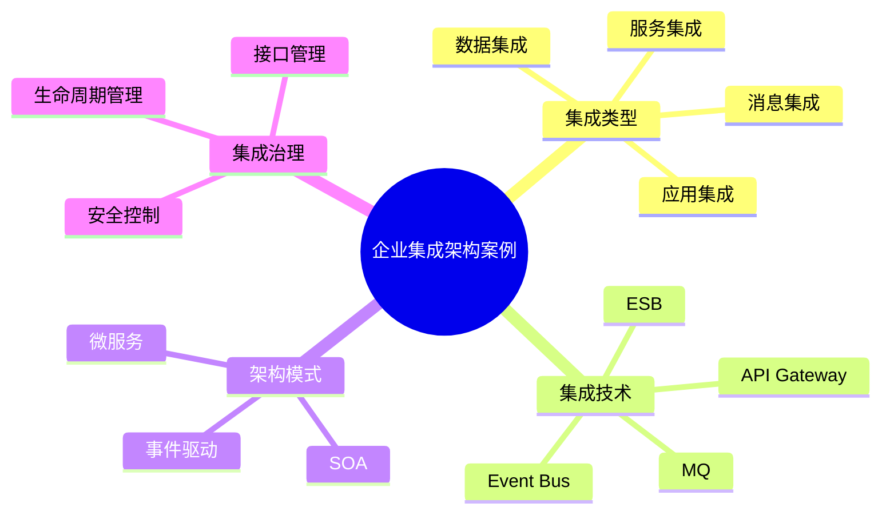

# 56-enterprise-integration-case.md（企业集成架构案例）

> 本文用于系统架构设计师考试案例分析专题 V2 复习。
>
> 本篇重点整理企业集成架构（Enterprise Integration Architecture）设计案例，包括应用集成、数据集成、服务集成、消息集成、ESB、API治理、事件驱动集成以及企业集成治理。

---

# 目录

1. 企业集成架构案例概述
2. 企业集成基本概念
3. 企业系统集成挑战案例
4. 企业集成整体架构案例
5. 应用集成架构案例
6. 数据集成架构案例
7. 服务集成架构案例
8. 消息集成架构案例
9. ESB企业服务总线案例
10. API集成架构案例
11. API Gateway案例
12. 微服务集成案例
13. 事件驱动集成案例
14. 企业集成平台案例
15. 集成安全架构案例
16. 集成治理案例
17. 企业集成演进案例
18. 企业级集成架构案例
19. 案例分析答题模板
20. 高频考点
21. 易错点
22. Mermaid知识结构图
23. 本节小结

---

# 1. 企业集成架构案例概述

企业集成架构：

> 通过统一的方法和技术，实现企业内部及外部系统之间的信息共享和业务协同。

目标：

- 消除信息孤岛；
- 提升系统协同能力；
- 降低系统耦合；
- 提高业务响应速度。

整体关系：

```text
业务系统

↓

集成平台

↓

其他系统

↓

业务协同
```

---

# 2. 企业集成基本概念

主要包括：

## 应用集成

实现系统之间功能调用和业务流程协同。

## 数据集成

实现数据同步和数据共享。

## 服务集成

实现服务复用和服务组合。

## 消息集成

实现异步通信和系统解耦。

---

# 3. 企业系统集成挑战案例

常见问题：

- 点对点连接过多；
- 接口标准不统一；
- 数据同步困难；
- 系统耦合严重。

---

# 4. 企业集成整体架构案例

```text
业务系统

↓

集成层

↓

服务层

↓

数据层

↓

基础设施
```

---

# 5. 应用集成架构案例

应用集成：

> 将多个应用系统连接起来，实现业务流程协同。

模式：

## 点对点集成

优点：

- 实现简单。

缺点：

- 系统规模扩大后维护困难。

## 集成平台模式

```text
系统A

↓

集成平台

↓

系统B
```

降低系统之间耦合。

---

# 6. 数据集成架构案例

数据集成方式：

## ETL

```text
Extract

↓

Transform

↓

Load
```

## 数据同步

包括：

- 批量同步；
- 实时同步。

## 数据交换平台

实现：

- 数据共享；
- 数据转换。

---

# 7. 服务集成架构案例

服务集成：

> 将业务能力封装为服务，实现服务复用。

架构：

```text
业务应用

↓

服务接口

↓

业务服务
```

优势：

- 松耦合；
- 易扩展。

---

# 8. 消息集成架构案例

消息模式：

```text
生产者

↓

消息队列

↓

消费者
```

优势：

- 异步处理；
- 削峰填谷；
- 降低耦合。

典型场景：

- 订单处理；
- 通知系统；
- 数据同步。

---

# 9. ESB企业服务总线案例

ESB：

Enterprise Service Bus。

作用：

作为企业系统通信中枢。

```text
系统A

↓

ESB

↓

系统B
```

能力：

- 协议转换；
- 消息路由；
- 服务管理；
- 数据转换。

---

# 10. API集成架构案例

API集成：

通过标准接口实现系统连接。

常见方式：

- REST API；
- SOAP；
- GraphQL。

优势：

- 开放；
- 灵活；
- 易扩展。

---

# 11. API Gateway案例

API网关作为统一访问入口。

```text
客户端

↓

API Gateway

↓

后端服务
```

功能：

- 路由；
- 鉴权；
- 限流；
- 日志；
- 监控。

---

# 12. 微服务集成案例

微服务通信通常结合：

- API Gateway；
- 服务注册中心；
- 消息队列。

架构：

```text
用户

↓

网关

↓

服务集群

↓

数据服务
```

---

# 13. 事件驱动集成案例

事件驱动：

> 通过事件通知实现系统协作。

架构：

```text
事件生产者

↓

事件总线

↓

事件消费者
```

优势：

- 高扩展；
- 松耦合；
- 实时响应。

---

# 14. 企业集成平台案例

平台能力：

- 接口管理；
- 消息管理；
- 数据转换；
- 服务治理。

---

# 15. 集成安全架构案例

包括：

- 身份认证；
- 权限控制；
- 数据加密；
- 接口安全。

---

# 16. 集成治理案例

治理内容：

- 接口标准；
- 服务生命周期；
- 数据规范；
- 访问控制。

流程：

```text
设计

↓

发布

↓

使用

↓

监控

↓

优化
```

---

# 17. 企业集成演进案例

演进路线：

```text
点对点集成

↓

ESB

↓

SOA

↓

API管理

↓

事件驱动架构
```

---

# 18. 企业级集成架构案例

整体：

```text
企业应用

↓

集成平台

↓

数据与服务

↓

基础设施
```

目标：

- 业务协同；
- 数据共享；
- 系统互联。

---

# 19. 案例分析答题模板

## 系统接口数量过多

> 建设企业集成平台，通过统一接口管理降低系统耦合。

## 数据无法共享

> 建立数据集成体系，通过数据交换和治理实现数据共享。

## 系统需要实时协同

> 采用消息队列或事件驱动架构，实现异步通信和实时处理。

## 微服务调用复杂

> 采用API Gateway和服务治理机制，实现统一服务管理。

---

# 20. 高频考点

重点掌握：

1. 企业集成概念；
2. ESB架构；
3. API治理；
4. 消息集成；
5. 事件驱动架构；
6. 集成治理。

---

# 21. 易错点

|易错知识|正确理解|
|-|-|
|企业集成只是接口开发|企业集成包含应用、数据、服务和消息|
|ESB只是消息转发工具|ESB还负责转换、路由和治理|
|API Gateway只负责转发|网关还承担安全和流量治理|
|消息队列只能异步通知|消息队列还可用于削峰和解耦|

---

# 22. Mermaid知识结构图



---

# 23. 本节小结

企业集成架构案例核心：

> 通过统一集成技术和治理体系，实现企业系统之间的数据共享、服务复用和业务协同。

案例分析重点：

- 理解企业集成目标；
- 掌握ESB、API、消息队列等集成方式；
- 理解SOA、微服务和事件驱动演进；
- 掌握集成治理方法。
