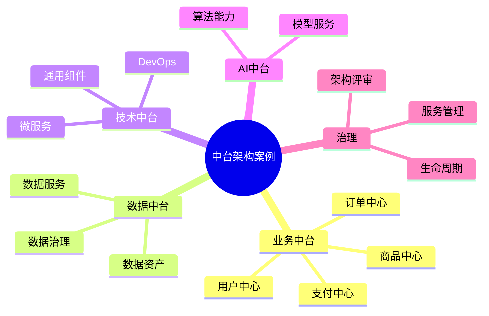

# 57-middle-platform-case.md（中台架构案例）

> 本文用于系统架构设计师考试案例分析专题 V2 复习。
>
> 本篇重点整理中台架构（Middle Platform Architecture）设计案例，包括业务中台、数据中台、技术中台、AI中台、中台建设方法、中台治理以及中台与微服务、企业架构融合。

---

# 目录

1. 中台架构案例概述
2. 中台基本概念
3. 企业中台建设挑战案例
4. 中台整体架构案例
5. 业务中台架构案例
6. 数据中台架构案例
7. 技术中台架构案例
8. AI中台架构案例
9. 中台与企业架构融合案例
10. 中台与微服务架构案例
11. 中台与DDD领域设计案例
12. 中台服务设计案例
13. 中台数据治理案例
14. 中台运营治理案例
15. 中台建设方法案例
16. 中台演进案例
17. 企业级中台架构案例
18. 中台架构治理平台案例
19. 案例分析答题模板
20. 高频考点
21. 易错点
22. Mermaid知识结构图
23. 本节小结

---

# 1. 中台架构案例概述

中台：

> 将企业可复用的业务能力、数据能力和技术能力沉淀为共享服务的平台。

核心思想：

```text
前台快速创新

↓

中台能力复用

↓

后台资源支撑
```

目标：

- 提升业务响应速度；
- 降低重复建设；
- 提升企业数字化能力。

---

# 2. 中台基本概念

中台通常包括：

## 业务中台

沉淀：

- 业务能力；
- 业务流程；
- 业务服务。

## 数据中台

沉淀：

- 数据资产；
- 数据服务；
- 数据分析能力。

## 技术中台

提供：

- 基础技术能力；
- 通用技术服务。

## AI中台

提供：

- AI模型；
- 算法能力；
- 智能服务。

---

# 3. 企业中台建设挑战案例

常见问题：

- 系统重复建设；
- 数据孤岛；
- 创新速度慢；
- 技术能力无法复用。

---

# 4. 中台整体架构案例

```text
用户端

↓

业务前台

↓

业务中台

↓

数据中台

↓

技术中台

↓

基础设施
```

---

# 5. 业务中台架构案例

业务中台：

> 将企业核心业务能力封装为共享服务。

示例：

```text
业务中台

├── 用户中心

├── 商品中心

├── 订单中心

├── 支付中心

└── 营销中心
```

价值：

- 能力复用；
- 快速组合业务。

---

# 6. 数据中台架构案例

数据中台：

> 将企业数据资产转化为数据服务能力。

架构：

```text
数据采集

↓

数据治理

↓

数据资产

↓

数据服务

↓

业务应用
```

能力：

- 数据整合；
- 数据分析；
- 数据共享。

---

# 7. 技术中台架构案例

技术中台提供：

- 微服务平台；
- 配置中心；
- 注册中心；
- DevOps平台；
- 通用组件。

作用：

降低技术重复建设。

---

# 8. AI中台架构案例

AI中台提供：

- 模型管理；
- 算法服务；
- AI接口。

架构：

```text
业务数据

↓

AI平台

↓

模型服务

↓

智能应用
```

---

# 9. 中台与企业架构融合案例

关系：

```text
企业战略

↓

企业架构

↓

中台能力

↓

业务应用
```

中台不是独立系统，而是企业架构的一部分。

---

# 10. 中台与微服务架构案例

中台能力通常通过微服务实现。

架构：

```text
业务应用

↓

API Gateway

↓

中台服务

↓

基础能力
```

---

# 11. 中台与DDD领域设计案例

DDD用于：

- 划分业务边界；
- 设计服务模型。

流程：

```text
业务领域

↓

领域模型

↓

中台服务
```

---

# 12. 中台服务设计案例

服务设计原则：

- 高内聚；
- 低耦合；
- 可复用。

典型服务：

- 用户服务；
- 商品服务；
- 订单服务；
- 支付服务。

---

# 13. 中台数据治理案例

数据治理包括：

- 数据标准；
- 元数据管理；
- 数据质量；
- 数据安全。

目标：

提升数据资产价值。

---

# 14. 中台运营治理案例

治理内容：

- 服务管理；
- 生命周期管理；
- 权限管理；
- 运行监控。

---

# 15. 中台建设方法案例

建设步骤：

```text
业务分析

↓

能力识别

↓

服务设计

↓

平台建设

↓

持续运营
```

---

# 16. 中台演进案例

演进：

```text
传统系统

↓

业务服务化

↓

业务中台

↓

数字化平台
```

---

# 17. 企业级中台架构案例

整体：

```text
企业战略

↓

业务中台

↓

数据中台

↓

技术中台

↓

业务创新
```

---

# 18. 中台架构治理平台案例

治理能力：

- 服务资产管理；
- 能力目录管理；
- 接口管理；
- 运行监控；
- 架构评审。

---

# 19. 案例分析答题模板

## 系统重复建设严重

> 建设业务中台，将通用业务能力沉淀为共享服务，提高能力复用。

## 数据无法共享

> 建设数据中台，通过数据治理和数据服务实现数据资产共享。

## 企业创新速度慢

> 通过中台架构沉淀公共能力，提高业务敏捷性。

## 技术能力重复开发

> 建设技术中台，提供统一基础技术能力。

---

# 20. 高频考点

重点掌握：

1. 中台架构思想；
2. 业务中台；
3. 数据中台；
4. 技术中台；
5. 中台与微服务结合；
6. 中台治理。

---

# 21. 易错点

|易错知识|正确理解|
|-|-|
|中台就是一个大型系统|中台核心是能力沉淀和服务复用|
|中台等于数据中台|中台包括业务、数据、技术等多种类型|
|建设中台只需要技术投入|中台建设需要业务和技术共同规划|
|中台替代所有后台系统|中台负责能力复用，不一定替代后台|

---

# 22. Mermaid知识结构图



---

# 23. 本节小结

中台架构案例核心：

> 通过沉淀企业可复用能力，形成共享服务平台，提高企业数字化能力和业务创新速度。

案例分析重点：

- 理解中台建设目标；
- 掌握业务中台、数据中台、技术中台；
- 理解中台与微服务、DDD结合；
- 掌握中台治理方法。
