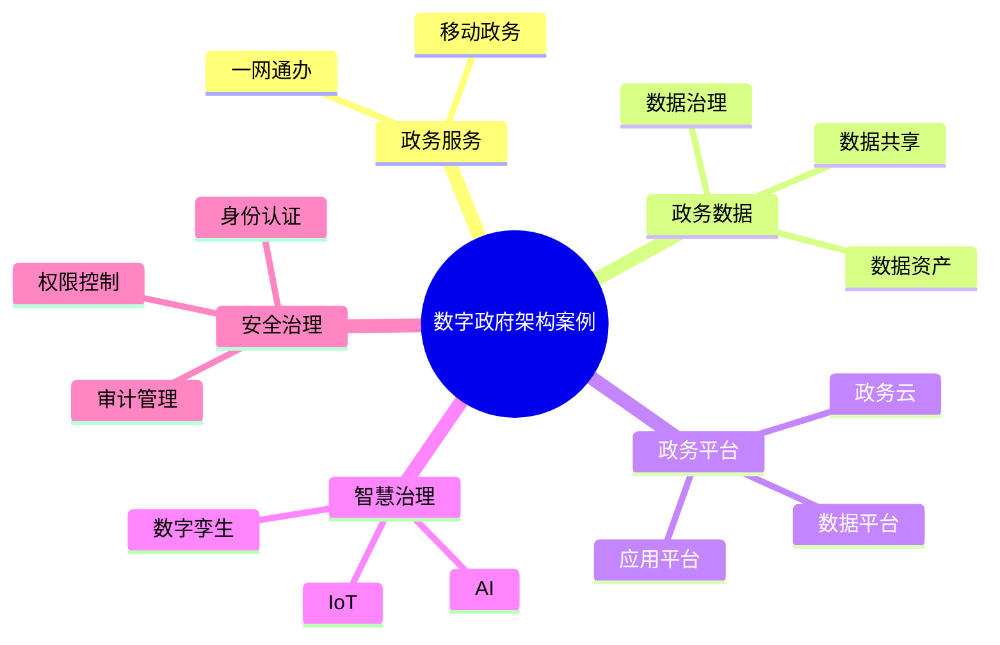

# 58-digital-government-case.md（数字政府架构案例）

> 本文用于系统架构设计师考试案例分析专题 V2 复习。
>
> 本篇重点整理数字政府架构（Digital Government Architecture）设计案例，包括政务云、一体化政务服务、政务数据共享交换、政务数据治理、城市治理平台、智慧城市融合以及政务中台架构。

---

# 目录

1. 数字政府架构案例概述
2. 数字政府基本概念
3. 传统政务系统挑战案例
4. 数字政府总体架构案例
5. 政务云架构案例
6. 一体化政务服务平台案例
7. 政务数据共享交换案例
8. 政务数据治理案例
9. 政务大数据平台案例
10. 城市治理平台案例
11. 智慧城市融合案例
12. 政务中台架构案例
13. 政务微服务架构案例
14. 政务安全架构案例
15. 政务系统集成案例
16. 数字政府建设方法案例
17. 数字政府演进案例
18. 企业级数字政府架构案例
19. 案例分析答题模板
20. 高频考点
21. 易错点
22. Mermaid知识结构图
23. 本节小结

---

# 1. 数字政府架构案例概述

数字政府：

> 利用数字技术推动政府治理体系和治理能力现代化。

目标：

- 提升政务服务效率；
- 实现数据共享；
- 提升政府治理能力；
- 提供便民服务。

整体关系：

```text
政府业务

↓

数字政府架构

↓

政务平台

↓

公众服务
```

---

# 2. 数字政府基本概念

主要组成：

## 政务服务

包括：

- 网上办事；
- 移动政务；
- 一站式服务。

## 政务数据

包括：

- 数据采集；
- 数据共享；
- 数据治理。

## 政务平台

包括：

- 云平台；
- 数据平台；
- 应用平台。

## 智慧治理

包括：

- 城市管理；
- 风险预警；
- 智能决策。

---

# 3. 传统政务系统挑战案例

常见问题：

- 信息孤岛；
- 数据共享困难；
- 服务入口分散；
- 跨部门协同困难。

---

# 4. 数字政府总体架构案例

```text
公众 / 企业 / 政府人员

↓

政务服务门户

↓

业务应用层

↓

数据中台

↓

政务云平台

↓

基础设施
```

---

# 5. 政务云架构案例

政务云：

> 为政府信息系统提供统一计算、存储和服务能力。

架构：

```text
政务应用

↓

云平台

↓

虚拟化资源

↓

基础设施
```

特点：

- 资源共享；
- 弹性扩展；
- 统一管理。

---

# 6. 一体化政务服务平台案例

目标：

- 一网通办；
- 一次办成；
- 服务统一入口。

架构：

```text
用户

↓

政务服务门户

↓

业务系统

↓

数据共享平台
```

---

# 7. 政务数据共享交换案例

数据交换解决：

- 跨部门数据共享。

架构：

```text
部门系统

↓

数据交换平台

↓

共享数据库

↓

业务应用
```

关键：

- 数据标准；
- 接口规范；
- 权限管理。

---

# 8. 政务数据治理案例

数据治理包括：

- 数据标准；
- 数据质量；
- 元数据管理；
- 数据安全。

目标：

形成：

> 可共享、可管理、可利用的数据资产。

---

# 9. 政务大数据平台案例

架构：

```text
数据采集

↓

数据存储

↓

数据计算

↓

数据分析

↓

决策支持
```

应用：

- 城市管理；
- 公共安全；
- 民生服务。

---

# 10. 城市治理平台案例

城市治理融合：

- IoT；
- AI；
- 大数据。

架构：

```text
城市感知设备

↓

数据平台

↓

智能分析

↓

治理应用
```

---

# 11. 智慧城市融合案例

智慧城市结合：

- 数字政府；
- 物联网；
- 数字孪生；
- AI。

目标：

- 城市智能管理；
- 精准服务。

---

# 12. 政务中台架构案例

政务中台：

沉淀：

- 通用业务能力；
- 数据能力；
- 技术能力。

架构：

```text
政务应用

↓

业务中台

↓

数据中台

↓

技术中台
```

---

# 13. 政务微服务架构案例

采用：

- 微服务；
- API Gateway；
- 服务治理。

架构：

```text
政务门户

↓

API网关

↓

业务服务

↓

数据服务
```

---

# 14. 政务安全架构案例

包括：

- 身份认证；
- 权限控制；
- 数据加密；
- 安全审计。

---

# 15. 政务系统集成案例

集成方式：

- API；
- ESB；
- 消息队列。

目标：

- 系统互联；
- 业务协同。

---

# 16. 数字政府建设方法案例

建设步骤：

```text
需求分析

↓

总体规划

↓

平台建设

↓

数据治理

↓

持续优化
```

---

# 17. 数字政府演进案例

```text
电子政务

↓

数字政务

↓

数字政府

↓

智慧治理
```

---

# 18. 企业级数字政府架构案例

整体：

```text
政府战略

↓

数字政府架构

↓

数据与应用平台

↓

技术基础设施
```

---

# 19. 案例分析答题模板

## 政务系统数据孤岛严重

> 建立政务数据共享交换体系，通过统一数据标准和治理机制实现数据共享。

## 群众办事流程复杂

> 建设一体化政务服务平台，实现统一入口和业务协同。

## 城市治理能力不足

> 利用大数据、物联网和人工智能技术建设智慧治理平台。

## 多部门系统难以整合

> 采用企业集成架构，通过API、ESB等方式实现系统互联。

---

# 20. 高频考点

重点掌握：

1. 数字政府总体架构；
2. 政务云；
3. 数据共享交换；
4. 数据治理；
5. 一体化政务服务；
6. 智慧城市融合。

---

# 21. 易错点

|易错知识|正确理解|
|-|-|
|数字政府只是网上办事|数字政府还包括治理、数据和平台体系|
|政务云只是服务器集中|核心是资源池化和统一管理|
|数据共享不需要治理|共享必须建立标准、安全和质量体系|
|智慧城市只依赖物联网|需要结合数据、AI和业务应用|

---

# 22. Mermaid知识结构图



---

# 23. 本节小结

数字政府架构案例核心：

> 通过云计算、大数据、人工智能等数字技术，实现政务服务提升、数据共享和政府治理现代化。

案例分析重点：

- 理解数字政府整体架构；
- 掌握政务云和数据共享体系；
- 理解政务中台和智慧城市融合；
- 掌握数字政府建设方法。
