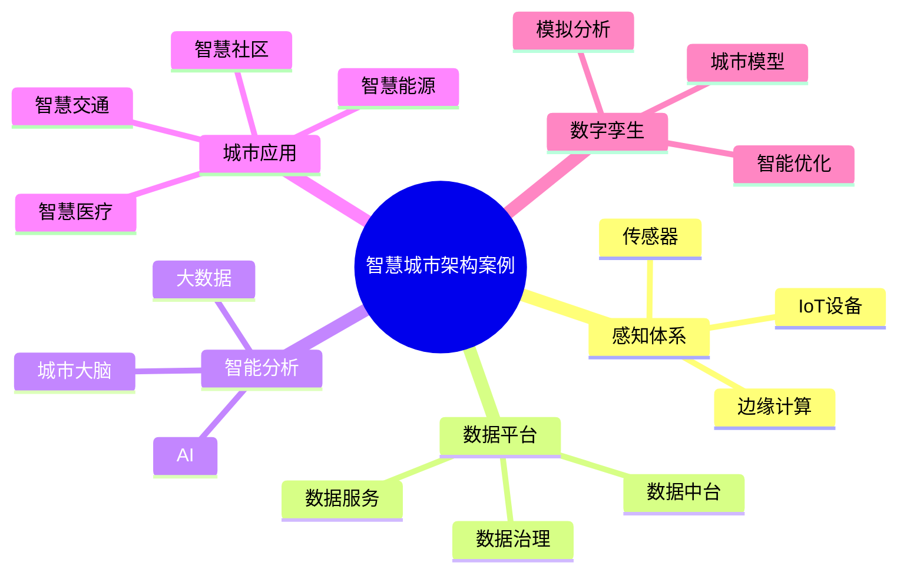

# 59-smart-city-case.md（智慧城市架构案例）

> 本文用于系统架构设计师考试案例分析专题 V2 复习。
>
> 本篇重点整理智慧城市架构（Smart City Architecture）设计案例，包括城市感知体系、城市物联网平台、城市数据中台、城市大脑、数字孪生城市、智慧交通、智慧能源、智慧社区以及智慧城市治理。

---

# 目录

1. 智慧城市架构案例概述
2. 智慧城市基本概念
3. 智慧城市建设挑战案例
4. 智慧城市总体架构案例
5. 城市感知层架构案例
6. 城市物联网平台案例
7. 城市数据中台案例
8. 城市大脑架构案例
9. 数字孪生城市案例
10. 智慧交通架构案例
11. 智慧能源架构案例
12. 智慧社区架构案例
13. 智慧医疗架构案例
14. 智慧环保架构案例
15. 智慧城市安全架构案例
16. 智慧城市数据治理案例
17. 智慧城市建设方法案例
18. 智慧城市演进案例
19. 企业级智慧城市架构案例
20. 案例分析答题模板
21. 高频考点
22. 易错点
23. Mermaid知识结构图
24. 本节小结

---

# 1. 智慧城市架构案例概述

智慧城市：

> 利用物联网、大数据、人工智能等技术，实现城市运行智能化和公共服务智慧化。

目标：

- 提升城市治理能力；
- 优化公共资源配置；
- 改善居民生活体验；
- 实现城市可持续发展。

整体关系：

```text
城市资源

↓

数字化感知

↓

数据分析

↓

智能决策

↓

城市服务
```

---

# 2. 智慧城市基本概念

主要组成：

## 城市感知体系

包括：

- 摄像头；
- 传感器；
- 智能设备。

## 城市数据平台

负责：

- 数据汇聚；
- 数据治理；
- 数据分析。

## 城市应用平台

包括：

- 智慧交通；
- 智慧医疗；
- 智慧环保。

## 智能决策体系

利用：

- AI；
- 大数据分析。

实现：

- 预测；
- 调度；
- 优化。

---

# 3. 智慧城市建设挑战案例

常见问题：

- 数据孤岛；
- 感知能力不足；
- 系统建设分散；
- 智能化水平不足。

---

# 4. 智慧城市总体架构案例

```text
城市居民 / 企业 / 管理人员

↓

城市应用层

↓

城市数据平台

↓

城市物联网平台

↓

感知设备层

↓

基础设施
```

---

# 5. 城市感知层架构案例

感知层负责：

- 数据采集；
- 状态监测。

设备：

- 摄像头；
- 环境传感器；
- 智能终端。

架构：

```text
传感设备

↓

边缘节点

↓

城市平台
```

---

# 6. 城市物联网平台案例

IoT平台能力：

- 设备管理；
- 数据采集；
- 协议转换；
- 设备控制。

架构：

```text
设备

↓

IoT平台

↓

数据服务

↓

城市应用
```

---

# 7. 城市数据中台案例

城市数据中台：

> 将城市多源数据转化为可共享的数据能力。

架构：

```text
数据采集

↓

数据治理

↓

数据资产

↓

数据服务

↓

城市应用
```

能力：

- 数据共享；
- 数据分析；
- 数据开放。

---

# 8. 城市大脑架构案例

城市大脑：

> 利用AI和大数据技术实现城市智能决策。

架构：

```text
城市数据

↓

AI分析平台

↓

智能决策

↓

城市治理
```

应用：

- 交通调度；
- 应急管理；
- 城市运营。

---

# 9. 数字孪生城市案例

数字孪生：

> 在数字空间建立真实城市的动态映射。

架构：

```text
真实城市

↓

数据采集

↓

数字模型

↓

智能分析

↓

城市优化
```

应用：

- 城市规划；
- 灾害模拟；
- 运行监控。

---

# 10. 智慧交通架构案例

包括：

- 智能信号灯；
- 交通监控；
- 自动调度。

架构：

```text
交通设备

↓

交通数据平台

↓

智能分析

↓

交通管理
```

---

# 11. 智慧能源架构案例

包括：

- 智能电网；
- 能源监测；
- 能耗分析。

目标：

- 节能；
- 降低碳排放。

---

# 12. 智慧社区架构案例

包括：

- 智能门禁；
- 智能停车；
- 社区服务。

目标：

提升居民生活体验。

---

# 13. 智慧医疗架构案例

包括：

- 电子健康档案；
- 远程医疗；
- AI辅助诊断。

---

# 14. 智慧环保架构案例

利用：

- 传感器；
- 大数据。

实现：

- 空气监测；
- 污染预警。

---

# 15. 智慧城市安全架构案例

包括：

- 网络安全；
- 数据安全；
- 身份认证；
- 安全监控。

---

# 16. 智慧城市数据治理案例

治理内容：

- 数据标准；
- 数据质量；
- 数据共享；
- 数据安全。

目标：

形成城市数据资产。

---

# 17. 智慧城市建设方法案例

建设步骤：

```text
需求分析

↓

总体规划

↓

平台建设

↓

数据治理

↓

应用建设

↓

持续优化
```

---

# 18. 智慧城市演进案例

演进：

```text
数字城市

↓

智慧城市

↓

城市大脑

↓

数字孪生城市
```

---

# 19. 企业级智慧城市架构案例

整体：

```text
城市战略

↓

智慧城市架构

↓

数据与应用平台

↓

技术基础设施
```

---

# 20. 案例分析答题模板

## 城市数据无法共享

> 建设城市数据中台，通过统一数据标准和治理体系实现数据共享。

## 城市治理效率低

> 建设城市大脑，利用AI和大数据实现智能分析和辅助决策。

## 城市设备数量巨大

> 建设物联网平台，实现设备统一接入和管理。

## 城市规划缺少模拟能力

> 建设数字孪生城市，实现城市运行状态可视化和预测分析。

---

# 21. 高频考点

重点掌握：

1. 智慧城市总体架构；
2. IoT平台；
3. 城市数据中台；
4. 城市大脑；
5. 数字孪生城市；
6. 智慧城市治理。

---

# 22. 易错点

|易错知识|正确理解|
|-|-|
|智慧城市只是增加传感器|核心是数据融合和智能决策|
|物联网平台就是智慧城市|IoT只是感知和连接基础|
|数字孪生只是三维展示|核心是动态数据映射和分析|
|智慧城市不需要数据治理|数据治理是城市智能化基础|

---

# 23. Mermaid知识结构图



---

# 24. 本节小结

智慧城市架构案例核心：

> 通过物联网、大数据、人工智能和数字孪生技术，实现城市感知、数据融合、智能决策和智慧服务。

案例分析重点：

- 理解智慧城市总体架构；
- 掌握IoT和城市数据平台；
- 理解城市大脑和数字孪生；
- 掌握智慧城市建设方法。
