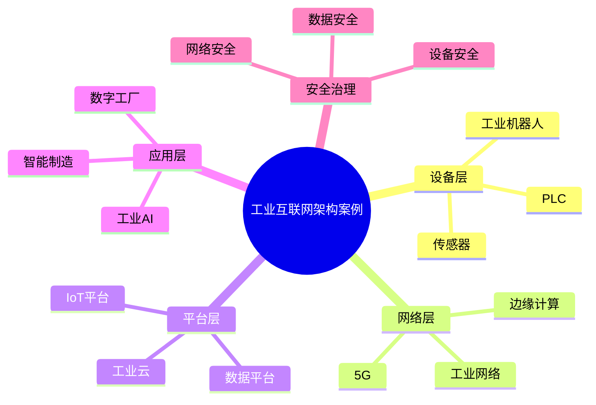

# 60-industrial-internet-case.md（工业互联网架构案例）

> 本文用于系统架构设计师考试案例分析专题 V2 复习。
>
> 本篇重点整理工业互联网架构（Industrial Internet Architecture）设计案例，包括工业物联网、工业平台、边缘计算、工业云、工业数据平台、智能制造、数字工厂、工业数字孪生以及工业互联网安全。

---

# 目录

1. 工业互联网架构案例概述
2. 工业互联网基本概念
3. 传统制造业数字化挑战案例
4. 工业互联网总体架构案例
5. 工业设备连接架构案例
6. 工业物联网平台案例
7. 工业边缘计算架构案例
8. 工业云平台架构案例
9. 工业数据平台案例
10. 工业大数据分析案例
11. 智能制造架构案例
12. 数字工厂架构案例
13. 工业数字孪生案例
14. 工业AI应用案例
15. 工业互联网安全架构案例
16. 工业互联网平台建设案例
17. 工业互联网与企业架构融合案例
18. 工业互联网演进案例
19. 企业级工业互联网架构案例
20. 案例分析答题模板
21. 高频考点
22. 易错点
23. Mermaid知识结构图
24. 本节小结

---

# 1. 工业互联网架构案例概述

工业互联网：

> 通过连接工业设备、人、系统和数据，实现工业生产全过程数字化和智能化。

目标：

- 提升生产效率；
- 降低生产成本；
- 提高产品质量；
- 实现智能制造。

整体关系：

```text
工业设备

↓

数据采集

↓

数据分析

↓

智能决策

↓

生产优化
```

---

# 2. 工业互联网基本概念

主要组成：

## 工业设备层

包括：

- 生产设备；
- 工业机器人；
- 传感器。

## 网络连接层

负责：

- 数据传输；
- 设备通信。

包括：

- 工业网络；
- 5G；
- 工业以太网。

## 平台层

包括：

- 工业互联网平台；
- 数据平台；
- AI平台。

## 应用层

包括：

- 智能制造；
- 质量管理；
- 设备预测维护。

---

# 3. 传统制造业数字化挑战案例

常见问题：

- 设备数据孤岛；
- 生产过程不可视；
- 设备维护效率低；
- 生产优化困难。

---

# 4. 工业互联网总体架构案例

```text
工业应用层

↓

工业平台层

↓

工业网络层

↓

设备感知层

↓

生产设备
```

---

# 5. 工业设备连接架构案例

设备连接包括：

- PLC；
- 传感器；
- 工业机器人；
- 数控设备。

架构：

```text
工业设备

↓

边缘网关

↓

工业平台
```

作用：

- 数据采集；
- 协议转换。

---

# 6. 工业物联网平台案例

工业IoT平台能力：

- 设备管理；
- 数据采集；
- 设备监控；
- 远程控制。

架构：

```text
设备

↓

IoT平台

↓

数据服务

↓

工业应用
```

---

# 7. 工业边缘计算架构案例

边缘计算：

> 在靠近工业设备的位置进行数据处理。

优势：

- 降低延迟；
- 减少网络压力；
- 支持实时控制。

架构：

```text
设备

↓

边缘节点

↓

云平台
```

---

# 8. 工业云平台架构案例

工业云提供：

- 计算资源；
- 存储能力；
- 工业服务。

架构：

```text
工业应用

↓

工业云平台

↓

云基础设施
```

---

# 9. 工业数据平台案例

工业数据平台整合：

- 设备数据；
- 生产数据；
- 质量数据。

架构：

```text
数据采集

↓

数据存储

↓

数据治理

↓

数据服务

↓

工业应用
```

---

# 10. 工业大数据分析案例

应用：

- 生产分析；
- 质量预测；
- 设备预测维护。

流程：

```text
工业数据

↓

数据分析

↓

模型建立

↓

优化决策
```

---

# 11. 智能制造架构案例

智能制造结合：

- 自动化；
- 信息化；
- 智能化。

包括：

- 自动生产线；
- 智能调度；
- 质量控制。

---

# 12. 数字工厂架构案例

数字工厂：

> 利用数字技术模拟和优化生产过程。

架构：

```text
真实工厂

↓

数据采集

↓

数字模型

↓

智能优化
```

---

# 13. 工业数字孪生案例

工业数字孪生建立：

- 设备模型；
- 生产模型；
- 工厂模型。

应用：

- 设备预测；
- 生产模拟；
- 工艺优化。

---

# 14. 工业AI应用案例

AI应用：

- 质量检测；
- 故障预测；
- 智能排产。

架构：

```text
工业数据

↓

AI模型

↓

智能决策

↓

生产优化
```

---

# 15. 工业互联网安全架构案例

安全包括：

- 网络安全；
- 设备安全；
- 数据安全；
- 访问控制。

重点：

工业控制系统安全。

---

# 16. 工业互联网平台建设案例

建设步骤：

```text
设备接入

↓

数据采集

↓

平台建设

↓

应用开发

↓

持续优化
```

---

# 17. 工业互联网与企业架构融合案例

关系：

```text
企业战略

↓

业务架构

↓

工业互联网平台

↓

智能制造应用
```

---

# 18. 工业互联网演进案例

演进：

```text
自动化生产

↓

数字化工厂

↓

智能制造

↓

工业互联网
```

---

# 19. 企业级工业互联网架构案例

整体：

```text
企业战略

↓

工业互联网平台

↓

工业数据与应用

↓

智能制造体系
```

---

# 20. 案例分析答题模板

## 设备数据无法统一采集

> 建设工业物联网平台，通过设备接入和协议转换实现设备互联。

## 生产过程不可视

> 建设工业数据平台，实现生产数据采集、分析和可视化。

## 设备故障频繁

> 利用工业大数据和AI技术，实现设备预测性维护。

## 生产效率需要提升

> 建设智能制造体系，通过自动化和智能分析优化生产过程。

---

# 21. 高频考点

重点掌握：

1. 工业互联网总体架构；
2. 工业IoT平台；
3. 边缘计算；
4. 工业数据平台；
5. 智能制造；
6. 工业数字孪生；
7. 工业安全。

---

# 22. 易错点

|易错知识|正确理解|
|-|-|
|工业互联网只是设备联网|核心是设备、数据、平台和应用融合|
|工业IoT等于工业互联网全部内容|IoT只是连接和感知基础|
|工业云只提供计算资源|工业云还提供数据和业务能力|
|数字工厂只是三维展示|核心是生产过程数字化和优化|

---

# 23. Mermaid知识结构图



---

# 24. 本节小结

工业互联网架构案例核心：

> 通过工业设备连接、数据采集、平台分析和智能应用，实现制造业数字化、网络化和智能化。

案例分析重点：

- 理解工业互联网总体架构；
- 掌握工业IoT和边缘计算；
- 理解工业数据平台；
- 掌握智能制造和工业数字孪生应用。
