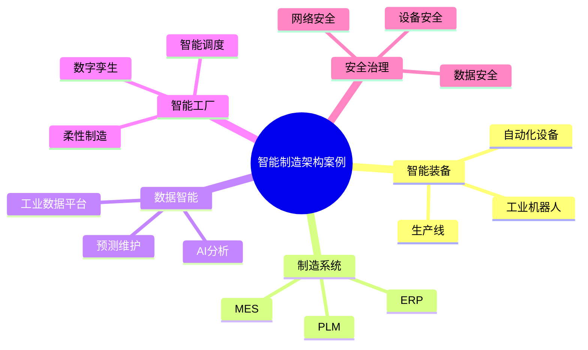

# 61-intelligent-manufacturing-case.md（智能制造架构案例）

> 本文用于系统架构设计师考试案例分析专题 V2 复习。
>
> 本篇重点整理智能制造架构（Intelligent Manufacturing Architecture）设计案例，包括智能工厂、自动化生产线、工业机器人、MES、ERP与MES集成、柔性制造、智能调度、智能质量、预测维护、数字孪生制造以及智能制造安全。

---

# 目录

1. 智能制造架构案例概述
2. 智能制造基本概念
3. 传统制造模式挑战案例
4. 智能制造总体架构案例
5. 智能工厂架构案例
6. 自动化生产线案例
7. 工业机器人应用案例
8. MES制造执行系统案例
9. ERP与MES集成案例
10. PLM产品生命周期管理案例
11. 柔性制造架构案例
12. 智能生产调度案例
13. 智能质量管理案例
14. 设备预测维护案例
15. 工业数据分析案例
16. 数字孪生制造案例
17. 智能供应链案例
18. 智能制造安全架构案例
19. 智能制造建设方法案例
20. 智能制造演进案例
21. 企业级智能制造架构案例
22. 案例分析答题模板
23. 高频考点
24. 易错点
25. Mermaid知识结构图
26. 本节小结

---

# 1. 智能制造架构案例概述

智能制造：

> 利用先进信息技术和制造技术，实现制造过程数字化、网络化和智能化。

目标：

- 提升生产效率；
- 降低制造成本；
- 提高产品质量；
- 实现个性化制造。

整体关系：

```text
产品需求

↓

智能设计

↓

智能生产

↓

智能检测

↓

智能服务
```

---

# 2. 智能制造基本概念

主要组成：

## 智能装备

包括：

- 工业机器人；
- 自动化设备；
- 智能生产线。

## 智能生产系统

包括：

- MES；
- APS；
- SCADA。

## 工业数据平台

包括：

- 数据采集；
- 数据分析；
- 数据服务。

## 智能决策系统

利用：

- AI；
- 大数据。

实现：

- 预测；
- 优化；
- 自动决策。

---

# 3. 传统制造模式挑战案例

常见问题：

- 生产自动化不足；
- 信息系统割裂；
- 生产计划响应慢；
- 质量控制困难。

---

# 4. 智能制造总体架构案例

```text
智能服务层

↓

智能应用层

↓

制造执行层

↓

工业控制层

↓

设备层
```

---

# 5. 智能工厂架构案例

智能工厂：

> 利用数字技术实现生产全过程透明化和智能化。

架构：

```text
用户需求

↓

生产计划

↓

智能制造系统

↓

自动化设备

↓

产品输出
```

---

# 6. 自动化生产线案例

自动化生产线包括：

- 自动装配；
- 自动检测；
- 自动搬运。

优势：

- 提升效率；
- 降低人工成本；
- 提高稳定性。

---

# 7. 工业机器人应用案例

应用：

- 焊接；
- 搬运；
- 装配；
- 检测。

架构：

```text
机器人

↓

控制系统

↓

生产管理系统
```

---

# 8. MES制造执行系统案例

MES：

Manufacturing Execution System。

作用：

连接：

- 计划层；
- 生产现场。

功能：

- 生产调度；
- 工艺管理；
- 质量管理；
- 设备管理。

架构：

```text
ERP

↓

MES

↓

生产设备
```

---

# 9. ERP与MES集成案例

```text
ERP

↓

生产计划

↓

MES

↓

现场执行

↓

设备数据
```

价值：

- 计划协同；
- 生产透明。

---

# 10. PLM产品生命周期管理案例

PLM管理：

- 产品设计；
- 工艺设计；
- 产品维护。

实现：

产品全生命周期管理。

---

# 11. 柔性制造架构案例

柔性制造：

> 根据市场变化快速调整生产能力。

特点：

- 小批量；
- 多品种；
- 快速切换。

架构：

```text
订单

↓

智能调度

↓

柔性生产线
```

---

# 12. 智能生产调度案例

利用：

- AI；
- 优化算法。

实现：

- 自动排产；
- 资源优化。

流程：

```text
订单数据

↓

智能排产

↓

生产执行

↓

结果反馈
```

---

# 13. 智能质量管理案例

利用：

- 图像识别；
- AI检测；
- 数据分析。

实现：

- 自动检测；
- 缺陷预测。

---

# 14. 设备预测维护案例

流程：

```text
设备数据

↓

状态分析

↓

故障预测

↓

提前维护
```

---

# 15. 工业数据分析案例

数据来源：

- 设备；
- MES；
- ERP。

分析：

- 生产效率；
- 质量趋势；
- 设备状态。

---

# 16. 数字孪生制造案例

建立：

- 产品模型；
- 设备模型；
- 工厂模型。

应用：

- 生产模拟；
- 工艺优化；
- 运行预测。

---

# 17. 智能供应链案例

结合：

- 生产；
- 仓储；
- 物流。

实现：

- 需求预测；
- 库存优化。

---

# 18. 智能制造安全架构案例

安全包括：

- 工业网络安全；
- 设备安全；
- 数据安全；
- 访问控制。

---

# 19. 智能制造建设方法案例

```text
现状分析

↓

总体规划

↓

系统建设

↓

数据治理

↓

智能优化
```

---

# 20. 智能制造演进案例

```text
人工制造

↓

自动化制造

↓

数字化制造

↓

智能制造
```

---

# 22. 案例分析答题模板

## 生产过程不可控

> 建设智能制造体系，通过MES和工业数据平台实现生产过程透明化。

## 设备故障影响生产

> 利用设备数据采集和AI分析，实现预测性维护。

## 生产计划调整困难

> 建设智能调度系统，通过算法优化生产资源配置。

## 产品质量不稳定

> 建设智能质量管理体系，通过自动检测和数据分析提升质量。

---

# 23. 高频考点

重点掌握：

1. 智能制造总体架构；
2. 智能工厂；
3. MES系统；
4. 工业机器人；
5. 柔性制造；
6. 预测维护；
7. 数字孪生制造。

---

# 24. 易错点

|易错知识|正确理解|
|-|-|
|智能制造就是自动化|智能制造还包含数据、分析和智能决策|
|MES等同于ERP|MES关注生产执行，ERP关注企业资源管理|
|机器人越多越智能|智能制造核心是系统协同和优化|
|数字孪生只是三维展示|核心是数据驱动的模拟和优化|

---

# 25. Mermaid知识结构图



---

# 26. 本节小结

智能制造架构案例核心：

> 通过自动化设备、工业软件、数据分析和人工智能技术，实现制造过程数字化、网络化和智能化。

案例分析重点：

- 理解智能制造总体架构；
- 掌握MES、ERP、PLM关系；
- 理解智能工厂和柔性制造；
- 掌握预测维护和数字孪生应用。
