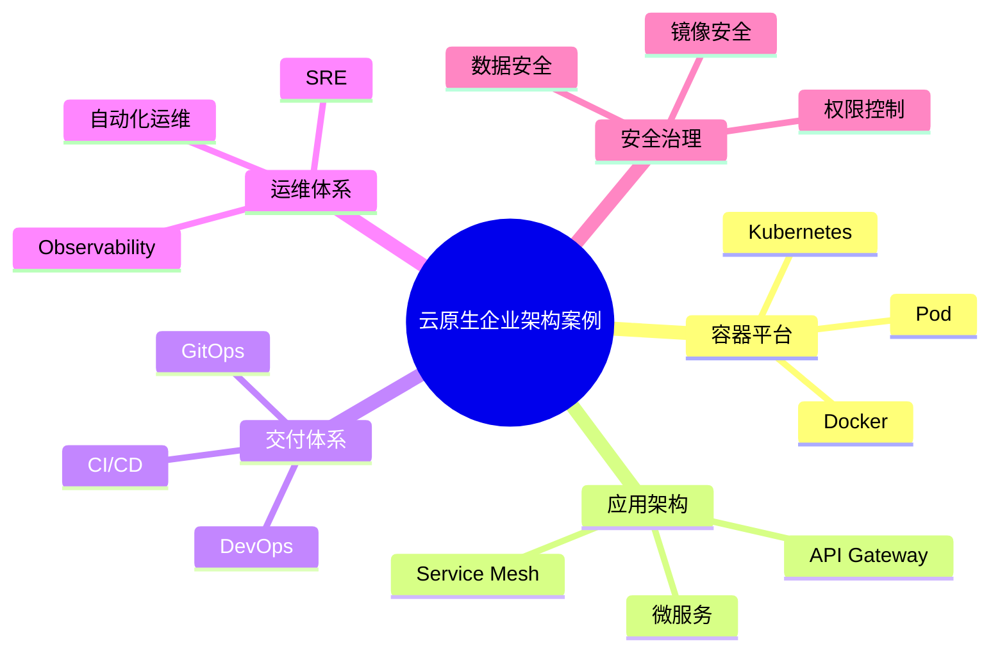

# 62-cloud-native-enterprise-case.md（云原生企业架构案例）

> 本文用于系统架构设计师考试案例分析专题 V2 复习。
>
> 本篇重点整理云原生企业架构（Cloud Native Enterprise Architecture）设计案例，包括容器化、Kubernetes、微服务、服务网格、DevOps、CI/CD、GitOps、可观测性、SRE、云原生安全以及企业云原生治理。

---

# 目录

1. 云原生企业架构案例概述
2. 云原生基本概念
3. 传统企业架构挑战案例
4. 云原生企业总体架构案例
5. 容器化架构案例
6. Kubernetes平台架构案例
7. 微服务架构案例
8. 服务网格架构案例
9. DevOps持续交付案例
10. CI/CD流水线案例
11. GitOps架构案例
12. 云原生应用设计案例
13. 云原生数据库架构案例
14. 云原生存储架构案例
15. 云原生网络架构案例
16. 可观测性架构案例
17. SRE可靠性工程案例
18. 云原生安全架构案例
19. 企业云原生治理案例
20. 云原生迁移案例
21. 企业级云原生架构案例
22. 案例分析答题模板
23. 高频考点
24. 易错点
25. Mermaid知识结构图
26. 本节小结

---

# 1. 云原生企业架构案例概述

云原生：

> 利用云计算优势设计和运行应用系统的方法，使应用具备弹性、自动化和持续交付能力。

目标：

- 快速迭代；
- 弹性伸缩；
- 自动化运维；
- 高可靠运行。

整体关系：

```text
业务需求

↓

云原生应用

↓

云平台

↓

基础设施
```

---

# 2. 云原生基本概念

核心组成：

## 容器化

实现：

- 应用隔离；
- 环境一致。

## 微服务

实现：

- 服务拆分；
- 独立部署。

## DevOps

实现：

- 开发运维协同；
- 自动化交付。

## Kubernetes

实现：

- 容器编排；
- 自动扩缩。

## 服务网格

实现：

- 服务通信治理；
- 流量控制。

---

# 3. 云原生企业总体架构案例

```text
业务应用

↓

云原生应用平台

↓

Kubernetes集群

↓

云基础设施

↓

计算 / 网络 / 存储
```

---

# 4. 容器化架构案例

容器将应用及运行环境标准化封装。

```text
应用

↓

Container

↓

Container Runtime

↓

操作系统
```

优势：

- 快速部署；
- 环境一致；
- 资源利用率高。

---

# 5. Kubernetes平台架构案例

Kubernetes负责：

- 容器编排；
- 服务发现；
- 自动伸缩；
- 故障恢复。

```text
Master节点

↓

Worker节点

↓

Pod

↓

Container
```

---

# 6. 微服务架构案例

```text
用户

↓

API Gateway

↓

微服务集群

↓

数据库
```

特点：

- 独立部署；
- 独立扩展；
- 快速交付。

---

# 7. 服务网格架构案例

服务网格解决：

- 服务通信；
- 流量治理。

```text
服务A

↓

Sidecar

↓

Service Mesh

↓

Sidecar

↓

服务B
```

能力：

- 服务发现；
- 熔断；
- 限流；
- 链路追踪。

---

# 8. DevOps与CI/CD案例

流程：

```text
代码提交

↓

自动构建

↓

自动测试

↓

自动部署
```

价值：

- 提升交付效率；
- 降低人为错误。

---

# 9. GitOps架构案例

GitOps：

> 使用Git作为系统配置和部署状态来源。

流程：

```text
Git仓库

↓

自动同步

↓

Kubernetes

↓

应用运行
```

---

# 10. 云原生可观测性案例

包括：

## Metrics

指标监控。

## Logging

日志管理。

## Tracing

链路追踪。

目标：

快速发现和定位问题。

---

# 11. SRE可靠性工程案例

SRE：

Site Reliability Engineering。

关注：

- 可用性；
- 稳定性；
- 自动化运维。

指标：

- SLA；
- SLO；
- Error Budget。

---

# 12. 云原生安全架构案例

包括：

- 镜像安全；
- 容器安全；
- 身份认证；
- 权限控制。

---

# 13. 云原生迁移案例

迁移路线：

```text
传统应用

↓

容器化改造

↓

微服务拆分

↓

云原生运行
```

---

# 案例分析答题模板

## 应用发布速度慢

> 建设DevOps持续交付体系，通过CI/CD流水线提升软件交付效率。

## 系统无法弹性扩展

> 采用容器化和Kubernetes平台，实现自动扩缩容。

## 微服务调用复杂

> 引入服务网格，实现服务通信治理和流量控制。

## 运维困难

> 建设云原生可观测体系，通过日志、指标和链路追踪提升运维能力。

---

# 高频考点

重点掌握：

1. 云原生架构思想；
2. 容器和Kubernetes；
3. 微服务体系；
4. DevOps与CI/CD；
5. 服务网格；
6. 可观测性；
7. SRE。

---

# 易错点

|易错知识|正确理解|
|-|-|
|云原生就是上云|云原生强调应用架构和运行方式变革|
|容器替代全部虚拟机|容器与虚拟机适用于不同场景|
|Kubernetes只是部署工具|Kubernetes提供编排、治理和自动化能力|
|DevOps只是工具链|DevOps包含文化、流程和技术体系|

---

# Mermaid知识结构图



---

# 本节小结

云原生企业架构案例核心：

> 通过容器、微服务、自动化交付和云平台能力，实现企业应用快速交付、弹性运行和持续演进。

案例分析重点：

- 理解云原生整体架构；
- 掌握Kubernetes和微服务；
- 理解DevOps与CI/CD；
- 掌握可观测性和可靠性设计。
